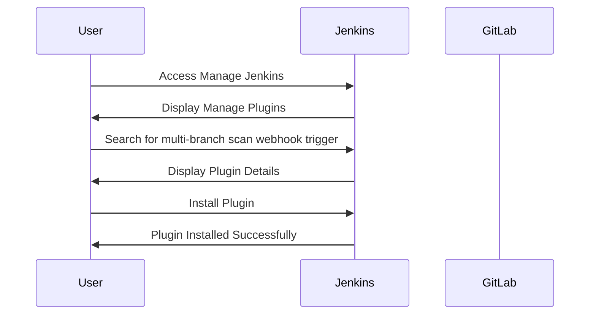
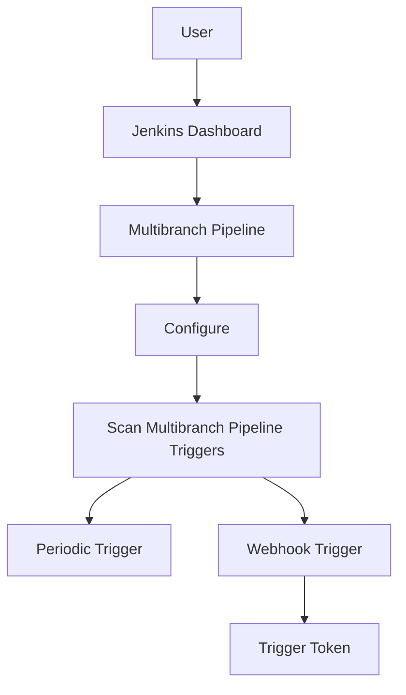
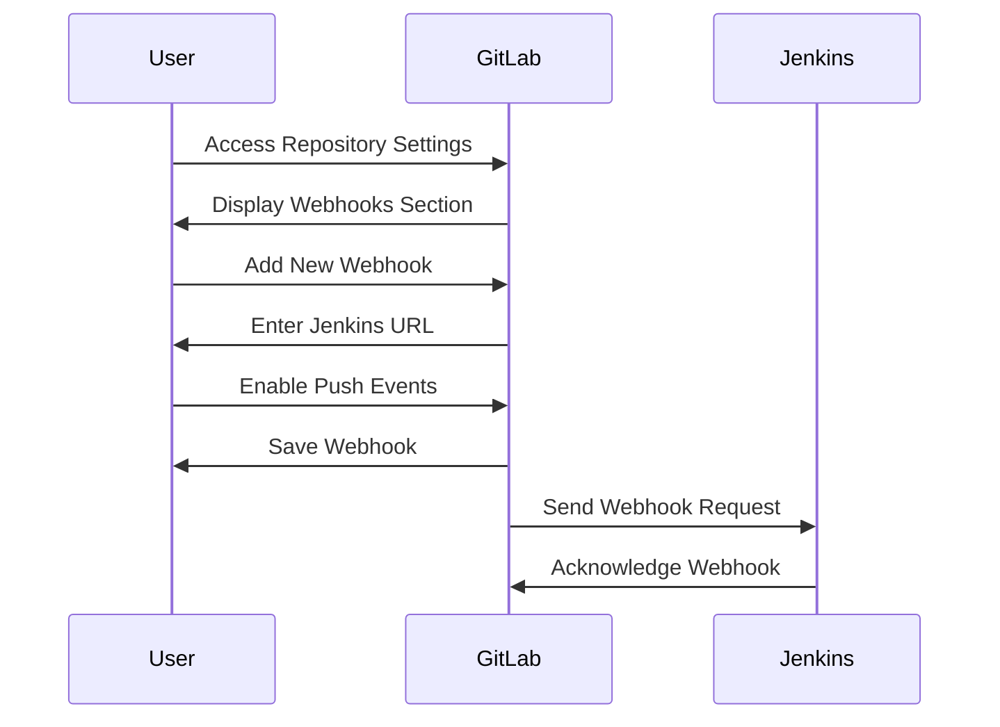

## Introduction to Continuous Integration and Continuous Delivery (CI/CD)

Continuous Integration (CI) and Continuous Delivery (CD) are fundamental practices in modern software development. They ensure that code changes are automatically built, tested, and deployed, reducing the risk of human error and speeding up the development cycle. Jenkins is a popular open-source automation server used for implementing CI/CD pipelines. GitLab, on the other hand, is a web-based Git-repository manager that provides a wide range of features for project management, CI/CD, and collaboration.

In this chapter, we will delve into automating build triggers using Jenkins and GitLab. Specifically, we will focus on configuring automatic webhooks for multi-branch pipelines using the `multi-branch scan webhook trigger` plugin in Jenkins.

### Background Theory

#### Continuous Integration (CI)
Continuous Integration is the practice of merging all developers' working copies to a shared mainline several times a day. Each integration is verified by an automated build process that includes testing. This helps catch integration errors early and reduces the cost of fixing them.

#### Continuous Delivery (CD)
Continuous Delivery extends CI by ensuring that the software can be released to production at any time. This means that the software is always in a deployable state, and the release process is automated.

#### Multi-Branch Pipelines
Multi-Branch Pipelines in Jenkins allow you to create pipelines that can handle multiple branches of a repository. This is particularly useful in environments where feature branches are used extensively. Each branch can have its own pipeline, and the pipeline can be configured to trigger based on specific events such as pushes to the repository.

### Configuring Automatic Webhooks for Multi-Branch Pipelines

To automate build triggers for multi-branch pipelines, we need to configure webhooks between GitLab and Jenkins. A webhook is a method for augmenting or altering the behavior of a web page, or the communication between web servers and clients. In the context of CI/CD, webhooks are used to notify Jenkins whenever there is a change in the GitLab repository.

#### Installing the Multi-Branch Scan Webhook Trigger Plugin

The first step is to install the `multi-branch scan webhook trigger` plugin in Jenkins. This plugin allows Jenkins to trigger builds based on webhooks received from GitLab.

1. **Access Jenkins Management Console**
   - Open your browser and navigate to the Jenkins URL.
   - Click on the "Manage Jenkins" link in the left-hand menu.

2. **Manage Plugins**
   - In the "Manage Jenkins" section, click on "Manage Plugins".
   - Switch to the "Available" tab to see a list of available plugins.

3. **Search for the Plugin**
   - Search for "multi-branch scan webhook trigger" in the search bar.
   - Select the plugin from the list.

4. **Install the Plugin**
   - Click on the "Install without restart" button to install the plugin.



### Configuring the Multi-Branch Pipeline

Once the plugin is installed, we need to configure the multi-branch pipeline to use the webhook trigger.

1. **Navigate to the Multi-Branch Pipeline Configuration**
   - Go to the Jenkins dashboard.
   - Find the multi-branch pipeline you want to configure and click on it.
   - Click on "Configure" to access the pipeline settings.

2. **Add Scan Multi-Branch Pipeline Triggers**
   - Scroll down to the "Scan Multibranch Pipeline Triggers" section.
   - By default, you might see a periodic trigger set up (e.g., "Periodically if not otherwise run").
   - To add a webhook trigger, check the box next to "Scan by webhook".

3. **Set Up the Webhook Token**
   - Under the "Scan by webhook" option, you will see an input field for the "Trigger token".
   - Generate a unique token and enter it in this field. This token will be used to authenticate the webhook requests from GitLab.



### Setting Up the Webhook in GitLab

After configuring Jenkins, we need to set up the webhook in GitLab to notify Jenkins about repository changes.

1. **Access GitLab Repository Settings**
   - Log in to your GitLab account.
   - Navigate to the repository you want to set up the webhook for.
   - Click on "Settings" in the left-hand menu.
   - Go to the "Webhooks" section.

2. **Create a New Webhook**
   - Click on "Add webhook".
   - Enter the Jenkins URL where the webhook should be sent. This URL typically looks like `http://<jenkins-url>/gitlab-webhook/<project-name>/<pipeline-name>?token=<trigger-token>`.

3. **Configure Webhook Settings**
   - Set the "Push events" checkbox to enable notifications for push events.
   - Optionally, you can also enable other types of events such as merge requests or issues.
   - Click on "Add webhook" to save the settings.



### Full Example of HTTP Requests and Responses

Here is a complete example of the HTTP request and response involved in setting up and triggering the webhook:

#### HTTP Request to GitLab to Create Webhook

```http
POST /api/v4/projects/1234/hooks HTTP/1.1
Host: gitlab.example.com
Content-Type: application/json

{
  "url": "http://jenkins.example.com/gitlab-webhook/project/pipeline?token=abc123",
  "push_events": true,
  "merge_requests_events": false,
  "tag_push_events": false,
  "note_events": false,
  "job_events": false,
  "pipeline_events": false,
  "wiki_page_events": false
}
```

#### HTTP Response from GitLab

```http
HTTP/1.1 201 Created
Content-Type: application/json

{
  "id": 5678,
  "created_at": "2023-10-01T12:00:00Z",
  "updated_at": "2023-10-01T12:00:00Z",
  "url": "http://jenkins.example.com/gitlab-webhook/project/pipeline?token=abc123",
  "push_events": true,
  "merge_requests_events": false,
  "tag_push_events": false,
  "note_events": false,
  "job_events": false,
  "pipeline_events": false,
  "wiki_page_events": false
}
```

#### HTTP Request from GitLab to Jenkins on Push Event

```http
POST /gitlab-webhook/project/pipeline?token=abc123 HTTP/1.1
Host: jenkins.example.com
Content-Type: application/json

{
  "before": "95790bf0ec2e4221c51ce5b0fbc86f34010f1c30",
  "after": "da1560886d4f094c3e65be1a29bb4310012fd54d",
  "ref": "refs/heads/master",
  "checkout_sha": "da1560886d4f094c3e65be1a29bb4310012fd54d",
  "user_id": 1,
  "user_name": "John Smith",
  "user_email": "john.smith@example.com",
  "user_avatar": "https://secure.gravatar.com/avatar/...",
  "project_id": 1234,
  "repository": {
    "name": "project",
    "url": "git@gitlab.example.com:project.git",
    "description": "",
    "homepage": "http://gitlab.example.com/project"
  },
  "commits": [
    {
      "id": "b6568db1bc1dcd7f8b4d5a946b342cb2c5e0defd",
      "message": "Update README.md",
      "timestamp": "2023-10-01T12:00:00Z",
      "url": "http://gitlab.example.com/project/commit/b6568db1bc1dcd7f8b4d5a946b342cb2c5e0defd",
      "author": {
        "name": "John Smith",
       
```

---
<!-- nav -->
[[05-Introduction to Build Triggers with Jenkins and GitLab|Introduction to Build Triggers with Jenkins and GitLab]] | [[DevOps/DevOps Bootcamp/06-CI CD & Build Tools/06-Automating Build Triggers With Jenkins And GitLab/00-Overview|Overview]] | [[07-Introduction to Jenkins and GitLab Integration|Introduction to Jenkins and GitLab Integration]]
