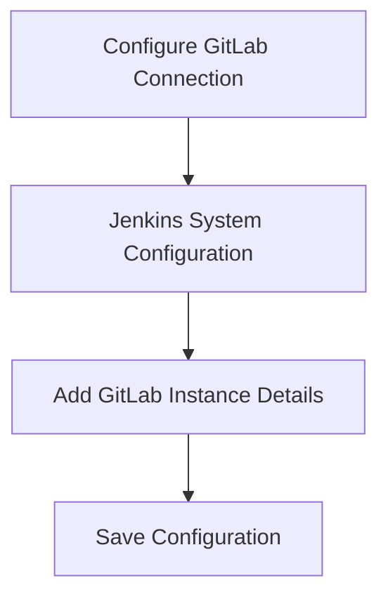
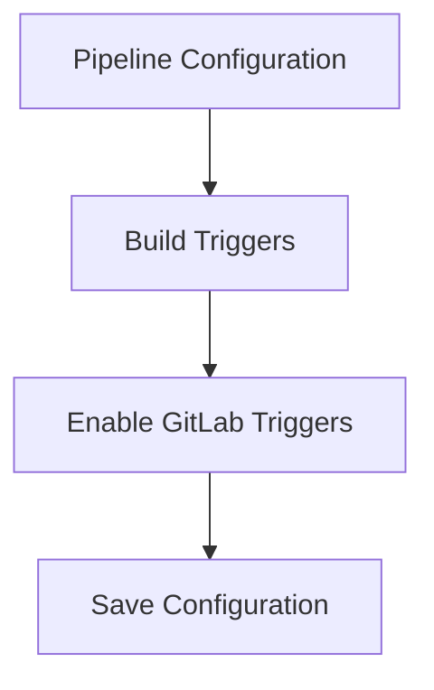

## Introduction to Jenkins and GitLab Integration

In the realm of DevOps, continuous integration and continuous delivery (CI/CD) pipelines are essential for ensuring that software is built, tested, and deployed efficiently and reliably. One of the most popular tools for setting up these pipelines is Jenkins, an open-source automation server that supports building, testing, and deploying software. Another crucial component in modern development workflows is GitLab, a web-based Git repository manager that provides a wide range of features for project management, issue tracking, and continuous integration.

This chapter delves into the integration between Jenkins and GitLab, focusing on automating build triggers through the use of plugins and configurations. We will explore the underlying mechanisms, potential pitfalls, and best practices for securing and optimizing this integration.

### Background Theory

#### Jenkins Overview

Jenkins is a highly extensible automation server that can be used to automate various tasks in the software development lifecycle, including building, testing, and deploying applications. It is built on Java and runs as a servlet container, typically using Tomcat. Jenkins supports a vast array of plugins that extend its functionality, allowing it to integrate with numerous other tools and services.

#### GitLab Overview

GitLab is a web-based platform that provides a comprehensive set of tools for managing software development projects. It includes features such as version control, issue tracking, code review, and continuous integration. GitLab is built on Ruby on Rails and is designed to be self-hosted, although it also offers a hosted service.

### Integrating Jenkins and GitLab

To integrate Jenkins and GitLab, we need to install the GitLab plugin in Jenkins. This plugin enables Jenkins to communicate with GitLab and handle various events, such as push notifications and merge request events.

#### Installing the GitLab Plugin

The first step is to install the GitLab plugin in Jenkins. This can be done via the Jenkins plugin manager:

```bash
# Navigate to the Jenkins dashboard
http://<jenkins-url>:8080/

# Click on "Manage Jenkins" > "Manage Plugins"
# Search for "GitLab Plugin" and click "Install without restart"
```

Once the plugin is installed, it will appear in the Jenkins system configuration, allowing us to set up connections to GitLab instances.

#### Configuring GitLab Connections

After installing the GitLab plugin, we need to configure the GitLab connections in Jenkins. This involves specifying the details of the GitLab instance(s) that Jenkins will interact with.



Here’s how to configure the GitLab connection:

1. **Navigate to Jenkins System Configuration**:
   - Go to `Manage Jenkins` > `Configure System`.
   
2. **Add GitLab Instance Details**:
   - Scroll down to the `GitLab` section.
   - Click on `Add GitLab` to create a new connection.
   - Enter the necessary details:
     - **Name**: A descriptive name for the connection.
     - **GitLab API URL**: The base URL of the GitLab instance (e.g., `https://gitlab.com/api/v4`).
     - **Private Token**: A personal access token with the necessary permissions to interact with GitLab.
     - **Skip SSL Verification**: Check this box if you are using a self-signed certificate.

3. **Save Configuration**:
   - Click `Save` to apply the changes.

### Enabling Build Triggers

Once the GitLab connection is configured, we can enable build triggers in our Jenkins pipeline. This allows Jenkins to automatically start builds when specific events occur in GitLab, such as push notifications or merge request events.

#### Configuring Build Triggers

To enable build triggers, navigate to the pipeline configuration in Jenkins:



Here’s how to configure the build triggers:

1. **Navigate to Pipeline Configuration**:
   - Go to the pipeline you want to configure.
   - Click on `Configure`.

2. **Enable GitLab Triggers**:
   - Scroll down to the `Build Triggers` section.
   - Check the box labeled `Build when a change is pushed to GitLab`.
   - Optionally, specify additional settings such as branch filters or event types.

3. **Save Configuration**:
   - Click `Save` to apply the changes.

### Understanding the Underlying Mechanism

When a build trigger is enabled, Jenkins sets up a webhook in GitLab. This webhook listens for specific events (such as push notifications or merge request events) and sends a notification to Jenkins when these events occur.

#### Webhook Configuration

The webhook configuration in GitLab is automatically set up by the GitLab plugin in Jenkins. Here’s how it works:

1. **Webhook URL**:
   - Jenkins generates a unique URL for each pipeline that is configured to receive notifications from GitLab.
   - This URL is typically in the format `http://<jenkins-url>/gitlab-webhook/<pipeline-name>`.

2. **Event Types**:
   - The webhook can be configured to listen for different types of events, such as push events, merge request events, etc.
   - These events are defined in the GitLab webhook configuration.

3. **Notification Process**:
   - When an event occurs in GitLab, the webhook sends a POST request to the Jenkins URL.
   - Jenkins receives this request and triggers the corresponding build.

### Real-World Examples and Recent CVEs

#### Example: Automating Builds for a Web Application

Suppose we have a web application hosted on GitLab, and we want to automate the build process using Jenkins. Here’s how we can set it up:

1. **Create a GitLab Repository**:
   - Create a new repository on GitLab for the web application.
   - Push the initial code to the repository.

2. **Set Up Jenkins Pipeline**:
   - Create a new pipeline in Jenkins.
   - Configure the pipeline to use the GitLab repository as the source code location.
   - Enable build triggers for push events.

3. **Configure Webhook in GitLab**:
   - Go to the GitLab repository settings.
   - Navigate to the `Webhooks` section.
   - Add a new webhook with the Jenkins URL.

4. **Test the Setup**:
   - Make a change to the code and push it to the GitLab repository.
   - Verify that the build is triggered automatically in Jenkins.

#### Recent CVEs and Breaches

While Jenkins and GitLab integrations are generally secure, there have been instances where vulnerabilities have been exploited. For example:

- **CVE-2021-21287**: This vulnerability affected Jenkins and allowed attackers to execute arbitrary code on the Jenkins server. While this CVE does not directly relate to the GitLab integration, it highlights the importance of keeping all components up to date.

- **CVE-2020-10180**: This vulnerability affected GitLab and allowed attackers to bypass authentication and gain unauthorized access to repositories. Ensuring that all components are patched and securely configured is crucial.

### Pitfalls and Best Practices

#### Common Pitfalls

1. **Incorrect Configuration**:
   - Ensure that the GitLab connection details are correctly configured in Jenkins.
   - Double-check the webhook URL and event types in GitLab.

2. **Security Risks**:
   - Use strong authentication methods, such as private tokens, to secure the GitLab connection.
   - Regularly update both Jenkins and GitLab to patch known vulnerabilities.

#### Best Practices

1. **Regular Updates**:
   - Keep Jenkins and GitLab updated to the latest versions.
   - Monitor for security advisories and apply patches promptly.

2. **Secure Authentication**:
   - Use private tokens with limited permissions for the GitLab connection.
   - Rotate tokens periodically to minimize exposure.

3. **Monitoring and Logging**:
   - Enable detailed logging for both Jenkins and GitLab.
   - Set up monitoring to detect unusual activity or failed builds.

### How to Prevent / Defend

#### Detection

1. **Logging and Monitoring**:
   - Enable detailed logging for both Jenkins and GitLab.
   - Use tools like ELK Stack or Splunk to monitor logs for suspicious activity.

2. **Alerts and Notifications**:
   - Set up alerts for failed builds or unauthorized access attempts.
   - Configure notifications to be sent to relevant team members.

#### Prevention

1. **Secure Configuration**:
   - Follow the best practices outlined above for secure configuration.
   - Use strong authentication methods and limit permissions.

2. **Regular Audits**:
   - Conduct regular security audits of both Jenkins and GitLab configurations.
   - Review access controls and ensure that only authorized users have access.

#### Secure Coding Fixes

Here’s an example of a vulnerable configuration and the corresponding secure fix:

**Vulnerable Configuration**:
```yaml
# Jenkinsfile (vulnerable)
pipeline {
    agent any
    stages {
        stage('Build') {
            steps {
                git url: 'https://gitlab.com/my-repo.git'
                sh 'make build'
            }
        }
    }
}
```

**Secure Configuration**:
```yaml
# Jenkinsfile (secure)
pipeline {
    agent any
    environment {
        GITLAB_PRIVATE_TOKEN = credentials('gitlab-private-token')
    }
    stages {
        stage('Build') {
            steps {
                git url: 'https://gitlab.com/my-repo.git', credentialsId: 'gitlab-private-token'
                sh 'make build'
            }
        }
    }
}
```

### Hands-On Labs

For hands-on practice with Jenkins and GitLab integration, consider the following resources:

- **PortSwigger Web Security Academy**: Offers a variety of labs related to web application security, including some that touch on CI/CD pipelines.
- **OWASP Juice Shop**: A deliberately insecure web application for practicing web security skills.
- **DVWA (Damn Vulnerable Web Application)**: A PHP/MySQL web application that is riddled with vulnerabilities for educational purposes.

These labs provide practical experience with setting up and securing CI/CD pipelines using Jenkins and GitLab.

### Conclusion

Integrating Jenkins and GitLab to automate build triggers is a powerful way to streamline the software development lifecycle. By understanding the underlying mechanisms, configuring the integration correctly, and following best practices, you can ensure that your pipelines are efficient, reliable, and secure.

---
<!-- nav -->
[[06-Introduction to Continuous Integration and Continuous Delivery (CICD)|Introduction to Continuous Integration and Continuous Delivery (CICD)]] | [[DevOps/DevOps Bootcamp/06-CI CD & Build Tools/06-Automating Build Triggers With Jenkins And GitLab/00-Overview|Overview]] | [[08-Hosting Repositories on GitLab|Hosting Repositories on GitLab]]
