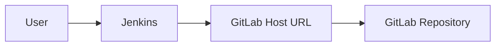
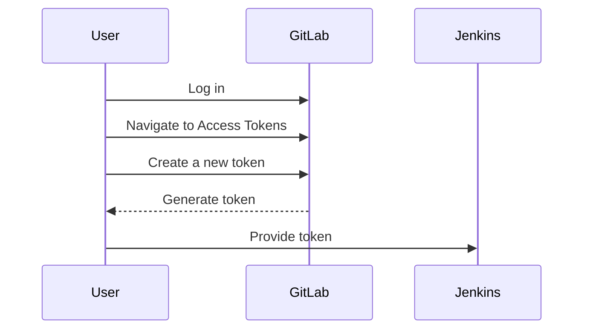

## Hosting Repositories on GitLab

### Introduction to GitLab

GitLab is a web-based platform for managing Git repositories. It provides a wide range of features such as code review, issue tracking, continuous integration, and deployment pipelines. GitLab can be hosted either on GitLab's own servers (GitLab.com) or on your own infrastructure.

#### Hosting on GitLab.com

When you host your repositories on GitLab.com, you benefit from the following:

- **Ease of Use**: No need to manage the underlying infrastructure.
- **Scalability**: GitLab handles scaling automatically.
- **Security**: GitLab ensures the security of your repositories.

However, hosting on GitLab.com means you rely on their services, which might not be suitable for all organizations due to data sovereignty concerns.

#### Self-hosted GitLab

Self-hosting GitLab allows you to maintain control over your infrastructure. This is particularly useful for organizations that require strict control over their data and infrastructure. Here are some benefits of self-hosting:

- **Data Control**: You have full control over your data and infrastructure.
- **Customization**: You can customize the environment according to your needs.
- **Compliance**: Easier to comply with internal policies and regulations.

To set up a self-hosted GitLab instance, you can follow the official documentation provided by GitLab. The setup process involves installing GitLab on a server and configuring it according to your requirements.

### Configuring Jenkins to Integrate with GitLab

Jenkins is a popular open-source automation server used for continuous integration and delivery. Integrating Jenkins with GitLab allows you to automate build triggers based on changes in your GitLab repositories.

#### Setting Up the GitLab Host URL

The first step in integrating Jenkins with GitLab is to configure the GitLab host URL. This URL points to the location where your GitLab repositories are hosted.

- **GitLab.com**: If you are using GitLab.com, the host URL would be `https://gitlab.com`.
- **Self-hosted GitLab**: If you are using a self-hosted GitLab instance, the host URL would be the URL of your GitLab server (e.g., `http://your-gitlab-server`).



#### Creating an API Token for GitLab Access

To allow Jenkins to interact with GitLab, you need to create an API token. This token is used to authenticate Jenkins with GitLab.

##### Steps to Create an API Token

1. **Log in to GitLab**: Navigate to your GitLab account.
2. **Access User Settings**: Click on your profile icon and go to `Settings`.
3. **Navigate to Access Tokens**: Under the `Settings` menu, click on `Access Tokens`.
4. **Create a New Token**: Enter a name for the token and specify the scopes (permissions) required. For Jenkins integration, you typically need `read_repository` and `write_repository` permissions.
5. **Generate the Token**: Click on `Create personal access token`. Copy the generated token as you won't be able to see it again.



### Configuring Jenkins Credentials

Once you have the API token, you need to configure it in Jenkins.

#### Adding Global Credentials in Jenkins

1. **Open Jenkins Dashboard**: Navigate to your Jenkins dashboard.
2. **Manage Credentials**: Go to `Credentials` under the `Manage Jenkins` section.
3. **Global Credentials**: Select `System` to manage global credentials.
4. **Add Credentials**: Click on `Add Credentials`.
5. **Select GitLab API Token**: Choose `GitLab API Token` from the list of available types.
6. **Enter Details**: Provide the API token and a description.
7. **Save**: Click on `OK` to save the credentials.

```mermaid
sequenceDiagram
    participant User
    participant Jenkins
    User->>Jenkins: Open Jenkins Dashboard
    User->>J
```

---
<!-- nav -->
[[07-Introduction to Jenkins and GitLab Integration|Introduction to Jenkins and GitLab Integration]] | [[DevOps/DevOps Bootcamp/06-CI CD & Build Tools/06-Automating Build Triggers With Jenkins And GitLab/00-Overview|Overview]] | [[DevOps/DevOps Bootcamp/06-CI CD & Build Tools/06-Automating Build Triggers With Jenkins And GitLab/09-Practice Questions & Answers|Practice Questions & Answers]]
