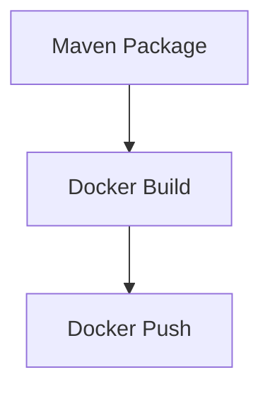

## Introduction to Chaining Freestyle Jobs in Jenkins Workflows

In the context of continuous integration and continuous delivery (CI/CD) pipelines, Jenkins is a widely-used automation server that supports various types of jobs to streamline the development process. One of the fundamental job types in Jenkins is the **Freestyle Job**, which allows developers to define a series of steps to execute as part of their build process. This chapter will delve into the concept of chaining multiple Freestyle Jobs together to create a comprehensive workflow, providing a detailed explanation of each step involved.

### What is a Freestyle Job?

A Freestyle Job in Jenkins is a basic type of job that allows you to define a series of build steps. These steps can include compiling code, running tests, packaging artifacts, and deploying applications. Each Freestyle Job is designed to perform a specific task, making it ideal for breaking down complex workflows into manageable pieces.

#### Why Use Freestyle Jobs?

Freestyle Jobs are particularly useful because they provide flexibility and modularity. By breaking down a complex workflow into smaller, independent tasks, you can:

- **Isolate Concerns**: Each job focuses on a specific task, making it easier to manage and debug.
- **Parallel Execution**: Independent jobs can be run in parallel, speeding up the overall build process.
- **Reusability**: A Freestyle Job can be reused across multiple workflows, reducing redundancy.

### Chaining Freestyle Jobs

Chaining Freestyle Jobs involves configuring one job to trigger another upon completion. This approach is commonly used to create a sequence of steps that collectively form a complete CI/CD pipeline. For example, you might have a job that runs unit tests, followed by a job that builds the application, and finally a job that deploys the application.

#### Example Workflow

Consider a typical CI/CD pipeline for a Java application:

1. **Run Unit Tests**: A Freestyle Job that uses Maven to compile and run unit tests.
2. **Build Application**: Another Freestyle Job that packages the compiled code into a distributable format.
3. **Deploy Application**: A final Freestyle Job that deploys the packaged application to a staging or production environment.

Each of these steps can be defined as a separate Freestyle Job, and the jobs can be chained together to ensure that each step is executed in sequence.

### Configuring Chained Freestyle Jobs

To configure chained Freestyle Jobs, you need to set up post-build actions in each job. Specifically, you can configure a job to trigger another job upon successful completion.

#### Step-by-Step Configuration

Let's walk through the configuration process using a simple example:

1. **Create the First Job**:
    - Name the job `Maven Package`.
    - Add a build step to execute Maven commands to compile and package the code.

2. **Configure Post-Build Actions**:
    - In the `Post-build Actions` section, select `Build other projects`.
    - Enter the name of the next job to be triggered, e.g., `Docker Build`.

3. **Create the Second Job**:
    - Name the job `Docker Build`.
    - Add a build step to execute Docker commands to build the image.

4. **Configure Post-Build Actions for the Second Job**:
    - In the `Post-build Actions` section, select `Build other projects`.
    - Enter the name of the next job to be triggered, e. g., `Docker Push`.

5. **Create the Third Job**:
    - Name the job `Docker Push`.
    - Add a build step to execute Docker commands to push the image to a registry.

#### Example Configuration in Jenkins

Here’s a detailed example of how to configure these jobs:

```yaml
# Jenkinsfile for Maven Package Job
pipeline {
    agent any
    stages {
        stage('Compile and Package') {
            steps {
                sh 'mvn clean package'
            }
        }
    }
    post {
        success {
            build job: 'Docker Build'
        }
    }
}

# Jenkinsfile for Docker Build Job
pipeline {
    agent any
    stages {
        stage('Build Docker Image') {
            steps {
                sh 'docker build -t myapp .'
            }
        }
    }
    post {
        success {
            build job: 'Docker Push'
        }
    }
}

# Jenkinsfile for Docker Push Job
pipeline {
    agent any
    stages {
        stage('Push Docker Image') {
            steps {
                sh 'docker push myapp'
            }
        }
    }
}
```

### Mermaid Diagrams for Visualization

To better understand the flow of these jobs, we can use Mermaid diagrams to visualize the sequence:



This diagram shows the sequence of jobs being triggered one after another.

### Real-World Examples and Recent Breaches

While chaining Freestyle Jobs is a common practice, it is important to consider the security implications. Recent breaches and vulnerabilities have highlighted the importance of securing each step in the CI/CD pipeline.

#### Example: CVE-2021-21287

CVE-2021-21287 is a vulnerability in Jenkins that allows attackers to execute arbitrary code. This vulnerability can be exploited if an attacker gains access to the Jenkins server and manipulates the build jobs.

**Impact**: An attacker could inject malicious code into the build process, compromising the integrity of the application.

**Mitigation**: To prevent such attacks, ensure that Jenkins is updated to the latest version and that access controls are properly configured. Additionally, use secure coding practices and validate inputs at each step of the build process.

### How to Prevent / Defend

#### Detection

To detect potential issues in your Jenkins setup, you can use tools like:

- **Jenkins Security Scanner**: This tool scans Jenkins configurations and plugins for known vulnerabilities.
- **SonarQube**: Integrating SonarQube with Jenkins can help identify security issues in the code during the build process.

#### Prevention

1. **Secure Access Controls**:
    - Ensure that only authorized users have access to Jenkins.
    - Use role-based access control (RBAC) to limit permissions.

2. **Regular Updates**:
    - Keep Jenkins and all plugins up to date to patch known vulnerabilities.

3. **Input Validation**:
    - Validate all inputs in each step of the build process to prevent injection attacks.

4. **Secure Coding Practices**:
    - Follow secure coding guidelines to minimize the risk of introducing vulnerabilities.

#### Secure Code Fix

Here’s an example of how to secure the code in a Freestyle Job:

**Vulnerable Code**:
```sh
sh 'mvn clean package -DskipTests'
```

**Secure Code**:
```sh
sh 'mvn clean package -DskipTests --batch-mode'
```

The `--batch-mode` flag ensures that Maven runs in non-interactive mode, reducing the risk of unexpected behavior.

### Hands-On Labs

To gain practical experience with chaining Freestyle Jobs in Jenkins, you can use the following labs:

- **PortSwigger Web Security Academy**: Offers hands-on labs to practice securing Jenkins and other CI/CD tools.
- **OWASP Juice Shop**: Provides a vulnerable web application that can be used to practice securing CI/CD pipelines.

By following these steps and best practices, you can effectively chain Freestyle Jobs in Jenkins to create a robust and secure CI/CD pipeline.

---
<!-- nav -->
[[DevOps/DevOps Bootcamp/06-CI CD & Build Tools/11-Chaining Freestyle Jobs in Jenkins Workflows/00-Overview|Overview]] | [[02-Introduction to Jenkins Pipeline Jobs|Introduction to Jenkins Pipeline Jobs]]
