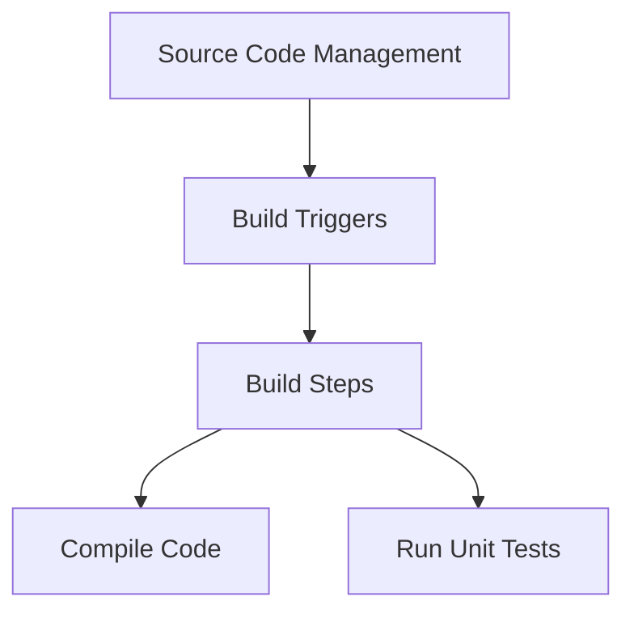
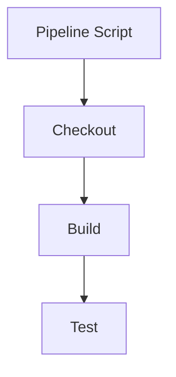

## Introduction to Jenkins Pipeline Jobs

Jenkins is one of the most widely used continuous integration and continuous delivery (CI/CD) tools in the DevOps ecosystem. Over the years, Jenkins has evolved significantly to support modern DevOps practices. One of the key advancements in Jenkins is the introduction of pipeline jobs, which provide a more flexible and powerful way to define and execute complex workflows compared to traditional freestyle jobs.

### Background Theory

Before diving into the details of pipeline jobs, let's first understand the limitations of freestyle jobs and why pipeline jobs were introduced.

#### Limitations of Freestyle Jobs

Freestyle jobs in Jenkins are configured through a user interface (UI). While this approach is straightforward for simple workflows, it becomes cumbersome and error-prone for complex scenarios. Some of the limitations include:

1. **Complexity Management**: As the number of steps in a workflow increases, managing them through the UI becomes difficult.
2. **Reusability**: Freestyle jobs lack built-in mechanisms for reusing common tasks across multiple jobs.
3. **Version Control**: Changes made through the UI are not easily version-controlled, making it hard to track changes and collaborate effectively.
4. **Scalability**: Scaling and maintaining large numbers of freestyle jobs can be challenging due to the lack of a structured definition.

#### Advantages of Pipeline Jobs

Pipeline jobs address these limitations by allowing you to define your entire workflow as code. This approach offers several benefits:

1. **Version Control**: Pipeline definitions can be stored in a version control system like Git, enabling better collaboration and change management.
2. **Reusability**: Common tasks can be defined as reusable components, reducing redundancy and improving maintainability.
3. **Flexibility**: Pipeline jobs support complex branching and looping constructs, making it easier to define sophisticated workflows.
4. **Integration**: Pipeline jobs integrate seamlessly with other Jenkins features and plugins, providing a unified experience.

### Transition from Freestyle to Pipeline Jobs

If you have been working with freestyle jobs in Jenkins, transitioning to pipeline jobs might seem daunting at first. However, the knowledge you gained from configuring freestyle jobs will be invaluable in understanding the underlying principles of Jenkins, such as plugin usage and tool execution.

#### Comparing Freestyle and Pipeline Jobs

To appreciate the advantages of pipeline jobs, let's compare them with freestyle jobs using a simple example.

##### Freestyle Job Example

Consider a freestyle job that builds a Java application and runs unit tests. The configuration might look something like this:

1. **Source Code Management**: Configure the SCM (e.g., Git) to fetch the source code.
2. **Build Triggers**: Set up triggers to start the build (e.g., on commit).
3. **Build Steps**:
   - Execute shell commands to compile the code.
   - Run unit tests using a testing framework (e.g., JUnit).

This setup is straightforward but lacks flexibility and reusability.



##### Pipeline Job Example

Now, let's define the same workflow using a pipeline job. The pipeline script might look like this:

```groovy
pipeline {
    agent any
    stages {
        stage('Checkout') {
            steps {
                git 'https://github.com/example/repo.git'
            }
        }
        stage('Build') {
            steps {
                sh 'mvn clean install'
            }
        }
        stage('Test') {
            steps {
                sh 'mvn test'
            }
        }
    }
}
```

This pipeline script is stored in a version control system and can be easily modified and shared among team members.



### Creating a Simple Pipeline Job

Let's walk through the process of creating a simple pipeline job in Jenkins.

#### Step-by-Step Guide

1. **Install Jenkins**: Ensure Jenkins is installed and running on your server.
2. **Create a New Item**: In Jenkins, click on "New Item" and name your job (e.g., `SimplePipeline`).
3. **Select Pipeline Type**: Choose "Pipeline" as the job type.
4. **Configure Pipeline Definition**: In the "Pipeline" section, select "Pipeline script" and enter the following Groovy script:

```groovy
pipeline {
    agent any
    stages {
        stage('Checkout') {
            steps {
                git 'https://github.com/example/repo.git'
            }
        }
        stage('Build') {
            steps {
                sh 'mvn clean install'
            }
        }
        stage('Test') {
            steps {
                sh 'mvn test'
            }
        }
    }
}
```

5. **Save and Run**: Save the job configuration and run it to see the pipeline in action.

#### Understanding the Pipeline Script

The pipeline script is written in Groovy, a powerful scripting language that integrates well with Jenkins. Let's break down the script:

- **agent any**: Specifies that the pipeline can run on any available agent.
- **stages**: Defines the stages of the pipeline.
  - **Checkout**: Clones the repository using the `git` step.
  - **Build**: Executes Maven commands to compile the code.
  - **Test**: Executes Maven commands to run unit tests.

### Real-World Examples and Recent Breaches

While pipeline jobs themselves are not inherently vulnerable, improper configuration or insecure practices can lead to security issues. Here are some recent examples and best practices to mitigate risks:

#### Example: CVE-2021-21234

In 2021, a critical vulnerability (CVE-2021-21234) was discovered in Jenkins, affecting versions prior to 2.289.2. This vulnerability allowed attackers to execute arbitrary code on the Jenkins server by manipulating the pipeline script.

**Impact**: An attacker could gain full control of the Jenkins server, leading to data theft, unauthorized access, and potential damage to the infrastructure.

**Prevention**:
1. **Keep Jenkins Updated**: Regularly update Jenkins to the latest version to ensure you have the latest security patches.
2. **Secure Pipeline Scripts**: Avoid using untrusted input in pipeline scripts. Validate and sanitize all inputs.
3. **Use Jenkins Credentials Plugin**: Store sensitive information securely using the Jenkins Credentials Plugin.

#### Secure Pipeline Script Example

Here’s an example of a secure pipeline script that uses credentials securely:

```groovy
pipeline {
    agent any
    environment {
        GIT_CREDENTIALS = credentials('git-credentials')
    }
    stages {
        stage('Checkout') {
            steps {
                git branch: 'main', credentialsId: env.GIT_CREDENTIALS, url: 'https://github.com/example/repo.git'
            }
        }
        stage('Build') {
            steps {
                sh 'mvn clean install'
            }
        }
        stage('Test') {
            steps {
                sh 'mvn test'
            }
        }
    }
}
```

### Common Pitfalls and Best Practices

When working with Jenkins pipeline jobs, there are several common pitfalls to avoid:

1. **Hardcoding Secrets**: Avoid hardcoding secrets in pipeline scripts. Use the Jenkins Credentials Plugin to store and manage secrets securely.
2. **Insecure Agent Configuration**: Ensure agents are properly configured and secured. Use `agent none` for multi-agent pipelines to avoid unintended execution.
3. **Improper Input Validation**: Always validate and sanitize user inputs to prevent injection attacks.

### How to Prevent / Defend

#### Detection

1. **Audit Logs**: Regularly review Jenkins audit logs to detect unauthorized access or suspicious activities.
2. **Security Scanners**: Use security scanners like SonarQube to identify vulnerabilities in pipeline scripts.

#### Prevention

1. **Least Privilege Principle**: Follow the principle of least privilege by granting minimal necessary permissions to Jenkins users and agents.
2. **Regular Updates**: Keep Jenkins and all plugins up to date with the latest security patches.
3. **Secure Coding Practices**: Implement secure coding practices in pipeline scripts to prevent common vulnerabilities.

#### Secure-Coding Fixes

Here’s an example of a vulnerable pipeline script and its secure counterpart:

**Vulnerable Script**:
```groovy
pipeline {
    agent any
    stages {
        stage('Checkout') {
            steps {
                git branch: 'main', url: 'https://github.com/${params.REPO}.git'
            }
        }
    }
}
```

**Secure Script**:
```groovy
pipeline {
    agent any
    environment {
        GIT_CREDENTIALS = credentials('git-credentials')
    }
    stages {
        stage('Checkout') {
            steps {
                script {
                    def repo = params.REPO.trim()
                    git branch: 'main', credentialsId: env.GIT_CREDENTIALS, url: "https://github.com/${repo}.git"
                }
            }
        }
    }
}
```

### Hands-On Practice

To gain practical experience with Jenkins pipeline jobs, consider the following labs:

- **PortSwigger Web Security Academy**: Offers hands-on labs to practice Jenkins security.
- **OWASP Juice Shop**: Provides a vulnerable application to practice securing CI/CD pipelines.
- **DVWA**: Another vulnerable application to practice securing Jenkins pipelines.

These labs will help you apply the concepts learned in this chapter and gain confidence in working with Jenkins pipeline jobs.

### Conclusion

Transitioning from freestyle jobs to pipeline jobs in Jenkins is a significant step towards modernizing your CI/CD processes. By leveraging the power of pipeline jobs, you can create more flexible, scalable, and secure workflows. Remember to follow best practices and regularly update your Jenkins installation to stay ahead of potential security threats.

---
<!-- nav -->
[[01-Introduction to Chaining Freestyle Jobs in Jenkins Workflows|Introduction to Chaining Freestyle Jobs in Jenkins Workflows]] | [[DevOps/DevOps Bootcamp/06-CI CD & Build Tools/11-Chaining Freestyle Jobs in Jenkins Workflows/00-Overview|Overview]] | [[03-Introduction to Jenkins Workflows and Chained Freestyle Jobs|Introduction to Jenkins Workflows and Chained Freestyle Jobs]]
