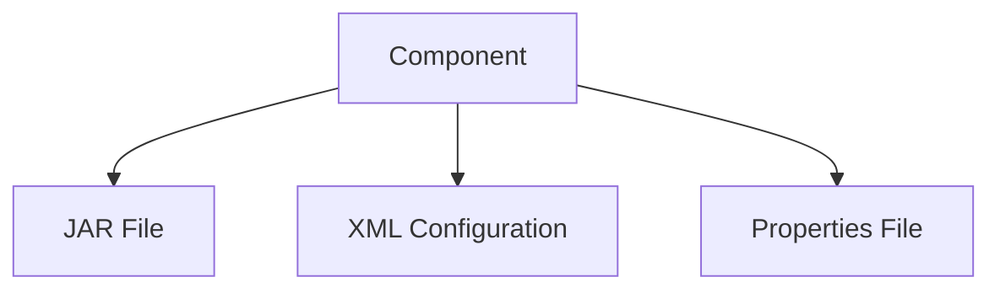
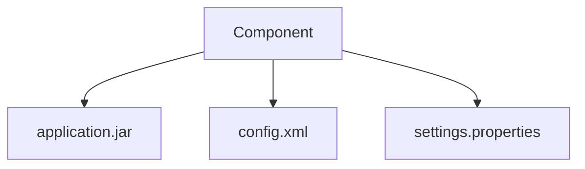

## Components and Assets in Nexus Repository Management

### Introduction to Nexus Repository Management

Nexus Repository Manager is a powerful artifact management solution used in DevOps environments to store and manage various types of software artifacts. These artifacts can range from compiled Java classes (JAR files), XML configurations, Docker images, and more. Understanding the concepts of components and assets within Nexus is crucial for effective artifact management and security.

### Components vs. Assets

In Nexus Repository Management, the terms "components" and "assets" are fundamental to organizing and managing artifacts. Let's delve into each of these concepts:

#### Components

A **component** in Nexus is an abstract, high-level definition of what you are uploading. Think of it as a logical grouping of related artifacts. For instance, if you have built an application, the entire application can be considered a component. Each component typically contains multiple assets, which are the individual files that make up the component.

**Why Components Matter:**
- **Organization:** Components help organize artifacts logically, making it easier to manage and locate specific files.
- **Versioning:** Components often have version numbers, allowing you to track different versions of your application or library.
- **Dependency Management:** Components can be dependencies for other components, facilitating dependency resolution in build systems.

**Example:**
Consider a Java application that consists of several JAR files, XML configuration files, and properties files. All these files together form a component.



#### Assets

An **asset** is a physical package or file that belongs to a component. Assets are the actual files that are uploaded to Nexus. They can include JAR files, XML files, properties files, Docker images, and more.

**Why Assets Matter:**
- **Granularity:** Assets provide a granular view of the files that make up a component.
- **Individual Access:** Assets can be accessed individually, which is useful for downloading specific files or for dependency resolution.
- **Versioning:** Each asset can have its own version, allowing for fine-grained control over updates and changes.

**Example:**
For a Java application component, the assets might include `application.jar`, `config.xml`, and `settings.properties`.



### Structure of Components and Assets

When you upload artifacts to Nexus, they are organized in a hierarchical structure. The top-level folders represent components, and within each component folder, you will find subfolders and files representing the assets.

**Example Structure:**

```
Snapshots/
  com.example/
    myapp/
      1.0-SNAPSHOT/
        application.jar
        config.xml
        settings.properties
```

In this example:
- `com.example/myapp` is the component.
- `1.0-SNAPSHOT` is the version.
- `application.jar`, `config.xml`, and `settings.properties` are the assets.

### Querying Components and Assets via Nexus API

Nexus provides an API that allows you to interact with components and assets programmatically. When you query the Nexus API, you receive a list of components, and each component has its own object containing a list of assets.

**Example API Response:**

```json
{
  "components": [
    {
      "name": "myapp",
      "version": "1.0-SNAPSHOT",
      "assets": [
        {
          "name": "application.jar",
          "path": "/com/example/myapp/1.0-SNAPSHOT/application.jar"
        },
        {
          "name": "config.xml",
          "path": "/com/example/myapp/1.0-SNAPSHOT/config.xml"
        },
        {
          "name": "settings.properties",
          "path": "/com/example/myapp/1.0-SNAPSHOT/settings.properties"
        }
      ]
    }
  ]
}
```

### Docker Repository Handling

Docker repositories handle components and assets differently. In Docker, assets are referred to as **layers**, and each layer has a unique identifier. This unique identifier ensures that each layer is immutable and can be shared across multiple images.

**Example Docker Layer Structure:**

```
docker/
  myimage/
    sha256:abc123/
      layer.tar
    sha256:def456/
      layer.tar
```

In this example:
- `myimage` is the component.
- `sha256:abc123` and `sha256:def456` are unique identifiers for the layers (assets).

### Real-World Examples and Security Implications

Understanding the structure and handling of components and assets is crucial for security. Recent vulnerabilities and breaches have highlighted the importance of proper artifact management.

#### Example: CVE-2021-44228 (Log4Shell)

The Log4Shell vulnerability (CVE-2021-44228) affected many Java applications due to the inclusion of vulnerable Log4j libraries. Proper management of components and assets in Nexus would have helped identify and mitigate this issue.

**Secure Coding Fix:**

Vulnerable Code:
```java
import org.apache.logging.log4j.LogManager;
import org.apache.logging.log4j.Logger;

public class MyApplication {
    private static final Logger logger = LogManager.getLogger(MyApplication.class);

    public void logMessage(String message) {
        logger.info(message);
    }
}
```

Fixed Code:
```java
import org.apache.logging.log4j.LogManager;
import org.apache.logging.log4j.Logger;

public class MyApplication {
    private static final Logger logger = LogManager.getLogger(MyApplication.class);

    public void logMessage(String message) {
        logger.info("{}", message); // Use parameterized logging
    }
}
```

### How to Prevent / Defend

#### Detection

To detect vulnerabilities in your components and assets, you can use tools like Sonatype Nexus Lifecycle, which integrates with Nexus Repository Manager to scan for known vulnerabilities.

**Example Scan Result:**

```json
{
  "vulnerabilities": [
    {
      "component": "log4j",
      "version": "2.14.1",
      "severity": "CRITICAL",
      "cve": "CVE-2021-44228",
      "description": "Apache Log4j2 JNDI feature used by default without protection"
    }
  ]
}
```

#### Prevention

To prevent vulnerabilities, ensure that all components and assets are regularly scanned and updated. Implement a process for reviewing and approving new components before they are added to your repository.

**Secure Configuration:**

```yaml
# nexus-repository-config.yaml
repositories:
  - id: snapshots
    type: maven2
    browseable: true
    storage:
      blobStoreName: default
      strictContentValidation: true
      writePolicy: allow_once
    cleanup:
      policies:
        - name: delete-old-versions
          rules:
            - condition: olderThan
              value: 30d
              action: delete
```

### Conclusion

Understanding the concepts of components and assets in Nexus Repository Management is essential for effective artifact management and security. By properly organizing and managing your artifacts, you can ensure that your applications are secure and up-to-date. Regular scanning and updating of components and assets are key to maintaining a secure environment.

### Practice Labs

For hands-on practice with Nexus Repository Management, consider the following labs:
- **PortSwigger Web Security Academy:** Offers modules on securing web applications, including artifact management.
- **OWASP Juice Shop:** A deliberately insecure web application for practicing web security techniques.
- **DVWA (Damn Vulnerable Web Application):** A PHP/MySQL web application that is riddled with vulnerabilities for educational purposes.

These labs provide practical experience in managing and securing artifacts in a DevOps environment.

---
<!-- nav -->
[[DevOps/DevOps Bootcamp/06-CI CD & Build Tools/12-Components and Assets in Nexus Repository Management/00-Overview|Overview]] | [[DevOps/DevOps Bootcamp/06-CI CD & Build Tools/12-Components and Assets in Nexus Repository Management/02-Practice Questions & Answers|Practice Questions & Answers]]
