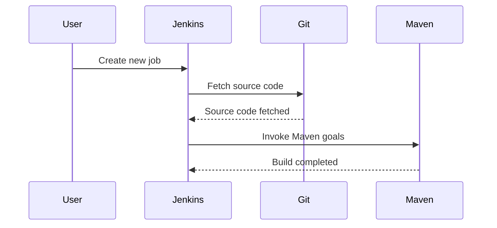
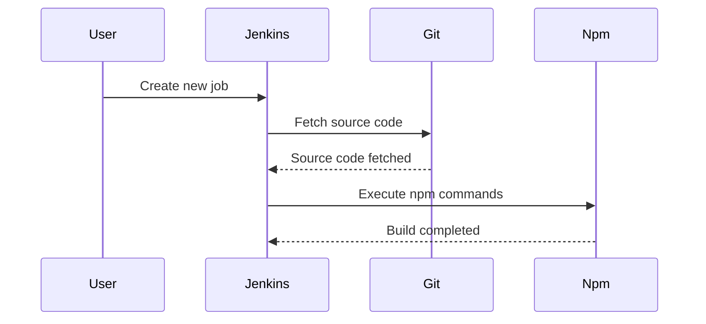
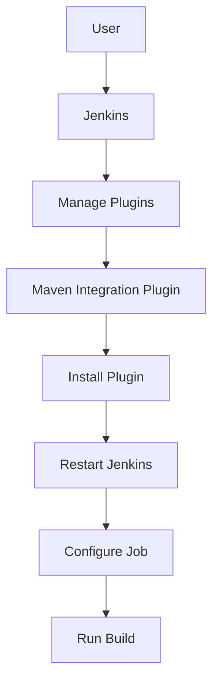

## Configuring Build Tools in Jenkins Jobs

### Introduction to Jenkins Jobs

Jenkins is a widely used open-source automation server that provides continuous integration and continuous delivery (CI/CD) services. One of the primary tasks in Jenkins is to create jobs that automate the testing and building workflows of applications. These jobs can be configured to run various build tools such as Maven for Java applications and npm for Node.js applications.

### Creating a Job for a Java Maven Application

#### Background Theory

Maven is a popular build automation tool primarily used for Java projects. It manages project builds, dependencies, and documentation using a Project Object Model (POM) file. Maven simplifies the build process by providing a standardized directory structure and lifecycle phases.

#### Step-by-Step Mechanics

To create a Jenkins job for a Java Maven application:

1. **Create a New Job**:
    - Log in to your Jenkins instance.
    - Click on "New Item".
    - Enter a name for your job (e.g., `JavaMavenApp`).
    - Select "Freestyle project" and click "OK".

2. **Configure Source Code Management**:
    - Under "Source Code Management", select "Git".
    - Enter the repository URL and credentials if required.
    - Specify the branch to build (e.g., `*/main`).

3. **Add Build Steps**:
    - Scroll down to the "Build" section.
    - Click "Add build step" and select "Invoke top-level Maven targets".
    - In the "Goals" field, enter `clean test package`.

4. **Save and Run the Job**:
    - Click "Save".
    - Click "Build Now" to trigger the job.

#### Complete Example



#### Common Pitfalls

- **Incorrect Maven Goals**: Ensure that the goals specified in the job match the desired build steps.
- **Missing Dependencies**: Ensure that all required dependencies are included in the POM file.

#### How to Prevent / Defend

- **Validate POM File**: Regularly review the POM file to ensure all dependencies are correctly specified.
- **Automated Testing**: Implement automated testing to catch issues early.

### Creating a Job for a Node.js Application

#### Background Theory

Node.js is a JavaScript runtime built on Chrome's V8 JavaScript engine. npm (Node Package Manager) is the default package manager for Node.js. It allows developers to manage project dependencies and run scripts defined in the `package.json` file.

#### Step-by-Step Mechanics

To create a Jenkins job for a Node.js application:

1. **Create a New Job**:
    - Log in to your Jenkins instance.
    - Click on "New Item".
    - Enter a name for your job (e.g., `NodeJSApp`).
    - Select "Freestyle project" and click "OK".

2. **Configure Source Code Management**:
    - Under "Source Code Management", select "Git".
    - Enter the repository URL and credentials if required.
    - Specify the branch to build (e.g., `*/main`).

3. **Add Build Steps**:
    - Scroll down to the "Build" section.
    - Click "Add build step" and select "Execute shell".
    - In the command field, enter:
      ```sh
      npm install
      npm test
      npm pack
      ```

4. **Save and Run the Job**:
    - Click "Save".
    - Click "Build Now" to trigger the job.

#### Complete Example



#### Common Pitfalls

- **Incorrect npm Commands**: Ensure that the commands specified in the job match the desired build steps.
- **Missing Dependencies**: Ensure that all required dependencies are included in the `package.json` file.

#### How to Prevent / Defend

- **Validate package.json**: Regularly review the `package.json` file to ensure all dependencies are correctly specified.
- **Automated Testing**: Implement automated testing to catch issues early.

### Configuring Build Tools in Jenkins

#### Plugins vs. Direct Installation

There are two primary methods to configure build tools in Jenkins:

1. **Plugins**:
    - **Ease of Use**: Plugins provide a simple way to integrate build tools into Jenkins.
    - **Installation**:
        - Navigate to "Manage Jenkins" > "Manage Plugins".
        - Search for the required plugin (e.g., Maven Integration Plugin, NodeJS Plugin).
        - Install the plugin and restart Jenkins if necessary.
    - **Usage**:
        - Once installed, the plugin can be configured in the global settings or individual jobs.

2. **Direct Installation**:
    - **Customization**: Direct installation allows for more customization and control over the build environment.
    - **Installation**:
        - SSH into the Jenkins server.
        - Install the required tools (e.g., Maven, Node.js) using package managers like `apt`, `yum`, or `brew`.
    - **Configuration**:
        - Set up environment variables and paths as needed.
        - Configure the build steps in Jenkins to use the installed tools.

#### Complete Example



#### Common Pitfalls

- **Plugin Compatibility**: Ensure that the installed plugins are compatible with the Jenkins version.
- **Environment Variables**: Ensure that environment variables are correctly set up for direct installations.

#### How to Prevent / Defend

- **Regular Updates**: Keep Jenkins and plugins updated to the latest versions.
- **Documentation Review**: Regularly review the documentation for the installed tools and plugins.

### Real-World Examples

#### Recent CVEs and Breaches

- **CVE-2021-21830**: This vulnerability affected Jenkins Pipeline and allowed attackers to execute arbitrary code. Ensure that Jenkins and all plugins are kept up-to-date to mitigate such risks.
- **Breaches**: Several high-profile breaches have occurred due to misconfigured Jenkins instances. Proper configuration and regular audits can help prevent such incidents.

#### Secure Configuration

- **Access Control**: Implement strict access controls and authentication mechanisms.
- **Regular Audits**: Conduct regular security audits to identify and mitigate vulnerabilities.

### Practice Labs

For hands-on practice with configuring build tools in Jenkins, consider the following labs:

- **PortSwigger Web Security Academy**: Offers comprehensive labs on web application security, including Jenkins.
- **OWASP Juice Shop**: Provides a vulnerable web application for practicing security testing and CI/CD pipelines.
- **DVWA (Damn Vulnerable Web Application)**: Useful for learning about web application security and integrating with Jenkins.

By following these detailed steps and best practices, you can effectively configure build tools in Jenkins to automate your application's testing and building workflows securely and efficiently.

---
<!-- nav -->
[[DevOps/DevOps Bootcamp/06-CI CD & Build Tools/13-Configuring Build Tools in Jenkins Jobs/00-Overview|Overview]] | [[DevOps/DevOps Bootcamp/06-CI CD & Build Tools/13-Configuring Build Tools in Jenkins Jobs/02-Practice Questions & Answers|Practice Questions & Answers]]
