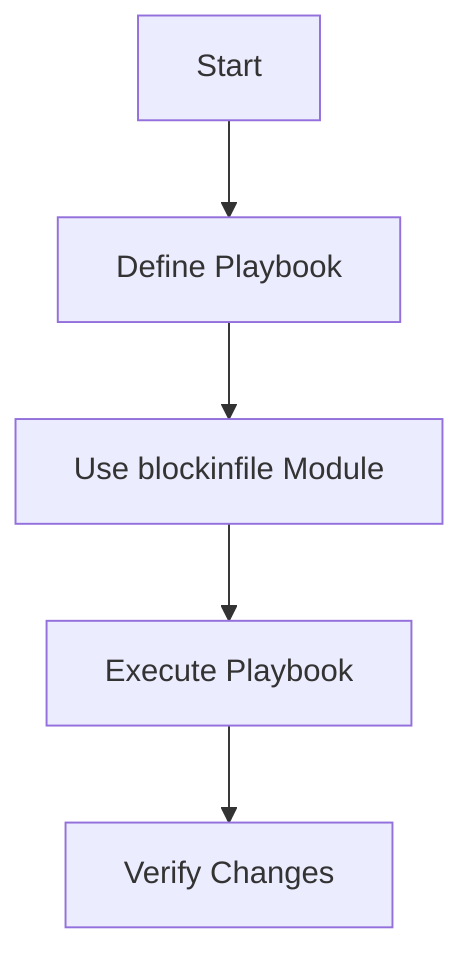

## Introduction to Ansible and Configuration Management

Ansible is an open-source automation tool used for configuration management, application deployment, and task automation. It uses a simple language called YAML to define tasks and configurations. In this chapter, we will focus on using Ansible to manage user and group ownership in a Nexus repository manager setup. We will cover the necessary concepts, steps, and practical examples to ensure a deep understanding of the process.

### Background Theory

Configuration management tools like Ansible help maintain consistency across multiple servers and environments. They allow administrators to define desired states and automate the processes to achieve those states. Ansible operates using playbooks, which are collections of tasks defined in YAML format.

#### Playbooks and Tasks

A playbook in Ansible consists of one or more plays. Each play targets a specific set of hosts and defines a series of tasks to be executed on those hosts. Tasks are the individual actions performed by Ansible, such as creating files, modifying configurations, or installing packages.

#### Modules in Ansible

Ansible provides a wide range of modules to perform various tasks. These modules encapsulate the logic required to interact with different systems and services. For example, the `blockinfile` module is used to insert or update a block of text within a file.

### Setting Up Nexus User and Group Ownership

In this section, we will walk through the process of setting up a Nexus user and group ownership using Ansible. We will use the `blockinfile` module to modify the `Nexus.RC` file.

#### Step-by-Step Process

1. **Define the Playbook Structure**
2. **Use the `blockinfile` Module**
3. **Execute the Playbook**
4. **Verify the Changes**

### Define the Playbook Structure

First, we need to create a playbook that defines the tasks to be executed. The playbook will target the Nexus server and specify the tasks to modify the `Nexus.RC` file.

```yaml
---
- name: Configure Nexus User and Group Ownership
  hosts: nexus_server
  become: yes
  tasks:
    - name: Set run as user Nexus
      blockinfile:
        path: /opt/nexus/bin/nexus.rc
        block: |
          RUN_AS_USER=nexus
```

### Use the `blockinfile` Module

The `blockinfile` module is used to insert or update a block of text within a file. Here’s a detailed breakdown of the parameters:

- **path**: Specifies the path to the file where the block should be inserted.
- **block**: Contains the block of text to be inserted into the file.

#### Example Code Block

```yaml
blockinfile:
  path: /opt/nexus/bin/nexus.rc
  block: |
    RUN_AS_USER=nexus
```

This code block inserts the line `RUN_AS_USER=nexus` into the `/opt/nexus/bin/nexus.rc` file.

### Execute the Playbook

To execute the playbook, use the following command:

```sh
ansible-playbook configure_nexus_user.yml
```

### Verify the Changes

After executing the playbook, verify that the changes have been applied correctly. Check the `nexus.rc` file to ensure the line `RUN_AS_USER=nexus` has been added.

```sh
cat /opt/nexus/bin/nexus.rc
```

### Full Example with Raw HTTP Messages

While this example does not involve HTTP messages directly, we can illustrate the process using a hypothetical scenario where the configuration is managed via an API.

#### Hypothetical HTTP Request

```http
PUT /api/v1/configurations/nexus/rc HTTP/1.1
Host: nexus.example.com
Content-Type: application/json

{
  "content": "RUN_AS_USER=nexus"
}
```

#### Hypothetical HTTP Response

```http
HTTP/1.1 200 OK
Content-Type: application/json

{
  "message": "Configuration updated successfully",
  "data": {
    "content": "RUN_AS_USER=nexus"
  }
}
```

### Mermaid Diagrams

#### Task Execution Flow



### Pitfalls and Common Mistakes

1. **Incorrect File Path**: Ensure the path specified in the `blockinfile` module is correct.
2. **Permissions Issues**: Make sure the Ansible user has the necessary permissions to modify the file.
3. **Overwriting Existing Content**: Be cautious when modifying existing files to avoid overwriting important configurations.

### How to Prevent / Defend

#### Detection

Regularly audit the configuration files to ensure they match the expected state. Use tools like `diff` to compare the current state with the desired state.

#### Prevention

1. **Version Control**: Store configuration files in a version control system like Git to track changes.
2. **Automated Testing**: Implement automated tests to validate the configuration after changes.

#### Secure Coding Fixes

**Vulnerable Code**

```yaml
blockinfile:
  path: /opt/nexus/bin/nexus.rc
  block: |
    RUN_AS_USER=nexus
```

**Secure Code**

```yaml
blockinfile:
  path: /opt/nexus/bin/nexus.rc
  block: |
    RUN_AS_USER=nexus
  backup: yes
  create: yes
```

Adding `backup: yes` ensures that a backup of the original file is created before making changes. Adding `create: yes` ensures that the file is created if it does not exist.

### Real-World Examples

#### Recent CVEs and Breaches

Consider a scenario where a misconfiguration in the `nexus.rc` file led to unauthorized access. For example, if the `RUN_AS_USER` was set to a less privileged user, it could lead to security vulnerabilities.

#### Example CVE

CVE-2021-44228 (Log4j vulnerability) could have been exploited if the Nexus server was improperly configured. Ensuring proper user and group ownership helps mitigate such risks.

### Practice Labs

For hands-on practice, consider the following labs:

- **PortSwigger Web Security Academy**: Offers exercises related to web application security.
- **OWASP Juice Shop**: Provides a vulnerable web application for practicing security testing.
- **DVWA (Damn Vulnerable Web Application)**: Another popular platform for learning web application security.

These labs provide a controlled environment to practice and understand the concepts covered in this chapter.

### Conclusion

By following the steps outlined in this chapter, you can effectively use Ansible to manage user and group ownership in a Nexus repository manager setup. Understanding the underlying concepts, potential pitfalls, and best practices will help you maintain a secure and consistent environment.

---
<!-- nav -->
[[01-Introduction to Ansible Modules for File Management|Introduction to Ansible Modules for File Management]] | [[DevOps/DevOps Bootcamp/06-CI CD & Build Tools/14-Create Nexus User And Group Ownership/00-Overview|Overview]] | [[03-Introduction to DevOps Automation with Ansible|Introduction to DevOps Automation with Ansible]]
