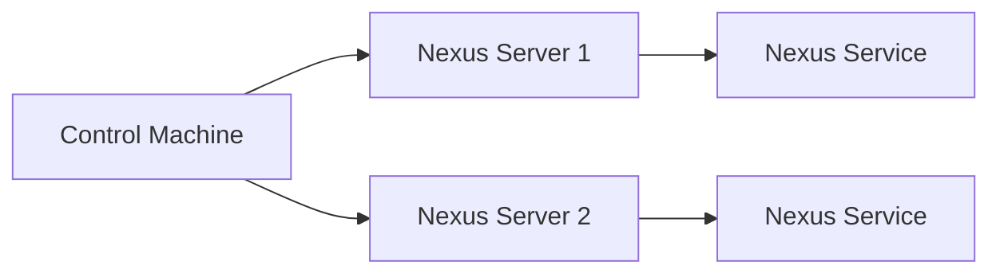
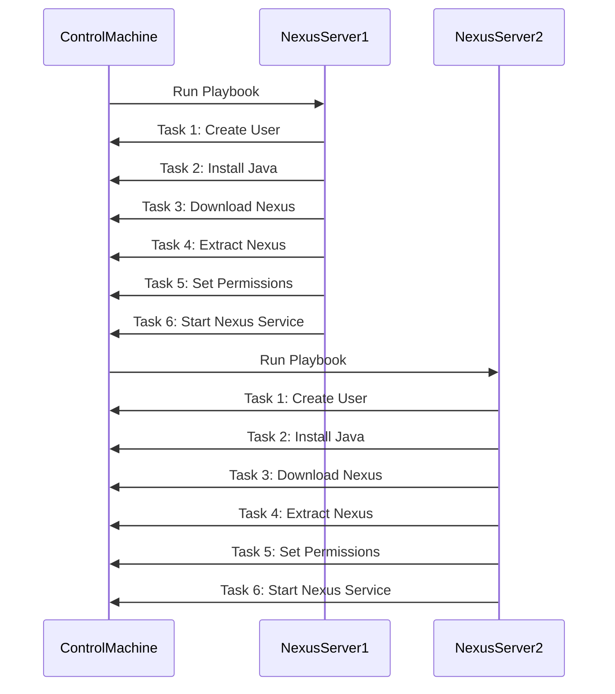

## Introduction to DevOps Automation with Ansible

In the realm of DevOps, automation is key to maintaining efficiency and consistency across multiple servers. One of the most popular tools for automating server configurations is Ansible. Ansible allows you to define infrastructure as code, which means you can describe your server configurations in a series of scripts and playbooks. This approach ensures that your configurations are repeatable and consistent, reducing the likelihood of human error.

### What is Ansible?

Ansible is an open-source automation tool that simplifies the process of configuring and managing servers. It uses a simple language called YAML to define tasks and plays. These plays can be grouped into playbooks, which are essentially collections of tasks that can be executed on one or more servers.

#### Why Use Ansible?

1. **Consistency**: By defining your server configurations in code, you ensure that all servers are configured identically. This reduces the chances of configuration drift, where different servers end up with slightly different settings.
   
2. **Efficiency**: With Ansible, you can automate repetitive tasks such as installing software, configuring services, and deploying applications. This saves time and effort, especially when managing large numbers of servers.

3. **Scalability**: Ansible can easily scale from managing a single server to managing thousands of servers. This makes it ideal for both small and large organizations.

4. **Idempotence**: Ansible tasks are idempotent, meaning that running them multiple times will not change the outcome. This ensures that your configurations remain stable and predictable.

### Setting Up Nexus with Ansible

Let's dive into a practical example of setting up Nexus, a popular artifact repository manager, using Ansible. We'll cover the steps involved in creating a user, installing Java, configuring Nexus, and starting the Nexus application.

#### Prerequisites

Before we begin, ensure that you have the following:

1. **Ansible Installed**: Install Ansible on your control machine. You can install it using `pip`:
    ```bash
    pip install ansible
    ```

2. **Inventory File**: Create an inventory file (`hosts`) that lists the IP addresses of the servers you want to configure. For example:
    ```ini
    [nexus_servers]
    192.168.1.10
    192.168.1.11
    ```

3. **SSH Access**: Ensure that you have SSH access to the target servers. This typically involves setting up SSH keys for passwordless authentication.

### Creating a User and Installing Java

The first step is to create a user and install Java on the target servers. This can be done using an Ansible playbook.

#### Playbook Structure

An Ansible playbook consists of one or more plays. Each play defines a set of tasks to be performed on a group of hosts. Here’s a basic structure of a playbook:

```yaml
---
- name: Setup Nexus
  hosts: nexus_servers
  become: yes
  tasks:
    - name: Create Nexus user
      user:
        name: nexus
        shell: /bin/bash
        state: present

    - name: Install Java
      apt:
        name: default-jdk
        state: present
```

This playbook performs two main tasks:

1. **Create Nexus User**: The `user` module creates a user named `nexus`.
2. **Install Java**: The `apt` module installs the `default-jdk` package, which provides the Java Development Kit.

#### Executing the Playbook

To run the playbook, use the following command:

```bash
ansible-playbook -i hosts setup_nexus.yml
```

This command tells Ansible to use the `hosts` inventory file and execute the `setup_nexus.yml` playbook.

### Configuring Nexus

Once the user and Java are installed, the next step is to configure Nexus. This involves downloading the Nexus binary, extracting it, and setting up the necessary directories and permissions.

#### Downloading and Extracting Nexus

We can use the `get_url` module to download the Nexus binary and the `unarchive` module to extract it.

```yaml
- name: Download Nexus
  get_url:
    url: https://download.sonatype.com/nexus/3/latest-unix.tar.gz
    dest: /tmp/nexus-latest-unix.tar.gz

- name: Extract Nexus
  unarchive:
    src: /tmp/nexus-latest-unix.tar.gz
    dest: /opt/
    remote_src: yes
```

#### Setting Up Directories and Permissions

Next, we need to set up the necessary directories and permissions for Nexus.

```yaml
- name: Create Nexus data directory
  file:
    path: /var/lib/nexus
    state: directory
    owner: nexus
    group: nexus
    mode: '0755'

- name: Set ownership of Nexus installation
  file:
    path: /opt/nexus-*
    owner: nexus
    group: nexus
    recurse: yes
```

### Starting Nexus

Finally, we need to start the Nexus service. This can be done using the `service` module.

```yaml
- name: Start Nexus service
  service:
    name: nexus
    state: started
    enabled: yes
```

### Complete Playbook

Here’s the complete playbook that combines all the steps:

```yaml
---
- name: Setup Nexus
  hosts: nexus_servers
  become: yes
  tasks:
    - name: Create Nexus user
      user:
        name: nexus
        shell: /bin/bash
        state: present

    - name: Install Java
      apt:
        name: default-jdk
        state: present

    - name: Download Nexus
      get_url:
        url: https://download.sonatype.com/nexus/3/latest-unix.tar.gz
        dest: /tmp/nexus-latest-unix.tar.gz

    - name: Extract Nexus
      unarchive:
        src: /tmp/n
```

### Handling Dynamic IP Addresses

One of the challenges in managing servers is dealing with dynamic IP addresses. When a new server is created, it often gets a new IP address. Managing these changes manually can be inefficient and error-prone.

#### Using Variables for Dynamic IPs

To handle dynamic IP addresses, Ansible allows you to use variables in your playbooks. Instead of hardcoding IP addresses, you can define them as variables and update them as needed.

For example, you can define a variable for the IP address in your inventory file:

```ini
[nexus_servers]
{{ nexus_ip }} ansible_host={{ nexus_ip }}
```

Then, in your playbook, you can reference this variable:

```yaml
- name: Setup Nexus
  hosts: nexus_servers
  become: yes
  vars:
    nexus_ip: 192.168.1.10
  tasks:
    - name: Create Nexus user
      user:
        name: nexus
        shell: /bin/bash
        state: present
```

By using variables, you can easily update the IP address without having to modify the playbook itself.

### How to Prevent / Defend

#### Detection

To detect misconfigurations or unauthorized changes, you can use Ansible's built-in features such as `check_mode`. This allows you to run a playbook in a dry-run mode to see what changes would be made without actually making them.

```bash
ansible-playbook -i hosts setup_nexus.yml --check
```

Additionally, you can use tools like `ansible-vault` to encrypt sensitive information in your playbooks and inventory files.

#### Prevention

To prevent unauthorized changes, you can implement strict access controls and use role-based access control (RBAC) to limit who can run Ansible playbooks. Additionally, you can use version control systems like Git to manage your playbooks and track changes.

#### Secure Coding Fixes

Here’s an example of a vulnerable playbook and its secure version:

**Vulnerable Playbook:**

```yaml
---
- name: Setup Nexus
  hosts: nexus_servers
  become: yes
  tasks:
    - name: Create Nexus user
      user:
        name: nexus
        shell: /bin/bash
        state: present
```

**Secure Playbook:**

```yaml
---
- name: Setup Nexus
  hosts: nexus_servers
  become: yes
  vars:
    nexus_ip: 192.168.1.10
  tasks:
    - name: Create Nexus user
      user:
        name: nexus
        shell: /bin/bash
        state: present
```

### Conclusion

Using Ansible to automate server configurations provides significant benefits in terms of consistency, efficiency, and scalability. By following best practices and implementing proper security measures, you can ensure that your configurations remain secure and reliable.

### Practice Labs

For hands-on practice with Ansible and Nexus, consider the following labs:

- **PortSwigger Web Security Academy**: Offers a variety of labs related to web application security, including some that involve configuring and securing servers.
- **OWASP Juice Shop**: A deliberately insecure web application for practicing web security skills.
- **DVWA (Damn Vulnerable Web Application)**: Another popular web application for learning web security.
- **WebGoat**: An interactive training application designed to teach web application security.

These labs provide a practical way to apply the concepts learned in this chapter and gain hands-on experience with Ansible and Nexus.

### Diagrams

#### Network Topology



#### Playbook Execution Flow



### Summary

In this chapter, we covered the basics of using Ansible to automate server configurations, specifically focusing on setting up Nexus. We discussed the importance of automation, the steps involved in creating a user, installing Java, configuring Nexus, and starting the service. We also explored how to handle dynamic IP addresses and provided a comprehensive guide on how to prevent and detect misconfigurations. Finally, we suggested some practice labs to help you gain hands-on experience with Ansible and Nexus.

---
<!-- nav -->
[[02-Introduction to Ansible and Configuration Management|Introduction to Ansible and Configuration Management]] | [[DevOps/DevOps Bootcamp/06-CI CD & Build Tools/14-Create Nexus User And Group Ownership/00-Overview|Overview]] | [[04-Introduction to DevOps and Nexus|Introduction to DevOps and Nexus]]
