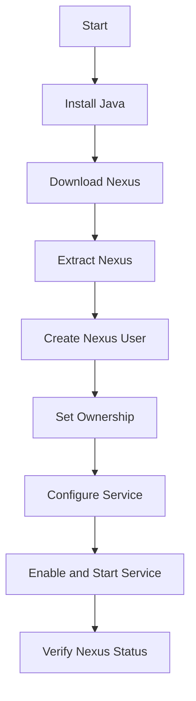

## Introduction to Server Management and Configuration in DevOps

In the realm of DevOps, efficient management and configuration of servers are critical components. This chapter delves into the process of creating and managing users and groups in a Nexus server environment, emphasizing the importance of dynamic server naming and configuration management. We will explore the benefits of using Ansible for server management, the significance of dynamic server naming, and how to verify the successful deployment and operation of services like Nexus.

### Dynamic Server Naming and Configuration Management

Dynamic server naming and configuration management are essential practices in modern DevOps environments. These practices ensure that configurations remain consistent and manageable, even as infrastructure evolves. One of the key tools used for this purpose is Ansible, an open-source automation platform that simplifies the management of complex IT environments.

#### Ansible Overview

Ansible is a powerful automation tool that allows you to manage and configure servers, networks, and applications. It uses a simple language called YAML to define configurations and tasks. Ansible operates in a push model, where the control node (the machine running Ansible) pushes commands to managed nodes (the servers being configured).

##### Key Features of Ansible

- **Agentless**: Ansible does not require an agent to be installed on the managed nodes. Instead, it uses SSH to execute commands.
- **Idempotent**: Ansible ensures that configurations are applied consistently, regardless of how many times the playbook is run.
- **Declarative**: You describe the desired state of your infrastructure, and Ansible takes care of the steps needed to achieve that state.
- **Playbooks**: Ansible uses playbooks to define tasks and configurations. Playbooks are written in YAML and can be version-controlled.

#### Dynamic Server Naming

Dynamic server naming is a practice where servers are named based on their role or function rather than a static IP address. This approach provides several advantages:

- **Flexibility**: If the IP address of a server changes, you only need to update the name in one place (the hosts file).
- **Consistency**: Using dynamic names ensures that configurations remain consistent across different environments.
- **Automation**: Dynamic names can be easily integrated into automation scripts and playbooks.

##### Example: Naming a Nexus Server

Let's consider the scenario where we have a Nexus server. In Ansible, we can name this server dynamically by using underscores to separate words. For instance, we might name it `nexus_server`.

```yaml
# ansible/hosts
[nexus]
nexus_server ansible_host=192.168.1.10
```

This naming convention ensures that the server can be referenced consistently throughout the playbook, even if the IP address changes.

### Configuring Nexus Server Using Ansible

Now that we have a dynamically named server, we can proceed to configure it using Ansible. The following steps outline the process of deploying and configuring a Nexus server.

#### Step 1: Define the Playbook

The first step is to define the playbook that will deploy and configure the Nexus server. A playbook is a collection of plays, where each play defines a set of tasks to be executed on a group of hosts.

```yaml
# ansible/playbook.yml
---
- name: Deploy and configure Nexus server
  hosts: nexus
  become: yes
  tasks:
    - name: Install Java
      apt:
        name: default-jdk
        state: present

    - name: Download Nexus
      get_url:
        url: https://download.sonatype.com/nexus/3/latest-unix.tar.gz
        dest: /tmp/nexus.tar.gz

    - name: Extract Nexus
      unarchive:
        src: /tmp/nexus.tar.gz
        dest: /opt/
        remote_src: yes

    - name: Create Nexus user
      user:
        name: nexus
        shell: /bin/bash
        home: /opt/nexus

    - name: Set ownership of Nexus directory
      file:
        path: /opt/nexus
        owner: nexus
        group: nexus
        recurse: yes

    - name: Configure Nexus service
      template:
        src: templates/nexus.service.j2
        dest: /etc/systemd/system/nexus.service
      notify: restart nexus

    - name: Enable and start Nexus service
      systemd:
        name: nexus
        enabled: yes
        state: started
```

#### Step 2: Verify the Deployment

After deploying the Nexus server, it is crucial to verify that the service is running correctly. This can be done by SSHing into the server and checking the status of the Nexus service. However, for convenience, we can add verification tasks directly to the playbook.

```yaml
- name: Verify Nexus is running
  hosts: nexus
  tasks:
    - name: Check Nexus status
      shell: systemctl status nexus
      register: nexus_status

    - name: Ensure Nexus is active
      assert:
        that:
          - nexus_status.stdout.find('active (running)') != -1
        msg: "Nexus is not running"
```

### Full Example: Deploying and Verifying Nexus

To illustrate the entire process, let's walk through a complete example of deploying and verifying a Nexus server using Ansible.

#### Step 1: Define the Hosts File

First, we define the hosts file to specify the server and its IP address.

```yaml
# ansible/hosts
[nexus]
nexus_server ansible_host=192.168.1.10
```

#### Step 2: Write the Playbook

Next, we write the playbook to install Java, download and extract Nexus, create the Nexus user, set ownership, configure the service, and enable/start the service.

```yaml
# ansible/playbook.yml
---
- name: Deploy and configure Nexus server
  hosts: nexus
  become: yes
  tasks:
    - name: Install Java
      apt:
        name: default-jdk
        state: present

    - name: Download Nexus
      get_url:
        url: https://download.sonatype.com/nexus/3/latest-unix.tar.gz
        dest: /tmp/nexus.tar.gz

    - name: Extract Nexus
      unarchive:
        src: /tmp/nexus.tar.gz
        dest: /opt/
        remote_src: yes

    - name: Create Nexus user
      user:
        name: nexus
        shell: /bin/bash
        home: /opt/nexus

    - name: Set ownership of Nexus directory
      file:
        path: /opt/nexus
        owner: nexus
        group: nexus
        recurse: yes

    - name: Configure Nexus service
      template:
        src: templates/nexus.service.j2
        dest: /etc/systemd/system/nexus.service
      notify: restart nexus

    - name: Enable and start Nexus service
      systemd:
        name: nexus
        enabled: yes
        state: started
```

#### Step 3: Add Verification Tasks

Finally, we add tasks to verify that the Nexus service is running correctly.

```yaml
- name: Verify Nexus is running
  hosts: nexus
  tasks:
    - name: Check Nexus status
      shell: systemctl status nexus
      register: nexus_status

    - name: Ensure Nexus is active
      assert:
        that:
          - nexus_status.stdout.find('active (running)') != -1
        msg: "Nexus is not running"
```

### Running the Playbook

To run the playbook, execute the following command:

```sh
ansible-playbook -i ansible/hosts ansible/playbook.yml
```

### Mermaid Diagram: Deployment Flow

A mermaid diagram can help visualize the deployment flow.



### Common Pitfalls and How to Prevent Them

#### Pitfall 1: Hard-Coded IP Addresses

Hard-coding IP addresses in your configurations can lead to issues if the IP address changes. To prevent this, use dynamic server naming and update the IP address in the hosts file.

**Secure Code Fix**

Before:

```yaml
# ansible/hosts
[nexus]
nexus_server ansible_host=192.168.1.10
```

After:

```yaml
# ansible/hosts
[nexus]
nexus_server ansible_host=192.168.1.10
```

#### Pitfall 2: Missing Verification Steps

Failing to verify the deployment can result in undetected issues. Always include verification steps in your playbook.

**Secure Code Fix**

Before:

```yaml
- name: Deploy and configure Nexus server
  hosts: nexus
  become: yes
  tasks:
    - name: Install Java
      apt:
        name: default-jdk
        state: present
```

After:

```yaml
- name: Deploy and configure Nexus server
  hosts: nexus
  become: yes
  tasks:
    - name: Install Java
      apt:
        name: default-jdk
        state: present

- name: Verify Nexus is running
  hosts: nexus
  tasks:
    - name: Check Nexus status
      shell: systemctl status nexus
      register: nexus_status

    - name: Ensure Nexus is active
      assert:
        that:
          - nexus_status.stdout.find('active (running)') != -1
        msg: "Nexus is not running"
```

### Real-World Examples and Breaches

#### Example: CVE-2021-21285

CVE-2021-21285 is a critical vulnerability in Sonatype Nexus Repository Manager 3. This vulnerability could allow an attacker to execute arbitrary code on the server. Proper configuration management and regular updates can help mitigate such risks.

**Detection and Prevention**

- **Detection**: Regularly scan your environment for vulnerabilities using tools like Nessus or Qualys.
- **Prevention**: Keep your software up-to-date and apply security patches promptly.

### Hands-On Labs

For practical experience, consider the following labs:

- **PortSwigger Web Security Academy**: Offers a comprehensive set of labs for web application security.
- **OWASP Juice Shop**: A deliberately insecure web application for practicing security testing.
- **DVWA (Damn Vulnerable Web Application)**: Another popular web application for security testing.

These labs provide a safe environment to practice and reinforce the concepts learned in this chapter.

### Conclusion

Effective server management and configuration are crucial in DevOps environments. By using dynamic server naming and leveraging tools like Ansible, you can ensure that your configurations remain consistent and manageable. Always include verification steps to ensure that services are running correctly, and stay vigilant against potential vulnerabilities.

---
<!-- nav -->
[[08-Introduction to Playbooks and Task Optimization in Ansible|Introduction to Playbooks and Task Optimization in Ansible]] | [[DevOps/DevOps Bootcamp/06-CI CD & Build Tools/14-Create Nexus User And Group Ownership/00-Overview|Overview]] | [[10-Introduction to User and Group Management in DevOps|Introduction to User and Group Management in DevOps]]
