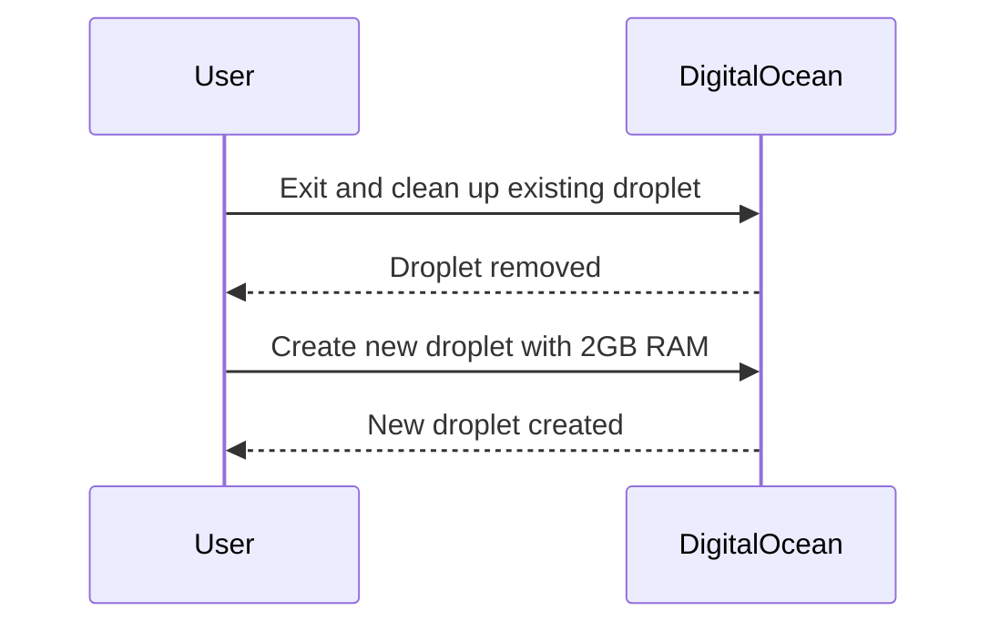

## Understanding Nexus and Its Resource Requirements

Nexus Repository Manager is a powerful artifact management solution used widely in software development environments. It provides a centralized repository for storing and managing artifacts such as Maven, npm, NuGet, and Docker images. However, Nexus requires significant system resources to operate efficiently, particularly memory (RAM).

### Why Memory Matters

Java applications, including Nexus, are highly dependent on the amount of available memory. Insufficient memory can lead to performance degradation, crashes, or even the inability to start the application. In the context of the Nexus module, the initial attempt to run Nexus with only one gigabyte of RAM resulted in an error indicating insufficient memory for the Java Runtime Environment (JRE).

#### Error Message Analysis

When the JRE encounters insufficient memory, it typically outputs an error message similar to the following:

```plaintext
Error occurred during initialization of VM
Could not reserve enough space for object heap
```

This error indicates that the JVM cannot allocate the necessary memory to initialize the object heap, which is critical for the operation of Java-based applications.

### Increasing System Resources

To resolve this issue, it is essential to increase the system's memory allocation. In the given scenario, the solution involved destroying the existing droplet (a virtual machine instance) and creating a new one with increased memory capacity.

#### Droplet Management

A droplet is a virtual private server (VPS) provided by DigitalOcean, a popular cloud hosting platform. Managing droplets involves creating, configuring, and destroying instances based on resource requirements.

##### Steps to Create a New Droplet

1. **Exit and Clean Up Existing Droplet**
    - Exit the current session.
    - Remove the existing droplet to free up resources.

2. **Create a New Droplet**
    - Choose the desired operating system (Ubuntu in this case).
    - Select a plan with sufficient memory (2GB in this example).
    - Specify the region and create the droplet.



### Installing and Configuring Nexus

Once the new droplet is created, the next step is to install and configure Nexus. This process involves several key steps:

1. **Install Java**
    - Java is required to run Nexus, as it is a Java-based application.
    - Ensure the correct version of Java is installed (usually OpenJDK).

2. **Install NetTools**
    - NetTools is a collection of network utilities that can be useful for managing and monitoring the server.

3. **Create Nexus User**
    - Creating a dedicated user for Nexus ensures proper isolation and security.

4. **Change Permissions for Nexus Folder**
    - Adjusting folder permissions ensures that the Nexus user has the necessary access rights.

#### Example Commands

Here are the detailed commands to perform these steps:

```bash
# Update package lists
sudo apt update

# Install Java
sudo apt install openjdk-11-jdk

# Install NetTools
sudo apt install net-tools

# Create Nexus user
sudo useradd nexus

# Change ownership of Nexus folder
sudo chown -R nexus:nexus /opt/nexus
```

### Automating with Playbooks

Manually executing these commands each time a new droplet is created can be cumbersome and error-prone. To streamline this process, automation tools like Ansible playbooks can be used.

#### Ansible Playbook Example

An Ansible playbook automates the installation and configuration of Nexus. Below is a sample playbook:

```yaml
---
- name: Install and configure Nexus
  hosts: all
  become: yes
  tasks:
    - name: Update package lists
      apt:
        update_cache: yes

    - name: Install Java
      apt:
        name: openjdk-11-jdk
        state: present

    - name: Install NetTools
      apt:
        name: net-tools
        state: present

    - name: Create Nexus user
      user:
        name: nexus
        state: present

    - name: Change ownership of Nexus folder
      file:
        path: /opt/nexus
        owner: nexus
        group: nexus
        recurse: yes
```

### How to Prevent / Defend

#### Detection

To detect insufficient memory issues, monitor the system's memory usage and log files. Tools like `htop` or `top` can provide real-time memory usage information.

```bash
htop
```

#### Prevention

1. **Provision Adequate Resources**
    - Always ensure that the server has sufficient memory and CPU resources to handle the workload.
    - Regularly review and adjust resource allocations based on actual usage patterns.

2. **Use Monitoring Tools**
    - Implement monitoring solutions like Prometheus or Nagios to alert on low memory conditions.

3. **Secure Configuration**
    - Use secure configurations for both the operating system and Nexus to minimize vulnerabilities.

#### Secure Code Fix

Compare the insecure setup with the secure setup:

**Insecure Setup:**

```bash
# Insufficient memory allocation
sudo apt install openjdk-11-jdk
sudo useradd nexus
sudo chown -R nexus:nexus /opt/nexus
```

**Secure Setup:**

```bash
# Ensure adequate memory allocation
sudo apt update
sudo apt install openjdk-11-jdk
sudo apt install net-tools
sudo useradd nexus
sudo chown -R nexus:nexus /opt/nexus
```

### Real-World Examples

Recent breaches and CVEs often involve misconfigured servers or insufficient resource allocation leading to service disruptions. For example, the 2021 SolarWinds breach involved compromised servers that were not properly monitored or configured, leading to widespread data exfiltration.

### Practice Labs

For hands-on practice, consider the following labs:

- **PortSwigger Web Security Academy**: Focuses on web application security but includes sections on server configuration and resource management.
- **OWASP Juice Shop**: A deliberately insecure web application for practicing web security skills, including server setup and configuration.
- **DVWA (Damn Vulnerable Web Application)**: Another web application for practicing security skills, including server setup and resource management.

By thoroughly understanding and implementing these steps, you can ensure that your Nexus installation runs smoothly and securely.

---
<!-- nav -->
[[13-Real-World Examples and Security Implications|Real-World Examples and Security Implications]] | [[DevOps/DevOps Bootcamp/06-CI CD & Build Tools/14-Create Nexus User And Group Ownership/00-Overview|Overview]] | [[DevOps/DevOps Bootcamp/06-CI CD & Build Tools/14-Create Nexus User And Group Ownership/15-Practice Questions & Answers|Practice Questions & Answers]]
