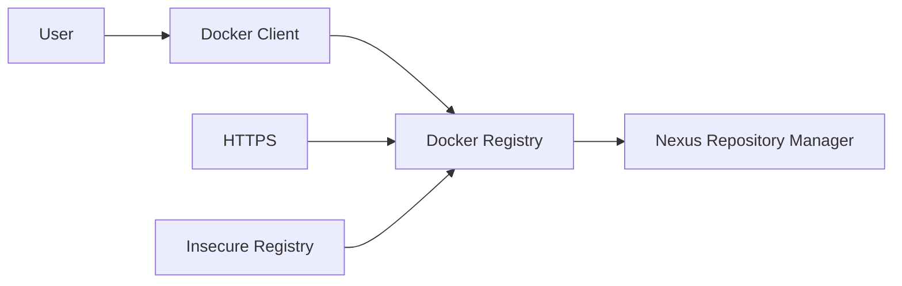
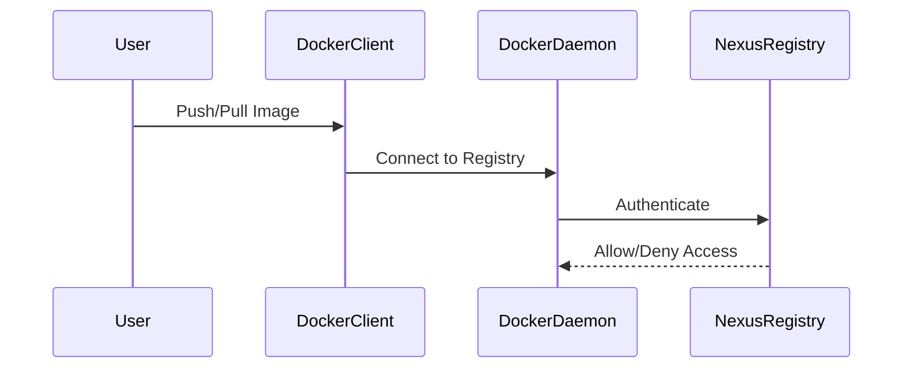

## Introduction to Docker Registries and Nexus Repository Manager

### What is a Docker Registry?

A Docker registry is a storage and distribution system for Docker images. Docker uses registries to store and distribute images. By default, the Docker client talks to the public Docker registry at `hub.docker.com`, but you can also run your own private registry. A private registry allows you to store and manage your own Docker images securely.

### Why Use a Private Registry?

Using a private registry provides several benefits:

1. **Security**: You can control access to your images and ensure that only authorized users can pull or push images.
2. **Customization**: You can customize your registry to meet specific requirements, such as integrating with your existing authentication systems.
3. **Performance**: Hosting your images on a local or nearby server can reduce latency and improve performance compared to pulling images from a remote public registry.

### What is Nexus Repository Manager?

Nexus Repository Manager is a powerful artifact management solution that supports various types of repositories, including Docker registries. It provides features like access control, auditing, and integration with other tools.

### Configuring Nexus as a Docker Registry

To configure Nexus as a Docker registry, you need to set up the repository in Nexus and then configure your Docker client to recognize Nexus as a registry.

### Setting Up Nexus as a Docker Registry

1. **Install and Configure Nexus**:
    - Download and install Nexus Repository Manager from the Sonatype website.
    - Start the Nexus service and log in to the admin console.
    - Create a new Docker Hosted repository in Nexus.

2. **Configure Docker Client**:
    - Edit the Docker daemon configuration to recognize Nexus as an insecure registry.

### Editing Docker Daemon Configuration

The Docker daemon configuration is stored in a file called `daemon.json`. This file is typically located at `/etc/docker/daemon.json` on Linux systems.

#### Example `daemon.json` Configuration

```json
{
  "insecure-registries" : ["<nexus-ip>:<nexus-port>"]
}
```

Replace `<nexus-ip>` and `<nexus-port>` with the actual IP address and port number where Nexus is running.

### Configuring Docker Desktop

If you are using Docker Desktop on Mac or Windows, the process is slightly different because Docker Desktop runs in a virtual machine.

#### Accessing Docker Desktop Configuration

1. Open Docker Desktop.
2. Go to Preferences.
3. Navigate to the Docker Engine tab (or the Daemon tab in older versions).

#### Adding Insecure Registry Configuration

Add the following configuration to the JSON file:

```json
{
  "experimental": false,
  "insecure-registries": ["<nexus-ip>:<nexus-port>"]
}
```

### Full Example of Docker Configuration

#### Linux System Configuration

1. **Edit `daemon.json`**:

    ```sh
    sudo nano /etc/docker/daemon.json
    ```

2. **Add Insecure Registry Configuration**:

    ```json
    {
      "insecure-registries" : ["192.168.1.100:8082"]
    }
    ```

3. **Restart Docker Service**:

    ```sh
    sudo systemctl restart docker
    ```

#### Docker Desktop Configuration

1. **Open Docker Desktop**.
2. **Go to Preferences**.
3. **Navigate to Docker Engine**.
4. **Add Configuration**:

    ```json
    {
      "experimental": false,
      "insecure-registries": ["192.168.1.100:8082"]
    }
    ```

### Explanation of Insecure Registries

An insecure registry is one that does not use HTTPS. By marking a registry as insecure, you tell Docker to allow connections to it even though it does not use encryption.

### Security Implications of Insecure Registries

Using insecure registries poses significant security risks:

1. **Data Exposure**: Without encryption, data transmitted between the Docker client and the registry can be intercepted.
2. **Man-in-the-Middle Attacks**: An attacker could intercept and modify the data being transmitted.

### How to Prevent / Defend Against Insecure Registries

#### Detection

1. **Audit Logs**: Regularly review audit logs to identify unauthorized access attempts.
2. **Network Monitoring**: Monitor network traffic for signs of data exfiltration or unauthorized access.

#### Prevention

1. **Use HTTPS**: Ensure that your registry uses HTTPS to encrypt data in transit.
2. **Access Control**: Implement strict access controls to limit who can access the registry.
3. **Secure Configuration**: Harden the configuration of both the Docker client and the registry.

#### Secure Code Fix

##### Vulnerable Configuration

```json
{
  "insecure-registries" : ["192.168.1.100:8082"]
}
```

##### Secure Configuration

```json
{
  "registry-mirrors": ["https://192.168.1.100:8082"]
}
```

### Real-World Examples and Recent Breaches

#### Example: Docker Hub Breach

In 2019, Docker Hub experienced a breach where unauthorized access was gained to user accounts. This highlights the importance of securing your private registries and implementing strong access controls.

#### Example: CVE-2019-14255

CVE-2019-14255 is a vulnerability in Docker that allows an attacker to bypass authentication and gain unauthorized access to the Docker daemon. This underscores the need for robust security measures, including the use of secure registries.

### Mermaid Diagrams

#### Docker Registry Architecture



#### Docker Configuration Flow



### Conclusion

Configuring Nexus as a Docker registry and marking it as an insecure registry is a necessary step for many organizations. However, it is crucial to understand the security implications and take appropriate measures to mitigate risks. By following best practices and implementing robust security controls, you can ensure the integrity and confidentiality of your Docker images.

### Practice Labs

For hands-on practice with Docker and Nexus, consider the following labs:

- **PortSwigger Web Security Academy**: Offers exercises related to Docker and container security.
- **OWASP Juice Shop**: Provides a vulnerable application that can be used to practice securing Docker environments.
- **CloudGoat**: Focuses on cloud security and includes scenarios related to Docker and private registries.

By completing these labs, you can gain practical experience and reinforce your understanding of the concepts covered in this chapter.

---
<!-- nav -->
[[DevOps/DevOps Bootcamp/06-CI CD & Build Tools/15-Creating Docker Repository On Nexus/00-Overview|Overview]] | [[02-Introduction to Docker Repositories and Nexus|Introduction to Docker Repositories and Nexus]]
