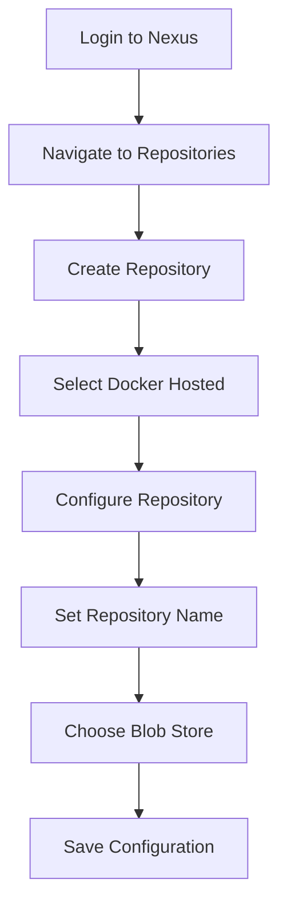
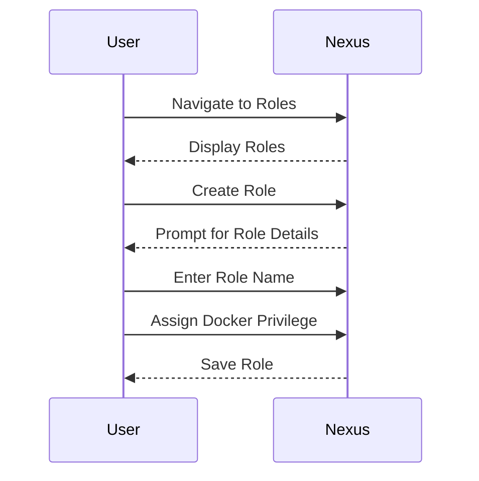

## Introduction to Docker Repositories and Nexus

In the world of containerization, Docker has become an indispensable tool for developers and DevOps engineers. Docker allows you to package your application and its dependencies into a lightweight, portable container. These containers can then be deployed consistently across different environments. However, managing these Docker images requires a robust solution, especially in a team environment. This is where Docker repositories come into play.

A Docker repository is a storage location for Docker images. These repositories can be either public (like Docker Hub) or private (like Nexus). Private repositories provide better control over access and security, making them ideal for enterprise environments.

Nexus Repository Manager is a popular artifact management server that supports various types of artifacts, including Docker images. In this chapter, we will delve into creating a Docker repository on Nexus and pushing Docker images to it.

### Background Theory

Before diving into the practical steps, let's understand the underlying concepts:

#### What is Nexus?

Nexus Repository Manager is a powerful artifact management server developed by Sonatype. It provides a centralized repository for storing and managing various types of artifacts, such as Maven, npm, NuGet, and Docker images. Nexus offers features like access control, security, and integration with CI/CD pipelines.

#### Why Use Nexus for Docker Images?

Using Nexus for Docker images provides several benefits:
- **Centralized Management**: All Docker images can be stored in one place, making it easier to manage and track.
- **Access Control**: Fine-grained access control can be implemented to ensure that only authorized users can push or pull images.
- **Security**: Nexus supports SSL/TLS encryption, ensuring that data is transmitted securely.
- **Integration**: Nexus integrates seamlessly with CI/CD tools, allowing for automated builds and deployments.

### Creating a Docker Repository on Nexus

Now that we understand the importance of Nexus for Docker images, let's walk through the process of creating a Docker repository on Nexus.

#### Step 1: Accessing the Nexus Administration Interface

To create a Docker repository, you need to access the Nexus administration interface. This is typically done via a web browser. Navigate to the Nexus server URL, and log in with your credentials.

#### Step 2: Navigating to Repository Management

Once logged in, navigate to the repository management section. This is usually found under the "Repositories" tab in the administration interface.

#### Step 3: Creating a New Repository

Click on the "Create repository" button to start the process of creating a new repository. You will be presented with a list of repository types. Select "Docker Hosted" since we want to host our own Docker images.

#### Step 4: Configuring the Repository

After selecting "Docker Hosted," you will be prompted to configure the repository. Here are the key settings you need to consider:

- **Repository Name**: Choose a descriptive name for your repository. For example, "docker-hosted".
- **Blob Store**: A blob store is a storage area for binary large objects (BLOBs). You need to specify which blob store to use. If you haven't created one yet, you can create a new one. For this example, we will use "My Store."
- **Other Settings**: Leave other settings as default for now.

Here is an example of the configuration:



#### Step 5: Saving the Configuration

After configuring the repository, click on the "Save" button to create the repository. Once saved, you will see the details of the newly created repository, including its URL.

### Pushing Docker Images to Nexus

Now that the repository is created, you can push Docker images to it. To do this, you need to authenticate with Nexus using a user who has access to the Docker repository.

#### Step 1: Creating a Role with Docker Privileges

Before pushing images, you need to ensure that the user has the necessary privileges. Create a new role with Docker privileges.

1. Navigate to the "Roles" section in the Nexus administration interface.
2. Click on "Create role."
3. Enter a name for the role, such as "NX Docker."
4. Assign the "Docker hosted" privilege to this role.

Here is an example of the role creation process:



#### Step 2: Authenticating with Nexus

Once the role is created, you can authenticate with Nexus using a user who has been assigned this role.

1. Open a terminal.
2. Run the following command to log in to Nexus:

```bash
docker login <nexus-url>:<port>
```

Replace `<nexus-url>` with the URL of your Nexus server and `<port>` with the port number (usually `8081`).

You will be prompted to enter your username and password. After successful authentication, you can push Docker images to the repository.

#### Step 3: Tagging and Pushing the Image

Before pushing the image, you need to tag it with the Nexus repository URL.

1. Tag the Docker image with the Nexus repository URL:

```bash
docker tag <image-name>:<tag> <nexus-url>:<port>/<repository-name>/<image-name>:<tag>
```

For example:

```bash
docker tag myapp:latest http://localhost:8081/docker-hosted/myapp:latest
```

2. Push the tagged image to the repository:

```bash
docker push <nexus-url>:<port>/<repository-name>/<image-name>:<tag>
```

For example:

```bash
docker push http://localhost:8081/docker-hosted/myapp:latest
```

### Full Example of Pushing a Docker Image

Let's walk through a complete example of pushing a Docker image to Nexus.

#### Step 1: Build the Docker Image

First, build the Docker image:

```Dockerfile
# Dockerfile
FROM alpine:latest
COPY . /app
WORKDIR /app
CMD ["sh", "-c", "echo 'Hello, World!'"]
```

Build the image:

```bash
docker build -t myapp:latest .
```

#### Step 2: Tag and Push the Image

Tag the image with the Nexus repository URL:

```bash
docker tag myapp:latest http://localhost:8081/docker-hosted/myapp:latest
```

Push the image to Nexus:

```bash
docker push http://localhost:8081/docker-hosted/myapp:latest
```

### Common Pitfalls and How to Avoid Them

#### Authentication Issues

One common issue is authentication failure. Ensure that the user you are using has the necessary privileges and that the credentials are correct.

#### Incorrect Repository URL

Ensure that the repository URL is correct. Double-check the URL and port number.

#### Network Issues

If you encounter network issues, ensure that the Nexus server is reachable and that there are no firewall rules blocking access.

### How to Prevent / Defend

#### Secure Access Control

Implement strict access control policies to ensure that only authorized users can push or pull images. Use roles and privileges to control access.

#### Enable SSL/TLS Encryption

Enable SSL/TLS encryption to ensure that data is transmitted securely. Configure Nexus to use HTTPS.

#### Regular Audits

Regularly audit the repository to ensure that no unauthorized changes have been made. Use tools like Sonatype Nexus Lifecycle to monitor and manage artifacts.

#### Secure Coding Practices

Follow secure coding practices when building Docker images. Avoid hardcoding sensitive information like passwords or API keys in the Dockerfile.

### Real-World Examples

#### Recent CVEs and Breaches

- **CVE-2021-21287**: A vulnerability in Docker was discovered that allowed attackers to execute arbitrary code on the host system. Ensure that you are using the latest version of Docker and apply security patches regularly.
- **Breaches at Docker Inc.**: In 2020, Docker Inc. experienced a data breach that exposed customer data. Ensure that you follow best practices for securing your Docker environment.

### Complete Example with Raw HTTP Messages

#### Example of Pushing a Docker Image

When you push a Docker image to Nexus, the following HTTP messages are exchanged:

**Request:**

```http
PUT /v2/<repository-name>/manifests/<tag> HTTP/1.1
Host: localhost:8081
Authorization: Basic <base64-encoded-credentials>
Content-Type: application/vnd.docker.distribution.manifest.v2+json
Content-Length: <length>

{
  "schemaVersion": 2,
  "mediaType": "application/vnd.docker.distribution.manifest.v2+json",
  "config": {
    "mediaType": "application/vnd.docker.container.image.v1+json",
    "size": <size>,
    "digest": "<digest>"
  },
  "layers": [
    {
      "mediaType": "application/vnd.docker.image.rootfs.diff.tar.gz",
      "size": <size>,
      "digest": "<digest>"
    }
  ]
}
```

**Response:**

```http
HTTP/1.1 201 Created
Date: <date>
Content-Length: 0
```

### Mermaid Diagrams

#### Repository Creation Process


#### Role Creation Process

```mermaid
sequenceDiagram
    participant User as User
    participant Nexus as Nexus
    User->>Nexus: Navigate to Roles
    Nexus-->>User: Display Roles
    User->>Nexus: Create Role
    Nexus-->>User: Prompt for Role Details
    User->>N
```

---
<!-- nav -->
[[01-Introduction to Docker Registries and Nexus Repository Manager|Introduction to Docker Registries and Nexus Repository Manager]] | [[DevOps/DevOps Bootcamp/06-CI CD & Build Tools/15-Creating Docker Repository On Nexus/00-Overview|Overview]] | [[03-Introduction to Docker Repositories on Nexus|Introduction to Docker Repositories on Nexus]]
