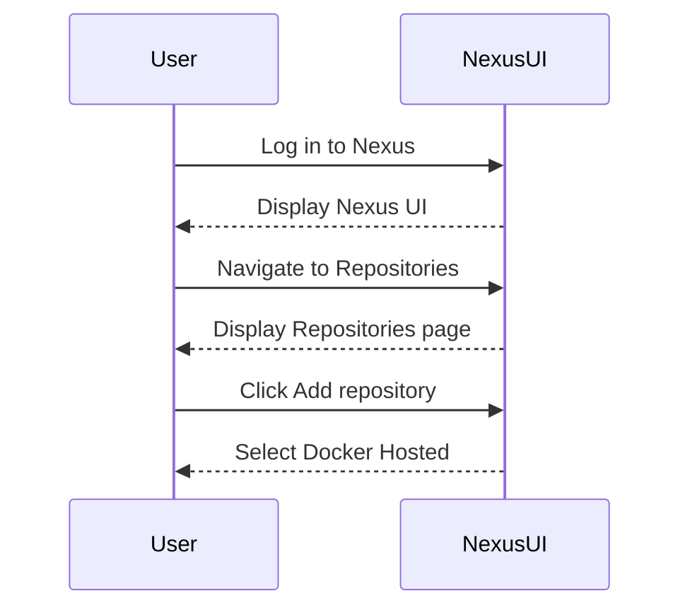
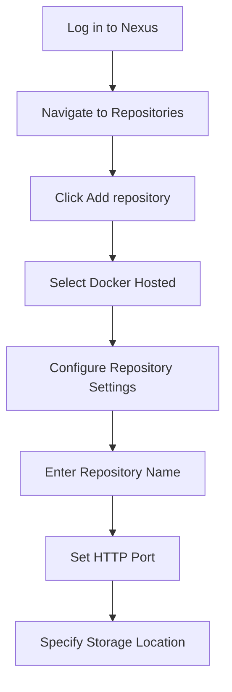
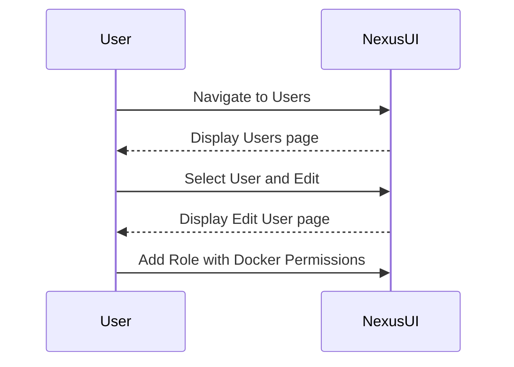
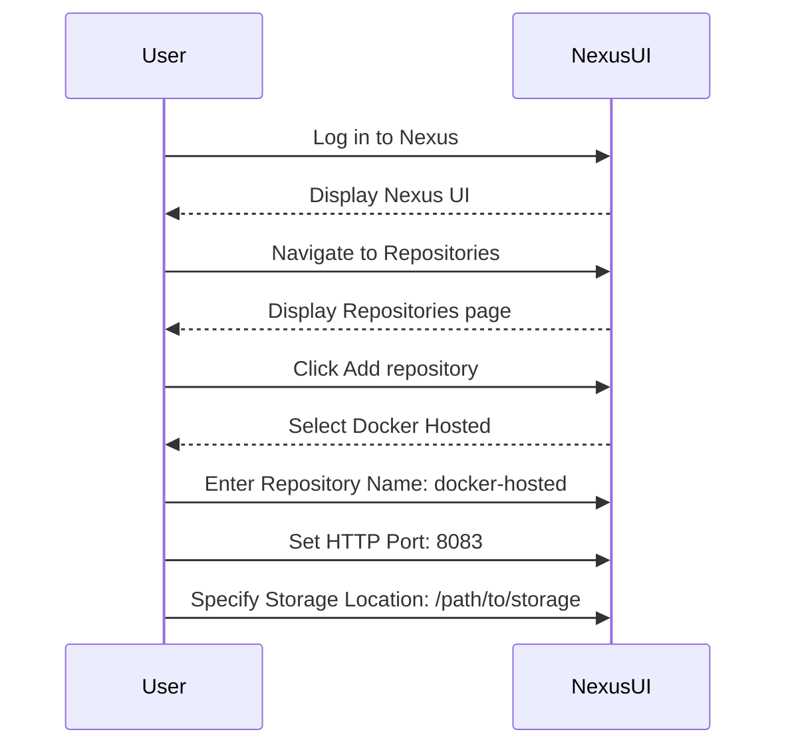

## Configuring a Docker Repository on Nexus

### Step 1: Create a Docker Hosted Repository

To create a Docker hosted repository on Nexus, follow these steps:

1. **Log in to Nexus**: Access the Nexus UI using your credentials.
2. **Navigate to Repositories**: Go to `Repositories` in the left-hand menu.
3. **Create a New Repository**: Click on `Add repository`, then select `Docker Hosted`.



### Step 2: Configure Repository Settings

After selecting `Docker Hosted`, you'll be prompted to configure the repository settings:

1. **Repository Name**: Enter a name for your repository, e.g., `docker-hosted`.
2. **HTTP Port**: Set the HTTP port for the repository. This port should be different from the Nexus server port.
3. **Storage Location**: Specify the storage location for the repository.



### Step 3: Assign Permissions to Users

To allow users to access the Docker repository, you need to assign appropriate permissions:

1. **Navigate to Users**: Go to `Users` in the left-hand menu.
2. **Edit User**: Select the user you want to grant access to and click `Edit`.
3. **Add Role**: Add a role that includes Docker repository permissions.



### Step 4: Configure Docker Client

To use the Docker repository, you need to configure the Docker client:

1. **Docker Login Command**: Use the `docker login` command to authenticate with the Nexus repository.

```bash
docker login <nexus-server>:<http-port>
```

For example, if your Nexus server is running on `localhost` and the HTTP port is `8083`:

```bash
docker login localhost:8083
```

### Step 5: Test the Configuration

To verify that the configuration is correct, push and pull a Docker image:

1. **Push Image**:

```bash
docker tag my-image localhost:8083/my-repo/my-image
docker push localhost:8083/my-repo/my-image
```

2. **Pull Image**:

```bash
docker pull localhost:8083/my-repo/my-image
```

### Full Example

Here is a complete example of setting up and using a Docker repository on Nexus:

#### Nexus Configuration

1. **Create Repository**:



2. **Assign Permissions**:


#### Docker Client Configuration

1. **Login**:

```bash
docker login localhost:8083
```

2. **Push Image**:

```bash
docker tag my-image localhost:8083/my-repo/my-image
docker push localhost:8083/my-repo/my-image
```

3. **Pull Image**:

```bash
docker pull localhost:8083/my-repo/my-image
```

### Common Pitfalls and How to Avoid Them

1. **Incorrect Port Configuration**: Ensure that the HTTP port for the Docker repository is different from the Nexus server port.
2. **Insufficient Permissions**: Verify that the user has the necessary permissions to access the Docker repository.
3. **Network Issues**: Check that the Docker client can reach the Nexus server on the specified port.

### How to Prevent / Defend

#### Detection

1. **Audit Logs**: Regularly review audit logs to detect unauthorized access attempts.
2. **Monitoring Tools**: Use monitoring tools like Prometheus and Grafana to monitor access patterns and detect anomalies.

#### Prevention

1. **Secure Connections**: Enable SSL/TLS encryption for secure communication between the Docker client and Nexus.
2. **Role-Based Access Control**: Implement strict role-based access control to limit access to sensitive repositories.

#### Secure Coding Fixes

**Vulnerable Code**:

```yaml
# Insecure Nexus Configuration
repositories:
  - id: docker-hosted
    type: docker-hosted
    httpPort: 8081
```

**Secure Code**:

```yaml
# Secure Nexus Configuration
repositories:
  - id: docker-hosted
    type: docker-hosted
    httpPort: 8083
    sslEnabled: true
    sslPort: 8443
```

### Real-World Examples

#### Recent CVEs and Breaches

1. **CVE-2021-21277**: This vulnerability in Nexus Repository Manager allowed attackers to bypass authentication and gain unauthorized access to repositories. Ensure that you are using the latest version of Nexus to mitigate this risk.
2. **Breaches**: In 2022, a breach was reported where unauthorized access to a Nexus repository led to the exposure of sensitive Docker images. This highlights the importance of implementing strong access controls and monitoring.

### Practice Labs

For hands-on practice, consider the following labs:

- **Sonatype Nexus Training**: Official training materials provided by Sonatype.
- **PortSwigger Web Security Academy**: Although primarily focused on web security, it also covers aspects of Docker and container security.
- **OWASP Juice Shop**: While not specific to Nexus, it provides a comprehensive environment for practicing web application security, which can be extended to include Docker and Nexus configurations.

By following these detailed steps and best practices, you can effectively set up and manage Docker repositories on Nexus, ensuring a secure and efficient DevOps workflow.

---
<!-- nav -->
[[04-Configuring Docker Repository on Nexus|Configuring Docker Repository on Nexus]] | [[DevOps/DevOps Bootcamp/06-CI CD & Build Tools/15-Creating Docker Repository On Nexus/00-Overview|Overview]] | [[DevOps/DevOps Bootcamp/06-CI CD & Build Tools/15-Creating Docker Repository On Nexus/06-Practice Questions & Answers|Practice Questions & Answers]]
