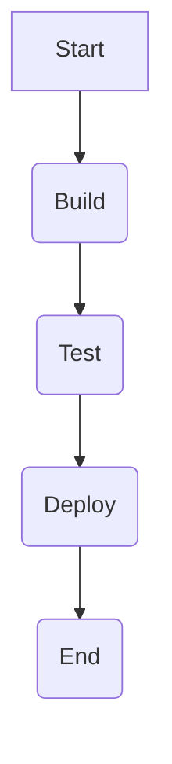

## Introduction to Continuous Delivery (CD) Pipelines

Continuous Delivery (CD) pipelines are a critical component of modern DevOps practices. They automate the process of taking code changes from development through testing, building, and deployment, ensuring that the software can be released reliably at any time. This automation helps teams to deliver high-quality software quickly and efficiently.

### Traditional Freestyle Builds

In traditional CI/CD setups, each stage of the pipeline might be managed as a separate job. For instance, you could have:

1. **Build Job**: Compiles the code using tools like Maven or Gradle.
2. **Test Job**: Runs unit tests and integration tests.
3. **Deploy Job**: Deploys the built artifacts to a staging or production environment.
4. **Notification Job**: Sends notifications to the team about the status of the build.

Each of these jobs would be configured independently, often through a user interface (UI). This approach can become cumbersome and difficult to manage as the number of jobs increases. For example, if you have six or seven such jobs, maintaining and updating them becomes a significant overhead.

#### Example of Multiple Freestyle Jobs

Consider a scenario where you have the following jobs:

1. **Build**: Uses Maven to compile the code.
2. **Unit Test**: Runs unit tests.
3. **Integration Test**: Runs integration tests.
4. **Deploy to Staging**: Deploys the application to a staging environment.
5. **Deploy to Production**: Deploys the application to a production environment.
6. **Notify Team**: Sends an email notification to the team.

If you decide to switch from Maven to Gradle, you would need to update the configuration in each of these jobs individually. This manual process can be error-prone and time-consuming.

### Pipeline-Based Approach

To address these challenges, pipelines provide a more streamlined and efficient way to manage the entire build and deployment process. Instead of having multiple independent jobs, a pipeline consolidates these steps into a single, cohesive workflow.

#### Benefits of Pipelines

1. **Simplified Maintenance**: All steps are defined in a single Jenkinsfile, making it easier to manage and update configurations.
2. **Seamless Integration**: Steps are automatically chained together, reducing the need for manual intervention.
3. **Reusability**: Common steps can be reused across different pipelines, promoting consistency and reducing redundancy.
4. **Version Control**: The Jenkinsfile can be stored in a version control system, allowing for easy tracking of changes and rollbacks.

### Jenkinsfile: The Heart of a Pipeline

A Jenkinsfile is a script written in Groovy that defines the steps of a pipeline. It acts as a blueprint for the entire build and deployment process. Here’s a basic example of a Jenkinsfile:

```groovy
pipeline {
    agent any

    stages {
        stage('Build') {
            steps {
                echo 'Building...'
                sh 'mvn clean package'
            }
        }
        stage('Test') {
            steps {
                echo 'Testing...'
                sh 'mvn test'
            }
        }
        stage('Deploy') {
            steps {
                echo 'Deploying...'
                sh 'scp target/myapp.jar user@server:/opt/myapp/'
            }
        }
    }
}
```

### Detailed Explanation of the Jenkinsfile

1. **Pipeline Block**: Defines the overall structure of the pipeline.
2. **Agent Block**: Specifies the agent (executor) that will run the pipeline. `any` means any available agent.
3. **Stages Block**: Contains multiple stages, each representing a distinct phase of the pipeline.
4. **Stage Blocks**: Each stage contains a set of steps to be executed.
5. **Steps Block**: Contains individual steps within a stage. These can include shell commands, script execution, or other Jenkins plugins.

### Real-World Example: Switching Build Tools

Suppose you have a pipeline that uses Maven for building your project. If you decide to switch to Gradle, you can easily update the Jenkinsfile to reflect this change. Here’s how you might modify the Jenkinsfile:

#### Before: Using Maven

```groovy
pipeline {
    agent any

    stages {
        stage('Build') {
            steps {
                echo 'Building with Maven...'
                sh 'mvn clean package'
            }
        }
        stage('Test') {
            steps {
                echo 'Testing with Maven...'
                sh 'mvn test'
            }
        }
        stage('Deploy') {
            steps {
                echo 'Deploying...'
                sh 'scp target/myapp.jar user@server:/opt/myapp/'
            }
        }
    }
}
```

#### After: Using Gradle

```groovy
pipeline {
    agent any

    stages {
        stage('Build') {
            steps {
                echo 'Building with Gradle...'
                sh 'gradle build'
            }
        }
        stage('Test') {
            steps {
                echo 'Testing with Gradle...'
                sh 'gradle check'
            }
        }
        stage('Deploy') {
            steps {
                echo 'Deploying...'
                sh 'scp build/libs/myapp.jar user@server:/opt/myapp/'
            }
        }
    }
}
```

### Mermaid Diagram: Pipeline Structure

A visual representation of the pipeline can help understand the flow better. Here’s a mermaid diagram illustrating the pipeline structure:



### Pitfalls and Best Practices

While pipelines offer many benefits, there are several pitfalls to watch out for:

1. **Complexity**: As pipelines grow, they can become complex and difficult to maintain. It’s important to keep the Jenkinsfile organized and modular.
2. **Security**: Ensure that sensitive information (like credentials) is securely managed. Use Jenkins credentials plugin to store and manage secrets.
3. **Parallel Execution**: Consider parallelizing steps where possible to speed up the pipeline. Use the `parallel` keyword in Groovy to achieve this.

### How to Prevent / Defend

#### Detection

Regularly review the Jenkinsfile for any outdated or insecure practices. Use static analysis tools like SonarQube to identify potential issues.

#### Prevention

1. **Use Version Control**: Store the Jenkinsfile in a version control system like Git. This allows you to track changes and revert to previous versions if needed.
2. **Automate Security Checks**: Integrate security checks into the pipeline. Use tools like OWASP Dependency-Check to scan for vulnerabilities.
3. **Secure Credentials Management**: Use Jenkins credentials plugin to securely manage sensitive information. Avoid hardcoding credentials in the Jenkinsfile.

#### Secure Coding Fix

Here’s an example of a vulnerable Jenkinsfile and its secure counterpart:

**Vulnerable Jenkinsfile**

```groovy
pipeline {
    agent any

    stages {
        stage('Build') {
            steps {
                echo 'Building...'
                sh 'mvn clean package -Dusername=admin -Dpassword=secret'
            }
        }
    }
}
```

**Secure Jenkinsfile**

```groovy
pipeline {
    agent any

    environment {
        USERNAME = credentials('admin-credentials')
        PASSWORD = credentials('admin-password')
    }

    stages {
        stage('Build') {
            steps {
                echo 'Building...'
                sh 'mvn clean package -Dusername=${USERNAME} -Dpassword=${PASSWORD}'
            }
        }
    }
}
```

### Conclusion

Pipelines provide a powerful and efficient way to manage the entire build and deployment process. By consolidating multiple steps into a single, cohesive workflow, pipelines simplify maintenance and reduce the risk of errors. Understanding and implementing pipelines effectively can significantly improve the efficiency and reliability of your DevOps processes.

### Practice Labs

For hands-on practice with Jenkins pipelines, consider the following labs:

- **PortSwigger Web Security Academy**: Offers a variety of labs that cover different aspects of DevOps security, including Jenkins pipelines.
- **OWASP Juice Shop**: Provides a vulnerable web application that you can use to practice setting up and securing Jenkins pipelines.
- **DVWA (Damn Vulnerable Web Application)**: Another great resource for practicing DevOps security techniques.

By working through these labs, you can gain practical experience in creating and managing Jenkins pipelines, ensuring that you can apply these skills effectively in real-world scenarios.

---
<!-- nav -->
[[DevOps/DevOps Bootcamp/06-CI CD & Build Tools/16-Creating Pipelines Using Groovy Scripts/00-Overview|Overview]] | [[02-Introduction to Freestyle Jobs and Their Limitations|Introduction to Freestyle Jobs and Their Limitations]]
