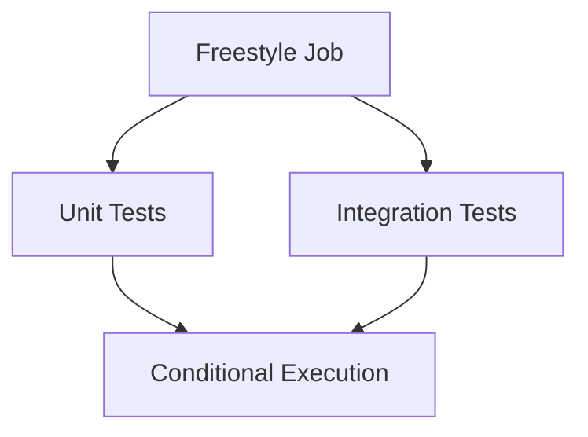
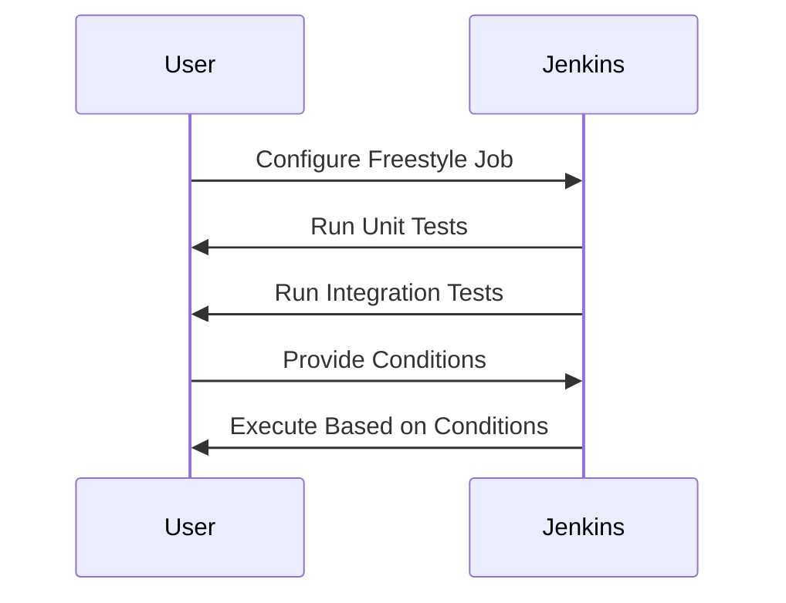

## Introduction to Freestyle Jobs and Their Limitations

In the context of continuous integration and delivery (CI/CD), Jenkins is a widely used open-source automation server that supports a variety of job types, including freestyle jobs. Freestyle jobs are simple, straightforward, and primarily configured via a graphical user interface (GUI). They are ideal for basic build and test scenarios but fall short when dealing with more complex workflows.

### What Are Freestyle Jobs?

Freestyle jobs in Jenkins are the most basic type of job that allows users to define a series of build steps, post-build actions, and triggers. These jobs are configured through a web-based interface, making them accessible to users who may not be familiar with scripting or programming.

#### Configuration Through GUI

The primary method of configuring freestyle jobs is through the Jenkins web interface. This includes setting up build triggers, defining build steps, and specifying post-build actions such as archiving artifacts or sending notifications. While this approach is user-friendly, it has significant limitations when it comes to handling complex logic.

### Limitations of Freestyle Jobs

One of the main drawbacks of freestyle jobs is their reliance on plugins to extend functionality. Plugins are necessary to perform tasks such as executing shell commands, running tests, or deploying applications. However, managing multiple plugins across numerous jobs can become cumbersome and lead to high maintenance costs.

#### Conditional Logic and Parallel Tasks

When you need to implement conditional logic or run tasks in parallel, freestyle jobs become less effective. For instance, if you want to run unit tests and integration tests in parallel based on certain conditions, or require user input to select a version for the next step, freestyle jobs struggle to handle these requirements efficiently.

### Example Scenario: Unit Tests and Integration Tests

Consider a scenario where you need to run unit tests and integration tests in parallel. In a freestyle job, you would typically configure separate build steps for each task. However, implementing conditional logic to decide which tests to run based on certain conditions becomes challenging.

### High Maintenance Cost

Another significant limitation is the high maintenance cost associated with managing multiple plugins across various jobs. Each plugin adds complexity and requires updates, leading to increased overhead. This can be particularly problematic in large-scale environments where maintaining consistency across numerous jobs is crucial.

### Transition to Scripted Pipelines

Given the limitations of freestyle jobs, transitioning to scripted pipelines using Groovy offers a more flexible and maintainable solution. Scripted pipelines allow you to define complex logic programmatically, making it easier to manage and scale your CI/CD processes.

---
<!-- nav -->
[[DevOps/DevOps Bootcamp/06-CI CD & Build Tools/16-Creating Pipelines Using Groovy Scripts/01-Introduction to Continuous Delivery (CD) Pipelines|Introduction to Continuous Delivery (CD) Pipelines]] | [[DevOps/DevOps Bootcamp/06-CI CD & Build Tools/16-Creating Pipelines Using Groovy Scripts/00-Overview|Overview]] | [[03-Introduction to Jenkins Declarative Pipeline Syntax|Introduction to Jenkins Declarative Pipeline Syntax]]
