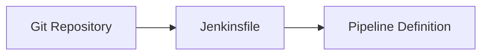
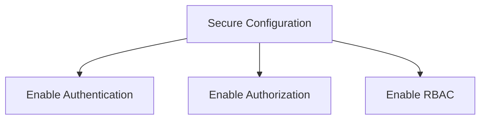

## Introduction to Jenkins Pipeline and Groovy Scripts

In the realm of continuous integration and continuous delivery (CI/CD), Jenkins stands out as one of the most widely used tools. A key aspect of Jenkins is its ability to define and manage pipelines using Groovy scripts. This chapter will delve into the creation and management of Jenkins pipelines using Groovy scripts, providing a comprehensive understanding of the concepts, syntax, and practical applications.

### What is a Jenkins Pipeline?

A Jenkins pipeline is a way to model your continuous integration and continuous delivery process. It is a series of steps that are executed in a specific order to build, test, and deploy your application. The pipeline can be defined using a Jenkinsfile, which is a text file containing the pipeline definition written in Groovy.

#### Why Use Jenkins Pipelines?

Jenkins pipelines offer several benefits:

1. **Reproducibility**: By defining the pipeline in a Jenkinsfile, you ensure that the same steps are executed consistently across different environments.
2. **Version Control**: Since the Jenkinsfile is stored in a version control system (VCS), you can track changes to the pipeline and revert to previous versions if needed.
3. **Automation**: Pipelines automate the entire CI/CD process, reducing manual intervention and minimizing human error.
4. **Flexibility**: Jenkins pipelines support both scripted and declarative syntaxes, allowing you to choose the approach that best suits your needs.

### Creating a Jenkinsfile

To get started with Jenkins pipelines, you need to create a Jenkinsfile in your Git repository. This file will contain the pipeline definition written in Groovy.

#### Standardized Naming Convention

The Jenkinsfile is typically named `Jenkinsfile`. This is a standardized name that Jenkins looks for by default. However, you can use a different name if you prefer, but you would need to configure Jenkins to look for that specific file name.



### Basic Syntax of a Jenkinsfile

Let's start with the most basic Jenkinsfile that does nothing. This will serve as a foundation for understanding the syntax.

```groovy
pipeline {
    agent any
}
```

This simple pipeline defines an agent that can run on any available node. The `agent` directive specifies where the pipeline should run.

#### Scripted vs. Declarative Syntax

Jenkins pipelines can be defined using either a scripted or declarative syntax. The choice between these two depends on your familiarity with Groovy and your specific requirements.

##### Scripted Pipeline

A scripted pipeline is written using Groovy scripting. This approach provides more flexibility but requires a good understanding of Groovy.

```groovy
node {
    stage('Build') {
        echo 'Building...'
    }
    stage('Test') {
        echo 'Testing...'
    }
    stage('Deploy') {
        echo 'Deploying...'
    }
}
```

In this example, the `node` block specifies that the pipeline should run on a specific node. The `stage` blocks define different stages of the pipeline, such as build, test, and deploy.

##### Declarative Pipeline

A declarative pipeline uses a more structured syntax that is easier to understand and maintain. This is the recommended approach for most users.

```groovy
pipeline {
    agent any
    stages {
        stage('Build') {
            steps {
                echo 'Building...'
            }
        }
        stage('Test') {
            steps {
                echo 'Testing...'
            }
        }
        stage('Deploy') {
            steps {
                echo 'Deploying...'
            }
        }
    }
}
```

In this declarative pipeline, the `stages` block contains multiple `stage` blocks, each with its own `steps` block. This structure makes it easier to define and manage complex pipelines.

### Detailed Explanation of Jenkinsfile Syntax

Now, let's dive deeper into the syntax of a Jenkinsfile, focusing on the declarative pipeline.

#### Agent Directive

The `agent` directive specifies where the pipeline should run. Common options include:

- `any`: Run on any available node.
- `label 'my-label'`: Run on a node with a specific label.
- `docker 'image-name'`: Run inside a Docker container.

```groovy
pipeline {
    agent { docker 'maven:3.8.1-jdk-11' }
    stages {
        stage('Build') {
            steps {
                sh 'mvn clean package'
            }
        }
    }
}
```

In this example, the pipeline runs inside a Docker container with the Maven image.

#### Stages and Steps

The `stages` block contains multiple `stage` blocks, each representing a phase of the pipeline. Each `stage` block contains a `steps` block that defines the actions to be performed.

```groovy
pipeline {
    agent any
    stages {
        stage('Build') {
            steps {
                sh 'mvn clean package'
            }
        }
        stage('Test') {
            steps {
                sh 'mvn test'
            }
        }
        stage('Deploy') {
            steps {
                sh 'scp target/myapp.jar user@server:/opt/myapp/'
            }
        }
    }
}
```

In this example, the pipeline consists of three stages: Build, Test, and Deploy. Each stage performs a specific action using shell commands.

### Real-World Examples and Recent Breaches

Understanding the practical implications of Jenkins pipelines is crucial. Let's look at some recent real-world examples and breaches related to CI/CD pipelines.

#### Example: CVE-2021-21234

CVE-2021-21234 is a critical vulnerability in Jenkins that allows remote code execution. This vulnerability affects Jenkins versions prior to 2.289.1 and 2.277.3.

**Impact**: An attacker could exploit this vulnerability to execute arbitrary code on the Jenkins server, potentially leading to a full compromise of the environment.

**Mitigation**: Ensure that your Jenkins installation is up-to-date and patched against known vulnerabilities. Regularly review your Jenkinsfile for potential security issues.

#### Example: Travis CI Breach

In 2018, Travis CI experienced a breach that exposed sensitive information, including API tokens and SSH keys. This incident highlights the importance of securing your CI/CD pipelines.

**Impact**: The breach allowed attackers to gain unauthorized access to build environments and potentially steal sensitive data.

**Mitigation**: Use secure practices for managing secrets in your Jenkinsfile. Utilize Jenkins credentials management to securely store and manage sensitive information.

### How to Prevent / Defend

Ensuring the security of your Jenkins pipelines is paramount. Here are some best practices for preventing and defending against common vulnerabilities.

#### Secure Secret Management

Use Jenkins credentials management to securely store and manage sensitive information such as API tokens, SSH keys, and passwords.

```groovy
pipeline {
    agent any
    environment {
        API_TOKEN = credentials('api-token')
    }
    stages {
        stage('Build') {
            steps {
                sh 'curl -H "Authorization: Bearer ${API_TOKEN}" https://api.example.com/build'
            }
        }
    }
}
```

In this example, the `environment` block uses the `credentials` function to securely reference a stored API token.

#### Regular Updates and Patching

Ensure that your Jenkins installation is regularly updated and patched against known vulnerabilities. Monitor Jenkins security advisories and apply updates promptly.

#### Secure Configuration

Secure your Jenkins configuration to prevent unauthorized access and modifications. Enable security features such as authentication, authorization, and role-based access control (RBAC).



#### Monitoring and Logging

Implement monitoring and logging to detect and respond to suspicious activities. Use tools like Jenkins plugins and external monitoring solutions to monitor pipeline executions.

```groovy
pipeline {
    agent any
    stages {
        stage('Build') {
            steps {
                sh 'mvn clean package'
            }
        }
    }
    post {
        success {
            slackSend channel: '#build-notifications', message: "Build successful"
        }
        failure {
            slackSend channel: '#build-notifications', message: "Build failed"
        }
    }
}
```

In this example, the `post` block sends notifications to a Slack channel based on the outcome of the pipeline.

### Complete Example: Full Pipeline with Request and Response

Let's walk through a complete example of a Jenkins pipeline that includes a full HTTP request and response.

#### Scenario: Automated Deployment to a Remote Server

Consider a scenario where you want to automate the deployment of an application to a remote server. The pipeline will build the application, run tests, and deploy the artifact to the server.

```groovy
pipeline {
    agent any
    environment {
        SERVER_URL = 'http://remote-server/api/deploy'
        API_TOKEN = credentials('api-token')
    }
    stages {
        stage('Build') {
            steps {
                sh 'mvn clean package'
            }
        }
        stage('Test') {
            steps {
                sh 'mvn test'
            }
        }
        stage('Deploy') {
            steps {
                script {
                    def artifactPath = 'target/myapp.jar'
                    def response = sh(script: "curl -X POST -H 'Authorization: Bearer ${API_TOKEN}' -F 'artifact=@${artifactPath}' ${SERVER_URL}", returnStdout: true)
                    echo "Deployment response: ${response}"
                }
            }
        }
    }
    post {
        success {
            slackSend channel: '#build-notifications', message: "Build and deployment successful"
        }
        failure {
            slackSend channel: '#build-notifications', message: "Build or deployment failed"
        }
    }
}
```

In this example, the pipeline consists of three stages: Build, Test, and Deploy. The `Deploy` stage uses a `curl` command to send the artifact to the remote server. The response from the server is captured and logged.

#### Vulnerable vs. Secure Code

Let's compare a vulnerable Jenkinsfile with a secure one.

**Vulnerable Jenkinsfile**

```groovy
pipeline {
    agent any
    stages {
        stage('Deploy') {
            steps {
                sh 'scp target/myapp.jar user@server:/opt/myapp/'
            }
        }
    }
}
```

In this vulnerable example, the username and password are hardcoded in the `sh` command, making it susceptible to exposure.

**Secure Jenkinsfile**

```groovy
pipeline {
    agent any
    environment {
        SERVER_USER = credentials('server-user')
        SERVER_PASSWORD = credentials('server-password')
    }
    stages {
        stage('Deploy') {
            steps {
                script {
                    def artifactPath = 'target/myapp.jar'
                    def response = sh(script: "scp -i ~/.ssh/id_rsa ${artifactPath} ${SERVER_USER}@server:/opt/myapp/", returnStdout: true)
                    echo "Deployment response: ${response}"
                }
            }
        }
    }
}
```

In this secure example, the credentials are stored securely using Jenkins credentials management.

### Hands-On Practice

To solidify your understanding, consider practicing with real-world labs that focus on Jenkins and CI/CD pipelines.

#### Recommended Labs

- **PortSwigger Web Security Academy**: Offers hands-on labs focused on web application security, including CI/CD pipelines.
- **OWASP Juice Shop**: A deliberately insecure web application for security training.
- **DVWA (Damn Vulnerable Web Application)**: Another popular web application for security training.

These labs provide practical experience in creating and managing Jenkins pipelines, helping you apply the concepts learned in this chapter.

### Conclusion

Creating and managing Jenkins pipelines using Groovy scripts is a powerful way to automate your CI/CD process. By understanding the syntax, structure, and best practices, you can build robust and secure pipelines that enhance your development workflow. Remember to follow secure practices, keep your environment up-to-date, and regularly review your Jenkinsfile for potential vulnerabilities.

---
<!-- nav -->
[[03-Introduction to Jenkins Declarative Pipeline Syntax|Introduction to Jenkins Declarative Pipeline Syntax]] | [[DevOps/DevOps Bootcamp/06-CI CD & Build Tools/16-Creating Pipelines Using Groovy Scripts/00-Overview|Overview]] | [[05-Introduction to Pipeline Configuration with Groovy Scripts|Introduction to Pipeline Configuration with Groovy Scripts]]
