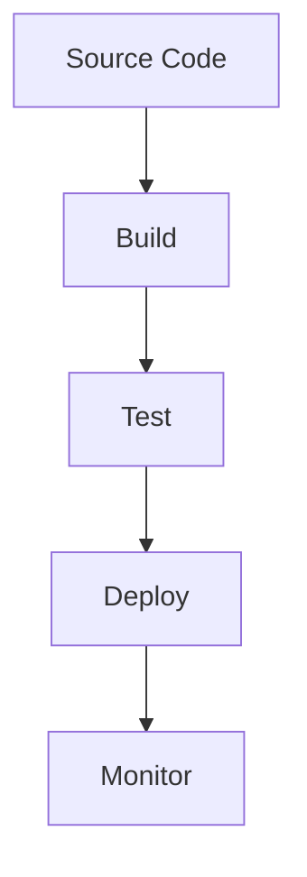
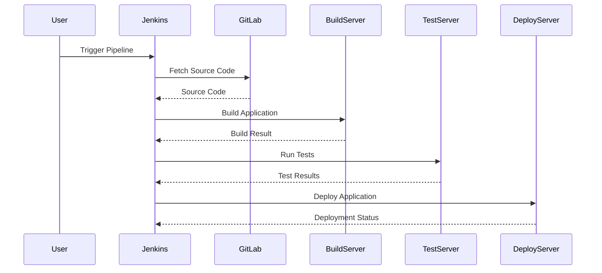

## Introduction to Pipeline Creation Using Groovy Scripts

In the realm of DevOps, creating automated pipelines is essential for streamlining the development process. These pipelines automate tasks such as building, testing, and deploying applications. One popular method for defining these pipelines is through Groovy scripts. Groovy is a versatile programming language that runs on the Java Virtual Machine (JVM) and is widely used in Jenkins for defining continuous integration and delivery (CI/CD) pipelines.

### What is a Pipeline?

A pipeline is a series of steps that are executed in a specific order to achieve a desired outcome. In the context of DevOps, pipelines are used to automate the entire software development lifecycle (SDLC), including:

- **Source Code Management**: Version control systems like GitLab, GitHub, Bitbucket, etc.
- **Build**: Compiling the source code into executable files.
- **Test**: Running automated tests to ensure the quality of the code.
- **Deploy**: Deploying the application to various environments (development, staging, production).

### Why Use Groovy Scripts?

Groovy scripts provide a flexible and powerful way to define pipelines. Unlike traditional UI-based configurations, Groovy scripts allow for more complex logic and dynamic behavior. Here are some key reasons why Groovy scripts are preferred:

- **Flexibility**: Groovy allows you to write complex logic and conditional statements, which is difficult to achieve with UI-based configurations.
- **Reusability**: You can define reusable functions and shared libraries, making your pipeline definitions more maintainable.
- **Version Control**: Since Groovy scripts are stored in version control systems, you can track changes and collaborate with team members more effectively.

### Setting Up a Pipeline in Jenkins

Let's walk through the process of setting up a pipeline in Jenkins using Groovy scripts. We'll start by creating a new pipeline project and then configure it to connect to a GitLab repository.

#### Step 1: Create a New Pipeline Project

1. Log in to your Jenkins instance.
2. Click on "New Item" to create a new job.
3. Enter a name for your pipeline, such as "my-pipeline".
4. Select "Pipeline" and click "OK".

#### Step 2: Configure the Pipeline

Once you've created the pipeline, you'll be taken to the configuration page. Here, you'll need to specify the source of your pipeline script.

##### Connecting to GitLab Repository

To connect your pipeline to a GitLab repository, follow these steps:

1. Scroll down to the "Pipeline" section.
2. Under "Definition", select "Pipeline script from SCM".
3. Choose "Git" as the SCM.
4. Enter the URL of your GitLab repository.
5. Specify the credentials to access the repository.
6. Enter the path to the pipeline script within the repository.

Here’s an example of how the configuration might look:

```yaml
pipeline {
    agent any
    stages {
        stage('Build') {
            steps {
                echo 'Building...'
            }
        }
        stage('Test') {
            steps {
                echo 'Testing...'
            }
        }
        stage('Deploy') {
            steps {
                echo 'Deploying...'
            }
        }
    }
}
```

### Understanding Groovy Syntax

Groovy is a dynamic, object-oriented programming language that runs on the JVM. It has a syntax similar to Java but is more concise and expressive. Here are some key features of Groovy:

- **Dynamic Typing**: Variables can be declared without specifying their type.
- **Closure Support**: Groovy supports closures, which are anonymous functions that can be passed around as parameters.
- **Operator Overloading**: Groovy allows you to overload operators, making the code more readable.

#### Example: Basic Groovy Script

Here’s a simple Groovy script that prints "Hello, World!":

```groovy
println "Hello, World!"
```

### Advanced Pipeline Concepts

Now that you understand the basics of Groovy and how to set up a pipeline, let's dive into some advanced concepts.

#### Conditional Logic

You can use conditional statements in your pipeline to perform different actions based on certain conditions. For example:

```groovy
pipeline {
    agent any
    stages {
        stage('Build') {
            steps {
                script {
                    def branch = env.BRANCH_NAME
                    if (branch == 'master') {
                        echo 'This is the master branch'
                    } else {
                        echo 'This is not the master branch'
                    }
                }
            }
        }
    }
}
```

#### Parallel Stages

You can run multiple stages in parallel to speed up the pipeline execution. For example:

```groovy
pipeline {
    agent any
    stages {
        stage('Parallel Stages') {
            parallel {
                stage('Stage 1') {
                    steps {
                        echo 'Running Stage 1'
                    }
                }
                stage('Stage 2') {
                    steps {
                        echo 'Running Stage 2'
                    }
                }
            }
        }
    }
}
```

### Real-World Examples and Recent Breaches

#### Example: CVE-2021-21234 - Jenkins Pipeline Script Security Bypass

In 2021, a critical vulnerability was discovered in Jenkins that allowed attackers to bypass script security restrictions. This vulnerability could be exploited to execute arbitrary Groovy scripts, leading to remote code execution.

**Impact**: An attacker could gain unauthorized access to the Jenkins server and potentially compromise the entire infrastructure.

**Detection**: Monitor Jenkins logs for unusual activity, such as unexpected script executions or unauthorized access attempts.

**Prevention**:
- **Secure Configuration**: Ensure that Jenkins is configured securely, with strong authentication mechanisms and restricted permissions.
- **Regular Updates**: Keep Jenkins and all plugins up to date with the latest security patches.
- **Script Approval**: Use the Script Security plugin to approve scripts before they are executed.

**Secure Coding Fix**:
- **Vulnerable Code**:
  ```groovy
  pipeline {
      agent any
      stages {
          stage('Unsecure Stage') {
              steps {
                  script {
                      // Vulnerable code that could be exploited
                      sh 'echo $(whoami)'
                  }
              }
          }
      }
  }
  ```
- **Fixed Code**:
  ```groovy
  pipeline {
      agent any
      stages {
          stage('Secure Stage') {
              steps {
                  script {
                      // Secure code that avoids executing untrusted commands
                      sh 'echo $USER'
                  }
              }
          }
      }
  }
  ```

### Mermaid Diagrams

#### Pipeline Architecture

Here’s a mermaid diagram illustrating the architecture of a typical CI/CD pipeline:



#### Request/Response Flow

Here’s a mermaid sequence diagram illustrating the request/response flow in a pipeline:



### Hands-On Labs

For hands-on practice with pipeline creation using Groovy scripts, consider the following resources:

- **PortSwigger Web Security Academy**: Offers interactive labs on web application security, including pipeline creation.
- **OWASP Juice Shop**: A deliberately insecure web application for practicing security skills, including pipeline automation.
- **DVWA (Damn Vulnerable Web Application)**: Another resource for practicing web application security, including pipeline setup.

These labs provide practical experience in setting up and securing pipelines, helping you to apply the concepts learned in this chapter.

### Conclusion

Creating pipelines using Groovy scripts is a powerful way to automate the software development lifecycle. By understanding the basics of Groovy and the advanced concepts of pipeline configuration, you can build robust and secure pipelines that streamline your development process. Always remember to follow best practices for security and maintainability, and regularly update your tools and configurations to stay ahead of potential vulnerabilities.

---
<!-- nav -->
[[05-Introduction to Pipeline Configuration with Groovy Scripts|Introduction to Pipeline Configuration with Groovy Scripts]] | [[DevOps/DevOps Bootcamp/06-CI CD & Build Tools/16-Creating Pipelines Using Groovy Scripts/00-Overview|Overview]] | [[07-Introduction to Scripted Pipelines Using Groovy|Introduction to Scripted Pipelines Using Groovy]]
