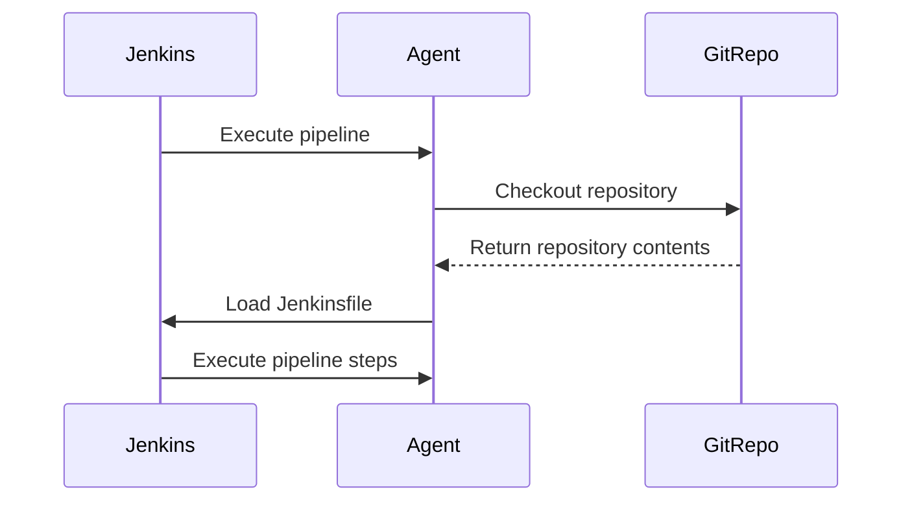

## Jenkins Pipeline Execution

### What Happens During Pipeline Execution?

When a Jenkins pipeline is executed, the following steps occur:

1. **Checkout Repository**: Jenkins checks out the specified Git repository.
2. **Load Jenkinsfile**: Jenkins loads the `Jenkinsfile` from the repository.
3. **Execute Pipeline**: Jenkins executes the pipeline steps defined in the `Jenkinsfile`.

### Example: Full Pipeline Execution

1. **Checkout Repository**

```http
GET /repos/username/repo.git HTTP/1.1
Host: github.com
Authorization: Bearer <token>
```

Response:

```http
HTTP/1.1 200 OK
Content-Type: application/json

{
  "name": "repo",
  "html_url": "https://github.com/username/repo",
  "clone_url": "https://github.com/username/repo.git"
}
```

2. **Load Jenkinsfile**

```groovy
pipeline {
    agent any

    stages {
        stage('Build') {
            steps {
                echo 'Building...'
            }
        }
        stage('Test') {
            steps {
                echo 'Testing...'
            }
        }
        stage('Deploy') {
            steps {
                echo 'Deploying...'
            }
        }
    }
}
```

3. **Execute Pipeline**



### Real-World Example: Jenkins Pipeline Failure

A common issue in Jenkins pipelines is the failure to find the `Jenkinsfile`. This can occur if the file is missing or not located in the correct directory.

#### Vulnerable Configuration

```groovy
pipeline {
    agent any

    stages {
        stage('Build') {
            steps {
                echo 'Building...'
            }
        }
    }
}
```

#### Secure Configuration

Ensure the `Jenkinsfile` is located in the root of the repository.

```groovy
pipeline {
    agent any

    stages {
        stage('Build') {
            steps {
                echo 'Building...'
            }
        }
    }
}
```

### How to Prevent / Defend

1. **Check Repository Structure**: Ensure the `Jenkinsfile` is located in the root of the repository.
2. **Use Jenkins Plugins**: Utilize plugins like the `Pipeline Syntax` plugin to validate pipeline configurations.
3. **Regular Audits**: Conduct regular audits of pipeline configurations to ensure compliance with best practices.

---
<!-- nav -->
[[10-Infrastructure as Code (IaC)|Infrastructure as Code (IaC)]] | [[DevOps/DevOps Bootcamp/06-CI CD & Build Tools/16-Creating Pipelines Using Groovy Scripts/00-Overview|Overview]] | [[12-Switching to Pipeline Script from Source Code Management|Switching to Pipeline Script from Source Code Management]]
