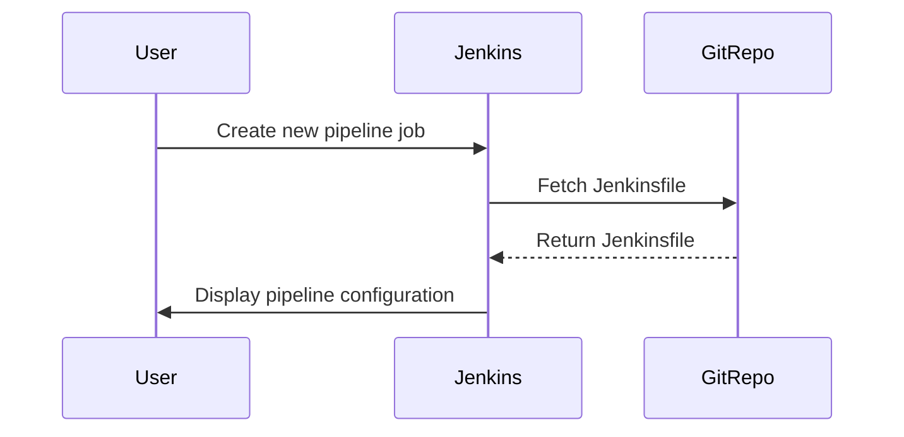

## Switching to Pipeline Script from Source Code Management

### What is Source Code Management?

Source Code Management (SCM) refers to the practice of managing and versioning source code using tools like Git, SVN, or Mercurial. SCM tools help track changes, collaborate on code, and maintain a history of modifications.

### Why Use SCM for Jenkins Pipelines?

Using SCM for Jenkins pipelines provides several advantages:

1. **Version Control**: Tracks changes to pipeline definitions, allowing rollbacks and comparisons.
2. **Collaboration**: Facilitates collaboration among team members working on pipeline definitions.
3. **Automation**: Integrates with CI/CD workflows, automatically triggering builds when changes are pushed to the repository.

### How to Configure Jenkins Pipeline from SCM

To configure a Jenkins pipeline from SCM, follow these steps:

1. **Create a Jenkinsfile**: Define the pipeline in a `Jenkinsfile` located in the root of your repository.
2. **Configure Jenkins Job**: Set up a Jenkins job to fetch the pipeline definition from the repository.

### Example: Configuring Jenkins Pipeline from Git

1. **Create a Jenkinsfile**

```groovy
pipeline {
    agent any

    stages {
        stage('Build') {
            steps {
                echo 'Building...'
            }
        }
        stage('Test') {
            steps {
                echo 'Testing...'
            }
        }
        stage('Deploy') {
            steps {
                echo 'Deploying...'
            }
        }
    }
}
```

2. **Configure Jenkins Job**



### Real-World Example: Jenkins Pipeline Misconfiguration

A common misconfiguration in Jenkins pipelines is the use of insecure credentials. This can lead to unauthorized access to sensitive resources.

#### Vulnerable Configuration

```groovy
pipeline {
    agent any

    environment {
        DB_PASSWORD = 'mysecretpassword'
    }

    stages {
        stage('Database Access') {
            steps {
                sh 'echo $DB_PASSWORD'
            }
        }
    }
}
```

#### Secure Configuration

```groovy
pipeline {
    agent any

    environment {
        DB_PASSWORD = credentials('db-password')
    }

    stages {
        stage('Database Access') {
            steps {
                sh 'echo $DB_PASSWORD'
            }
        }
    }
}
```

### How to Prevent / Defend

1. **Use Jenkins Credentials Plugin**: Store sensitive information securely using the Jenkins Credentials plugin.
2. **Limit Permissions**: Ensure credentials are only accessible to authorized users and processes.
3. **Audit Credentials Usage**: Regularly audit the usage of credentials in pipelines to identify and mitigate risks.

---
<!-- nav -->
[[11-Jenkins Pipeline Execution|Jenkins Pipeline Execution]] | [[DevOps/DevOps Bootcamp/06-CI CD & Build Tools/16-Creating Pipelines Using Groovy Scripts/00-Overview|Overview]] | [[DevOps/DevOps Bootcamp/06-CI CD & Build Tools/16-Creating Pipelines Using Groovy Scripts/13-Practice Questions & Answers|Practice Questions & Answers]]
