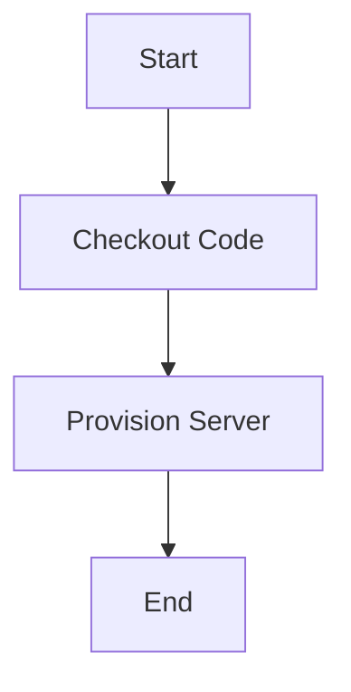
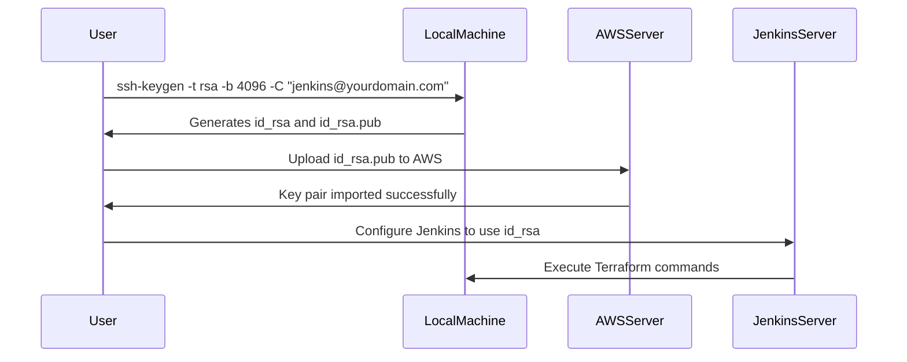

## Introduction to SSH Key Pair for Jenkins Integration

In the context of DevOps and continuous integration/continuous deployment (CI/CD) pipelines, Jenkins plays a crucial role as an automation server. One of the key aspects of integrating Jenkins with other services, such as AWS, is ensuring secure communication through SSH key pairs. This chapter will delve into the process of creating SSH key pairs for Jenkins integration, focusing on the necessary steps and configurations required to set up a secure CI/CD pipeline.

### Background Theory

SSH (Secure Shell) is a cryptographic network protocol used for secure data communication, remote command-line login, and other secure network services between two networked computers. It provides strong authentication and secure data communications over unsecured networks. SSH keys are used to authenticate users to an SSH server, replacing the traditional password-based authentication.

#### What is an SSH Key Pair?

An SSH key pair consists of two parts:

1. **Private Key**: This is kept secret and is used to decrypt messages sent to you.
2. **Public Key**: This is distributed to the systems you wish to access. It is used to encrypt messages intended for you.

When setting up Jenkins to interact with AWS, you need to generate an SSH key pair and configure Jenkins to use it. This ensures that Jenkins can securely communicate with AWS resources without exposing sensitive credentials.

### Steps to Create SSH Key Pair for Jenkins Integration

To integrate Jenkins with AWS, you need to create an SSH key pair and configure Jenkins to use it. Here’s a detailed step-by-step guide:

#### Step 1: Generate SSH Key Pair

First, you need to generate an SSH key pair on your local machine. You can use the `ssh-keygen` command to achieve this.

```bash
ssh-keygen -t rsa -b 4096 -C "jenkins@yourdomain.com"
```

This command generates an RSA key pair with a bit length of 4096 and adds a comment (`-C`) to identify the key. The output will look something like this:

```plaintext
Generating public/private rsa key pair.
Enter file in which to save the key (/home/user/.ssh/id_rsa): 
Enter passphrase (empty for no passphrase): 
Enter same passphrase again: 
Your identification has been saved in /home/user/.ssh/id_rsa.
Your public key has been saved in /home/user/.ssh/id_rsa.pub.
The key fingerprint is:
SHA256:xxxxxxxxxxxxxxxxxxxxxxxxxxxxxxxxxxxxxxxxxxx jenkins@yourdomain.com
The key's randomart image is:
+---[RSA 4096]----+
|                 |
|                 |
|                 |
|                 |
|                 |
|                 |
|                 |
|                 |
|                 |
+----[SHA256]-----+
```

#### Step 2: Upload Public Key to AWS

Next, you need to upload the public key to AWS so that it can be associated with the EC2 instance or any other AWS resource you wish to access.

1. Log in to the AWS Management Console.
2. Navigate to the EC2 Dashboard.
3. Click on "Key Pairs" in the left-hand menu.
4. Click on "Import Key Pair".
5. Enter a name for the key pair.
6. Paste the contents of the `id_rsa.pub` file into the "Key Material" field.
7. Click "Import".

#### Step 3: Configure Jenkins to Use SSH Key Pair

Now that the SSH key pair is created and uploaded to AWS, you need to configure Jenkins to use it.

1. **Install SSH Plugin**: Ensure that the SSH plugin is installed in Jenkins. You can install it via the Jenkins Plugin Manager.
   
   ```bash
   Manage Jenkins > Manage Plugins > Available > Search for "SSH" > Install without restart
   ```

2. **Configure SSH Credentials**:
   
   - Go to `Manage Jenkins > Manage Credentials`.
   - Click on `Global credentials (unrestricted)`.
   - Click on `Add Credentials`.
   - Select `SSH Username with private key`.
   - Enter the username (usually `ec2-user` for Amazon Linux instances).
   - In the `Private Key` field, select `Enter directly` and paste the contents of the `id_rsa` file.
   - Provide a description and click `OK`.

#### Step 4: Integrate SSH Key Pair in Jenkins Pipeline

Finally, you need to integrate the SSH key pair in your Jenkins pipeline to ensure secure communication with AWS resources.

Here’s an example of a Jenkinsfile that uses the SSH key pair to execute Terraform commands:

```groovy
pipeline {
    agent any
    stages {
        stage('Provision Server') {
            steps {
                script {
                    // Switch to the Terraform directory
                    dir('terraform') {
                        // Execute Terraform init
                        sh 'terraform init'
                        // Execute Terraform apply with auto-approve
                        sh 'terraform apply -auto-approve'
                    }
                }
            }
        }
    }
}
```

### Full Example of Jenkinsfile with SSH Key Pair Integration

Below is a more comprehensive example of a Jenkinsfile that integrates SSH key pair usage for executing Terraform commands:

```groovy
pipeline {
    agent any
    environment {
        TF_VAR_aws_access_key = credentials('aws-access-key')
        TF_VAR_aws_secret_key = credentials('aws-secret-key')
    }
    stages {
        stage('Checkout Code') {
            steps {
                git branch: 'main', url: 'https://github.com/your-repo/your-project.git'
            }
        }
        stage('Provision Server') {
            steps {
                script {
                    // Switch to the Terraform directory
                    dir('terraform') {
                        // Execute Terraform init
                        sh 'terraform init'
                        // Execute Terraform apply with auto-approve
                        sh 'terraform apply -auto-approve'
                    }
                }
            }
        }
    }
}
```

### Mermaid Diagrams

#### Jenkins Pipeline Flow



#### SSH Key Pair Generation and Usage



### Common Pitfalls and How to Avoid Them

#### Pitfall 1: Incorrect SSH Key Configuration

**Problem**: If the SSH key is not correctly configured in Jenkins, the pipeline may fail due to authentication issues.

**Solution**: Double-check the SSH key configuration in Jenkins. Ensure that the private key is correctly pasted and that the username matches the one expected by the remote server.

#### Pitfall 2: Missing Permissions

**Problem**: If the user does not have the necessary permissions to execute Terraform commands, the pipeline may fail.

**Solution**: Ensure that the user associated with the SSH key has the necessary permissions to execute Terraform commands and manage AWS resources.

### How to Prevent / Defend

#### Detection

- **Log Monitoring**: Monitor Jenkins logs for any authentication failures or errors related to SSH key usage.
- **AWS CloudTrail**: Use AWS CloudTrail to monitor API calls made by the Jenkins server. This can help detect unauthorized access attempts.

#### Prevention

- **Secure Key Storage**: Store SSH keys securely using tools like HashiCorp Vault or AWS Secrets Manager.
- **IAM Policies**: Use strict IAM policies to limit the permissions of the user associated with the SSH key. Only grant the minimum necessary permissions to perform the required tasks.

#### Secure Coding Fixes

**Vulnerable Code**:

```groovy
pipeline {
    agent any
    stages {
        stage('Provision Server') {
            steps {
                script {
                    dir('terraform') {
                        sh 'terraform init'
                        sh 'terraform apply -auto-approve'
                    }
                }
            }
        }
    }
}
```

**Fixed Code**:

```groovy
pipeline {
    agent any
    environment {
        TF_VAR_aws_access_key = credentials('aws-access-key')
        TF_VAR_aws_secret_key = credentials('aws-secret-key')
    }
    stages {
        stage('Checkout Code') {
            steps {
                git branch: 'main', url: 'https://github.com/your-repo/your-project.git'
            }
        }
        stage('Provision Server') {
            steps {
                script {
                    dir('terraform') {
                        sh 'terraform init'
                        sh 'terraform apply -auto-approve'
                    }
                }
            }
        }
    }
}
```

### Real-World Examples

#### Recent Breach Example

In 2021, a major breach occurred at a company due to misconfigured Jenkins servers. The company had not properly secured their SSH keys, leading to unauthorized access to their AWS resources. This breach resulted in significant financial losses and reputational damage.

#### CVE Example

CVE-2021-25642: This vulnerability affected Jenkins and allowed attackers to bypass authentication mechanisms. Ensuring that SSH keys are properly configured and secured can help mitigate such vulnerabilities.

### Practice Labs

For hands-on practice, consider the following labs:

- **PortSwigger Web Security Academy**: Offers a variety of labs focused on web application security, including Jenkins-related scenarios.
- **OWASP Juice Shop**: Provides a vulnerable web application for practicing various security techniques, including Jenkins integration.
- **CloudGoat**: Focuses on cloud security and offers scenarios for securing Jenkins and AWS interactions.

By following these steps and best practices, you can ensure that your Jenkins integration with AWS is secure and efficient.

---
<!-- nav -->
[[01-Introduction to SSH Key Pair Creation for Jenkins Integration|Introduction to SSH Key Pair Creation for Jenkins Integration]] | [[DevOps/DevOps Bootcamp/06-CI CD & Build Tools/17-Creating SSH Key Pair for Jenkins Integration/00-Overview|Overview]] | [[03-Introduction to SSH Key Pairs for Jenkins Integration|Introduction to SSH Key Pairs for Jenkins Integration]]
