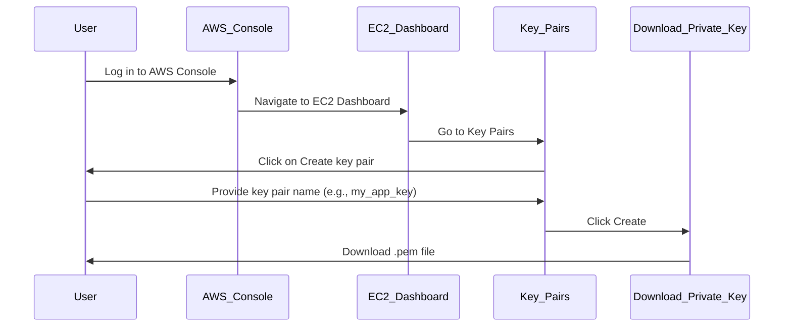
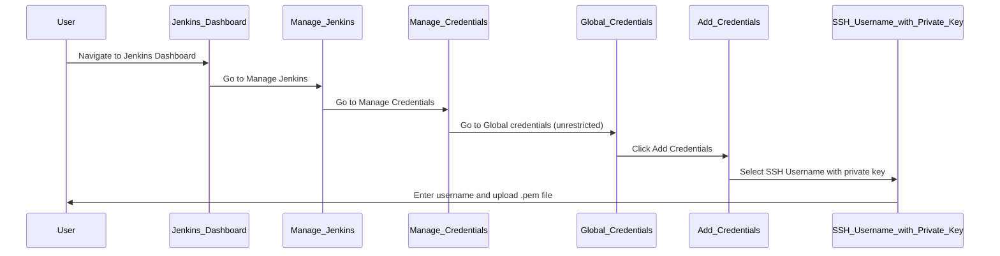

## Introduction to SSH Key Pairs for Jenkins Integration

In the context of DevOps, integrating Jenkins with other services often requires secure communication mechanisms. One such mechanism is Secure Shell (SSH), which uses key pairs for authentication. This chapter delves into the creation and management of SSH key pairs specifically for Jenkins integration, providing a comprehensive understanding of the process, underlying principles, and practical applications.

### What is SSH?

Secure Shell (SSH) is a cryptographic network protocol used for secure data communication, remote command-line login, remote command execution, and other secure network services between two networked computers. It provides strong authentication and secure communications over unsecured channels.

#### Components of SSH

1. **Client**: The entity initiating the connection.
2. **Server**: The entity accepting the connection.
3. **Key Pair**: A set of keys used for encryption and decryption. It consists of a public key and a private key.

#### How SSH Works

1. **Key Generation**: The client generates a pair of keys: a public key and a private key.
2. **Public Key Distribution**: The public key is distributed to the server.
3. **Authentication**: During the connection attempt, the server verifies the identity of the client using the public key.

### Why Use SSH Keys for Jenkins?

Jenkins is a popular open-source automation server used for continuous integration and continuous delivery (CI/CD). Using SSH keys for Jenkins integration ensures secure access to remote servers and resources. This method is more secure than using passwords, as it eliminates the risk of password exposure.

### Creating SSH Key Pairs for Jenkins Integration

The process of creating SSH key pairs for Jenkins integration can be done in several ways. We will explore both manual creation within the Jenkins environment and creation through AWS.

#### Manual Creation Within Jenkins

1. **Generate SSH Key Pair**:
    - Open a terminal window.
    - Run the following command to generate an SSH key pair:

      ```bash
      ssh-keygen -t rsa -b 4096 -C "your_email@example.com"
      ```

      This command creates a 4096-bit RSA key pair with your email address as a comment.

2. **Add Public Key to Jenkins**:
    - Navigate to the Jenkins dashboard.
    - Go to `Manage Jenkins` > `Manage Credentials`.
    - Click on `Global credentials (unrestricted)` and then `Add Credentials`.
    - Select `SSH Username with private key`.
    - Enter the username and paste the public key.
    - Upload the private key file.

#### Creating SSH Key Pair in AWS

1. **Create Key Pair in AWS Console**:
    - Log in to the AWS Management Console.
    - Navigate to the EC2 Dashboard.
    - In the left-hand menu, click on `Key Pairs`.
    - Click on `Create key pair`.

2. **Download Private Key**:
    - Provide a name for the key pair (e.g., `my_app_key`).
    - Click `Create`. AWS will automatically download the `.pem` file containing the private key.

3. **Add Key Pair to Jenkins**:
    - Navigate to the Jenkins dashboard.
    - Go to `Manage Jenkins` > `Manage Credentials`.
    - Click on `Global credentials (unrestricted)` and then `Add Credentials`.
    - Select `SSH Username with private key`.
    - Enter the username and upload the `.pem` file.

### Example: Full Process with Code and Diagrams

Let's walk through a complete example of creating an SSH key pair in AWS and integrating it with Jenkins.

#### Step 1: Create Key Pair in AWS



#### Step 2: Add Key Pair to Jenkins



### Real-World Examples and Breaches

Recent breaches have highlighted the importance of secure SSH key management. For instance, the 2021 SolarWinds breach involved unauthorized access to systems using compromised SSH keys. Ensuring proper key management and secure practices is crucial to preventing such incidents.

### Pitfalls and Common Mistakes

1. **Exposing Private Keys**: Accidentally sharing or exposing private keys can lead to unauthorized access.
2. **Weak Key Lengths**: Using weak key lengths (less than 2048 bits) can make keys vulnerable to brute-force attacks.
3. **Improper Key Storage**: Storing private keys in insecure locations or without proper permissions can lead to unauthorized access.

### How to Prevent / Defend

#### Detection

1. **Audit Logs**: Regularly review audit logs to detect unauthorized access attempts.
2. **Monitoring Tools**: Use monitoring tools like AWS CloudTrail to track key usage and detect anomalies.

#### Prevention

1. **Strong Key Lengths**: Ensure keys are at least 2048 bits long.
2. **Secure Key Storage**: Store private keys securely with appropriate permissions (e.g., chmod 600).

#### Secure Coding Fixes

##### Vulnerable Pattern

```yaml
credentials:
  sshCredentials:
    username: jenkins_user
    privateKeyFile: /path/to/private/key.pem
```

##### Secure Pattern

```yaml
credentials:
  sshCredentials:
    username: jenkins_user
    privateKeyFile: /secure/path/to/private/key.pem
```

#### Configuration Hardening

1. **IAM Policies**: Restrict access to key pairs using IAM policies.
2. **SSH Configurations**: Configure SSH to disallow root login and enforce strong key requirements.

### Complete Example with Raw HTTP Messages

#### Full HTTP Request and Response

```http
POST /api/json HTTP/1.1
Host: jenkins.example.com
Content-Type: application/json

{
  "credentials": {
    "username": "jenkins_user",
    "privateKeyFile": "/secure/path/to/private/key.pem"
  }
}

HTTP/1.1 200 OK
Content-Type: application/json

{
  "message": "Credentials added successfully"
}
```

### Practice Labs

For hands-on practice, consider the following labs:

- **PortSwigger Web Security Academy**: Focuses on web application security but includes SSH-related exercises.
- **OWASP Juice Shop**: Includes challenges related to SSH key management and secure coding practices.
- **CloudGoat**: Provides scenarios for managing SSH keys in cloud environments.

By thoroughly understanding and implementing these steps, you can ensure secure SSH key management for Jenkins integration, enhancing the overall security posture of your DevOps environment.

---
<!-- nav -->
[[02-Introduction to SSH Key Pair for Jenkins Integration|Introduction to SSH Key Pair for Jenkins Integration]] | [[DevOps/DevOps Bootcamp/06-CI CD & Build Tools/17-Creating SSH Key Pair for Jenkins Integration/00-Overview|Overview]] | [[04-Authentication in AWS for Jenkins and Terraform Integration|Authentication in AWS for Jenkins and Terraform Integration]]
