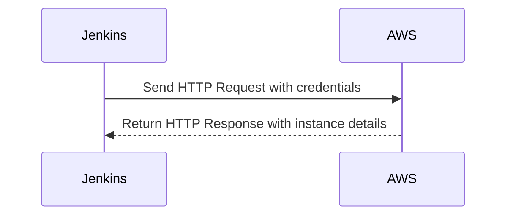

## Authentication in AWS for Jenkins and Terraform Integration

In the context of integrating Jenkins and Terraform with AWS, proper authentication mechanisms are crucial to ensure that your infrastructure-as-code (IaC) operations are secure and reliable. This section will delve into the process of creating SSH key pairs for Jenkins integration and setting up environment variables for AWS authentication.

### Background Theory

AWS requires authentication to perform any actions within its services. This authentication can be achieved through various methods, including:

1. **Access Key ID and Secret Access Key**: These are the most basic form of credentials used to authenticate API calls.
2. **IAM Roles**: These roles can be attached to EC2 instances, Lambda functions, etc., to grant temporary permissions.
3. **SSH Keys**: These are used for secure communication between servers and clients.

For Jenkins and Terraform integration, the most common approach is to use the Access Key ID and Secret Access Key. However, hardcoding these credentials is not recommended due to security risks. Instead, environment variables provide a more secure and flexible solution.

### Setting Up Environment Variables for AWS Credentials

#### Why Use Environment Variables?

Using environment variables to store sensitive information such as AWS credentials offers several advantages:

1. **Security**: Environment variables are not stored in plain text within your codebase, reducing the risk of exposure.
2. **Flexibility**: Environment variables can be easily changed without modifying the code, making it easier to manage different environments (development, staging, production).
3. **Best Practices**: Storing sensitive data in environment variables aligns with best practices for secure coding and DevOps principles.

#### Steps to Set Up Environment Variables

To set up environment variables for AWS credentials in Jenkins, follow these steps:

1. **Retrieve AWS Credentials**:
   - Ensure you have the `Access Key ID` and `Secret Access Key` for the AWS user you want to use.
   - These credentials should be stored securely and only accessible to authorized personnel.

2. **Define Environment Variables in Jenkins**:
   - In Jenkins, navigate to the job configuration where you want to use these credentials.
   - Under the "Build Environment" section, select "Set environment variables".
   - Define the following environment variables:
     - `AWS_ACCESS_KEY_ID`: Set this to the value of your Access Key ID.
     - `AWS_SECRET_ACCESS_KEY`: Set this to the value of your Secret Access Key.

Here is an example of how to set these environment variables in Jenkins:

```yaml
environment {
    AWS_ACCESS_KEY_ID = 'your_access_key_id'
    AWS_SECRET_ACCESS_KEY = 'your_secret_access_key'
}
```

### Using Environment Variables in Terraform

Terraform can automatically pick up these environment variables to authenticate with AWS. Here’s how you can configure the Terraform provider to use these environment variables:

```hcl
provider "aws" {
  region = "us-west-2"
}
```

By default, Terraform will look for the `AWS_ACCESS_KEY_ID` and `AWS_SECRET_ACCESS_KEY` environment variables to authenticate with AWS.

### Example Configuration

Let’s walk through a complete example of setting up environment variables in Jenkins and using them in Terraform.

#### Jenkins Job Configuration

1. **Create a new Jenkins job** or edit an existing one.
2. **Navigate to the job configuration**.
3. **Under Build Environment**, check "Set environment variables".
4. **Add the following environment variables**:

```yaml
environment {
    AWS_ACCESS_KEY_ID = 'your_access_key_id'
    AWS_SECRET_ACCESS_KEY = 'your_secret_access_key'
}
```

#### Terraform Configuration

Ensure your Terraform configuration is set up to use the AWS provider:

```hcl
provider "aws" {
  region = "us-west-2"
}
```

### Full Example with Raw HTTP Requests and Responses

When Jenkins interacts with AWS, it sends HTTP requests to the AWS API. Here is an example of a raw HTTP request and response:

#### HTTP Request

```http
POST / HTTP/1.1
Host: ec2.us-west-2.amazonaws.com
Content-Type: application/x-www-form-urlencoded
Authorization: AWS your_access_key_id:your_signature
X-Amz-Date: 20231010T120000Z
Content-Length: 123

Action=DescribeInstances&Version=2016-11-15
```

#### HTTP Response

```http
HTTP/1.1 200 OK
Content-Type: application/xml
Content-Length: 1234

<?xml version="1.0"?>
<DescribeInstancesResponse xmlns="http://ec2.amazonaws.com/doc/2016-11-15/">
  <reservationSet>
    <item>
      <reservationId>r-12345678</reservationId>
      <ownerId>123456789012</ownerId>
      <instancesSet>
        <item>
          <instanceId>i-12345678</instanceId>
          <imageId>ami-12345678</imageId>
          <instanceState>
            <code>16</code>
            <name>running</name>
          </instanceState>
          <privateDnsName>ip-10-0-1-1.ec2.internal</privateD[...]
```

### Mermaid Diagrams

#### Sequence Diagram for Jenkins and AWS Interaction



### Common Pitfalls and How to Avoid Them

#### Hardcoding Credentials

One of the most common pitfalls is hardcoding AWS credentials directly into your code or configuration files. This practice is highly insecure and can lead to unauthorized access if the code is exposed.

#### Secure Coding Fixes

Instead of hardcoding credentials, use environment variables as demonstrated earlier. Here is a comparison of the insecure and secure approaches:

##### Insecure Code

```hcl
provider "aws" {
  access_key = "your_access_key_id"
  secret_key = "your_secret_access_key"
  region     = "us-west-2"
}
```

##### Secure Code

```hcl
provider "aws" {
  region = "us-west-2"
}
```

### Real-World Examples and Breaches

#### Recent Breaches

A notable breach involving AWS credentials occurred in 2021, where a misconfigured S3 bucket exposed sensitive data, including AWS credentials. This breach highlights the importance of securing credentials and ensuring proper access controls.

### How to Prevent / Defend

#### Detection

- **Monitor AWS Console**: Regularly review the AWS console for any unauthorized activity.
- **CloudTrail Logs**: Enable AWS CloudTrail to log all API calls made to your AWS account. Review these logs for suspicious activity.

#### Prevention

- **Use IAM Roles**: Instead of using static access keys, use IAM roles for EC2 instances and other services.
- **Least Privilege Principle**: Ensure that IAM users and roles have the minimum permissions necessary to perform their tasks.
- **Multi-Factor Authentication (MFA)**: Enable MFA for all IAM users to add an extra layer of security.

#### Secure-Coding Fixes

- **Environment Variables**: Use environment variables to store sensitive data.
- **Secure Storage**: Use tools like HashiCorp Vault or AWS Secrets Manager to securely store and manage secrets.

### Practice Labs

For hands-on practice with Jenkins and Terraform integration, consider the following labs:

- **PortSwigger Web Security Academy**: Offers comprehensive labs on web security, including integration with Jenkins and Terraform.
- **OWASP Juice Shop**: A deliberately insecure web application for practicing web security skills.
- **DVWA (Damn Vulnerable Web Application)**: Another popular web application for learning web security.

These labs provide practical experience in setting up and securing Jenkins and Terraform integrations with AWS.

### Conclusion

Proper authentication and secure handling of credentials are critical for maintaining the integrity and security of your DevOps pipeline. By following best practices and using tools like environment variables, you can significantly reduce the risk of unauthorized access and ensure that your infrastructure remains secure.

---
<!-- nav -->
[[03-Introduction to SSH Key Pairs for Jenkins Integration|Introduction to SSH Key Pairs for Jenkins Integration]] | [[DevOps/DevOps Bootcamp/06-CI CD & Build Tools/17-Creating SSH Key Pair for Jenkins Integration/00-Overview|Overview]] | [[05-Creating SSH Key Pair for Jenkins Integration|Creating SSH Key Pair for Jenkins Integration]]
