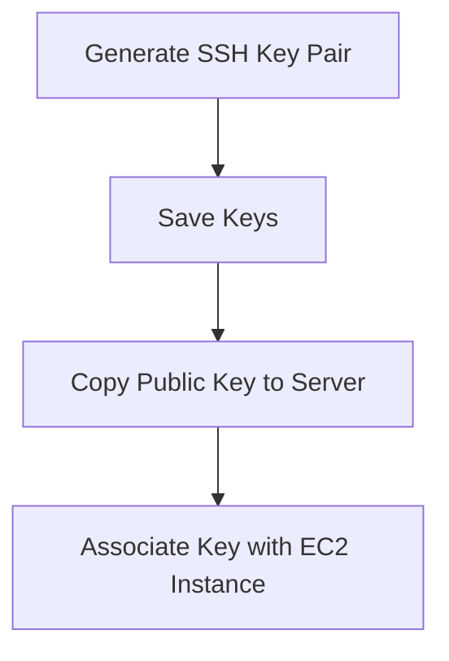
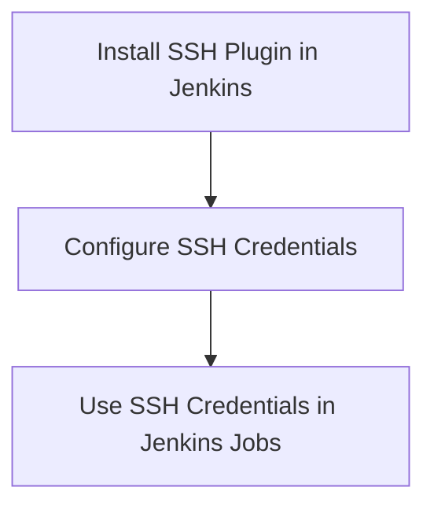
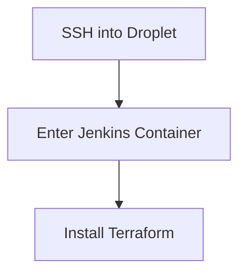

## Creating SSH Key Pair for Jenkins Integration

### Background Theory

Secure Shell (SSH) is a cryptographic network protocol used for secure data communication, remote command-line login, remote command execution, and other secure network services between two networked computers. It provides strong authentication and secure communications over unsecured channels. SSH uses public-key cryptography to authenticate the remote computer and allow the remote computer to authenticate the user.

In the context of DevOps, SSH keys are often used to automate tasks such as deploying applications, managing servers, and performing other administrative tasks. This automation is crucial for continuous integration and continuous deployment (CI/CD) pipelines, where manual intervention should be minimized.

### Creating SSH Key Pair

To create an SSH key pair, we need to generate both a public key and a private key. The public key is shared with the server, while the private key is kept secret and used to authenticate the client.

#### Step-by-Step Mechanics

1. **Generate the SSH Key Pair:**
   - On the local machine, run the following command to generate an SSH key pair:
     ```bash
     ssh-keygen -t rsa -b 4096 -C "your_email@example.com"
     ```
   - This command generates an RSA key pair with a bit length of 4096 bits and associates it with your email address for identification purposes.

2. **Save the Keys:**
   - By default, the keys are saved in `~/.ssh/id_rsa` (private key) and `~/.ssh/id_rsa.pub` (public key).

3. **Copy the Public Key to the Server:**
   - To copy the public key to the server, use the `ssh-copy-id` command:
     ```bash
     ssh-copy-id -i ~/.ssh/id_rsa.pub username@server_ip
     ```

### Associating SSH Key with EC2 Instance

In the context of Amazon EC2 instances, the SSH key pair is used to securely log in to the instance. The default user for EC2 instances is typically `ec2-user`.

#### Step-by-Step Mechanics

1. **Create the SSH Key Pair:**
   - Generate the SSH key pair as described above.

2. **Upload the Public Key to EC2:**
   - In the AWS Management Console, navigate to the EC2 dashboard.
   - Under the "Key Pairs" section, upload the public key (`id_rsa.pub`) to the EC2 instance.

3. **Associate the Key with the Instance:**
   - When launching a new EC2 instance, select the key pair you uploaded during the launch process.

### Integrating SSH Key with Jenkins

Jenkins is a popular open-source automation server used for continuous integration and delivery. To enable Jenkins to SSH into the EC2 instance, we need to configure Jenkins to use the private key.

#### Step-by-Step Mechanics

1. **Install SSH Plugin in Jenkins:**
   - Navigate to the Jenkins dashboard.
   - Go to "Manage Jenkins" > "Manage Plugins".
   - Search for and install the "SSH Agent" plugin.

2. **Configure SSH Credentials in Jenkins:**
   - Go to "Manage Jenkins" > "Manage Credentials" > "Global credentials (unrestricted)".
   - Click "Add Credentials".
   - Select "SSH Username with private key".
   - Enter the username (`ec2-user`).
   - Upload the private key file (`id_rsa`).
   - Save the credentials.

3. **Use SSH Credentials in Jenkins Jobs:**
   - In the Jenkins job configuration, specify the SSH credentials to be used for the build steps.

### Installing Terraform Inside Jenkins Container

Terraform is an infrastructure as code (IaC) tool that allows you to define and provision infrastructure resources using declarative configuration files. To install Terraform inside a Jenkins container, follow these steps:

#### Step-by-Step Mechanics

1. **SSH into the Droplet:**
   - Use the public key to SSH into the droplet:
     ```bash
     ssh -i ~/.ssh/id_rsa.pub username@droplet_ip
     ```

2. **Enter the Jenkins Container:**
   - Once inside the droplet, enter the Jenkins container as the root user:
     ```bash
     docker exec -it <container_id> /bin/bash
     ```

3. **Install Terraform:**
   - Inside the container, download and install Terraform:
     ```bash
     wget https://releases.hashicorp.com/terraform/1.0.0/terraform_1.0.0_linux_amd64.zip
     unzip terraform_1.0.0_linux_amd64.zip
     mv terraform /usr/local/bin/
     ```

### Mermaid Diagrams

#### SSH Key Generation and Association



#### Jenkins Integration with SSH Key



#### Terraform Installation in Jenkins Container



### Common Pitfalls and How to Prevent

#### Pitfall: Incorrect SSH Key Permissions

**What Goes Wrong:**
- If the permissions on the private key file are too loose, SSH may refuse to use the key due to security concerns.

**How to Prevent:**
- Ensure the private key file has the correct permissions:
  ```bash
  chmod 600 ~/.ssh/id_rsa
  ```

#### Pitfall: Missing SSH Agent Plugin

**What Goes Wrong:**
- Without the SSH Agent plugin, Jenkins cannot manage SSH credentials properly.

**How to Prevent:**
- Install the SSH Agent plugin as described earlier.

#### Pitfall: Incorrect Terraform Version

**What Goes Wrong:**
- Using an outdated or incorrect version of Terraform can lead to compatibility issues.

**How to Prevent:**
- Always check the latest stable version of Terraform and ensure it is installed correctly.

### Real-World Examples

#### Example: CVE-2021-21277

**Description:**
- CVE-2021-21277 is a vulnerability in Jenkins that allows attackers to execute arbitrary code by exploiting a path traversal flaw in the Jenkins CLI.

**Impact:**
- This vulnerability can be exploited to gain unauthorized access to the Jenkins server and potentially compromise the entire infrastructure.

**Mitigation:**
- Ensure Jenkins is updated to the latest version.
- Implement strict access controls and use SSH keys for authentication.

### Secure Coding Practices

#### Vulnerable Code Example

```yaml
# Jenkinsfile
pipeline {
    agent any
    stages {
        stage('Deploy') {
            steps {
                sh 'ssh -i ~/.ssh/id_rsa ec2-user@server_ip "sudo systemctl restart myservice"'
            }
        }
    }
}
```

#### Secure Code Example

```yaml
# Jenkinsfile
pipeline {
    agent any
    environment {
        SSH_KEY = credentials('jenkins-ssh-key')
    }
    stages {
        stage('Deploy') {
            steps {
                script {
                    sshagent(['jenkins-ssh-key']) {
                        sh 'ssh -o StrictHostKeyChecking=no ec2-user@server_ip "sudo systemctl restart myservice"'
                    }
                }
            }
        }
    }
}
```

### Detection and Prevention

#### Detection

- Regularly audit Jenkins configurations and credentials.
- Monitor Jenkins logs for suspicious activities.
- Use security tools like SonarQube to scan Jenkinsfiles for vulnerabilities.

#### Prevention

- Keep Jenkins and all plugins up to date.
- Use SSH keys for authentication instead of passwords.
- Implement least privilege access control.
- Harden SSH configurations by disabling password authentication and enabling public key authentication.

### Practice Labs

For hands-on practice, consider the following labs:

- **PortSwigger Web Security Academy:** Focuses on web application security but includes sections on SSH and Jenkins integration.
- **OWASP Juice Shop:** While primarily focused on web application security, it can be extended to include Jenkins and SSH practices.
- **CloudGoat:** Provides scenarios for securing AWS environments, including EC2 instances and Jenkins integration.

By following these detailed steps and best practices, you can effectively integrate SSH keys with Jenkins and Terraform to automate your DevOps processes securely and efficiently.

---
<!-- nav -->
[[04-Authentication in AWS for Jenkins and Terraform Integration|Authentication in AWS for Jenkins and Terraform Integration]] | [[DevOps/DevOps Bootcamp/06-CI CD & Build Tools/17-Creating SSH Key Pair for Jenkins Integration/00-Overview|Overview]] | [[06-Deploying with Jenkins and Terraform|Deploying with Jenkins and Terraform]]
