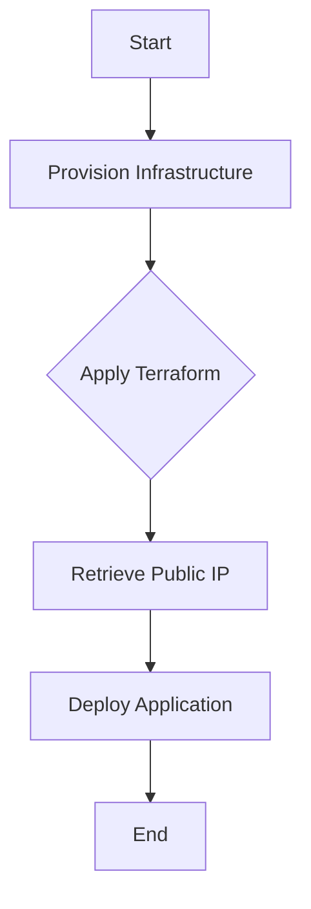

## Deploying with Jenkins and Terraform

### Background Theory

In modern DevOps practices, automation tools like Jenkins and Terraform are often used together to streamline the deployment process. Jenkins is a popular open-source automation server that provides continuous integration and continuous delivery (CI/CD) services. Terraform is an infrastructure as code (IaC) tool that allows you to define and provision your infrastructure using declarative configuration files.

When integrating Jenkins with Terraform, one common challenge is dynamically referencing the attributes of Terraform resources, such as the public IP address of an AWS instance, within the Jenkins pipeline. This is crucial because the IP address of the server is not known beforehand and is determined at runtime during the provisioning process.

### Dynamic Reference to Public IP Address

#### Problem Statement

In the given scenario, the Jenkinsfile contains a hardcoded IP address of the server. However, since the server is being provisioned dynamically using Terraform, the IP address is not known until the instance is created. Therefore, the Jenkinsfile needs to be modified to dynamically reference the public IP address of the server created by Terraform.

#### Solution Overview

To solve this problem, we can leverage Terraform's `output` directive to expose the public IP address of the server. Then, within the Jenkins pipeline, we can use the `terraform output` command to retrieve this value and use it in our deployment steps.

### Terraform Output Directive

#### What is the `output` Directive?

The `output` directive in Terraform is used to define the values that should be exposed after the Terraform apply operation. These values can be referenced outside of Terraform, such as in a Jenkins pipeline.

#### Syntax and Usage

The `output` directive is defined in the Terraform configuration file (`.tf`) and follows this basic structure:

```hcl
output "public_ip_address" {
  value = aws_instance.example.public_ip
}
```

Here, `"public_ip_address"` is the name of the output, and `aws_instance.example.public_ip` is the attribute whose value we want to expose.

#### Example Configuration

Let's assume we have a Terraform configuration file (`main.tf`) that provisions an AWS EC2 instance:

```hcl
provider "aws" {
  region = "us-west-2"
}

resource "aws_instance" "example" {
  ami           = "ami-0c55b159cbfafe1f0"
  instance_type = "t2.micro"

  tags = {
    Name = "example-instance"
  }
}

output "public_ip_address" {
  value = aws_instance.example.public_ip
}
```

### Retrieving the Public IP Address in Jenkins

#### Using `terraform output` Command

Once the Terraform apply operation is completed, we can use the `terraform output` command to retrieve the value of the `public_ip_address` output.

#### Full Command Example

```bash
terraform output public_ip_address
```

This command will return the public IP address of the server created by Terraform.

#### Integrating with Jenkins Pipeline

To integrate this into a Jenkins pipeline, we can use the `sh` step to execute the `terraform output` command and capture the result.

#### Jenkinsfile Example

Here is an example Jenkinsfile that demonstrates how to dynamically retrieve and use the public IP address:

```groovy
pipeline {
    agent any

    stages {
        stage('Provision Infrastructure') {
            steps {
                sh 'terraform init'
                sh 'terraform apply -auto-approve'
            }
        }

        stage('Deploy Application') {
            steps {
                script {
                    def publicIp = sh(script: 'terraform output public_ip_address', returnStdout: true).trim()
                    echo "Public IP Address: ${publicIp}"

                    // Use the public IP address in your deployment steps
                    sh "ssh -o StrictHostKeyChecking=no ubuntu@${publicIp} 'echo Hello World'"
                }
            }
        }
    }
}
```

### Diagram: Jenkins Pipeline Flow



### Common Pitfalls and How to Avoid Them

#### Hardcoding IP Addresses

Hardcoding IP addresses in your Jenkinsfile can lead to issues when the infrastructure changes. Always use dynamic references to ensure your pipeline remains flexible and resilient.

#### Missing Outputs

Ensure that all necessary outputs are defined in your Terraform configuration. Missing outputs can cause errors when trying to retrieve values in the Jenkins pipeline.

#### Incorrect Output Names

Double-check the names of the outputs in both your Terraform configuration and Jenkinsfile to avoid mismatches.

### Real-World Example: CVE-2021-21972

CVE-2021-21972 is a vulnerability in Jenkins that allows attackers to bypass authentication and gain unauthorized access to the Jenkins server. This vulnerability highlights the importance of securing your Jenkins environment and ensuring that sensitive information, such as IP addresses, is handled securely.

#### Secure Coding Practices

To prevent such vulnerabilities, follow these secure coding practices:

1. **Use Environment Variables**: Store sensitive information like IP addresses in environment variables rather than hardcoding them.
2. **Secure Secrets Management**: Use tools like HashiCorp Vault or AWS Secrets Manager to manage and secure secrets.
3. **Least Privilege Principle**: Ensure that Jenkins jobs and scripts run with the least privilege necessary to perform their tasks.

### Secure Code Fix

#### Vulnerable Code

```groovy
pipeline {
    agent any

    stages {
        stage('Deploy Application') {
            steps {
                sh "ssh -o StrictHostKeyChecking=no ubuntu@192.168.1.1 'echo Hello World'"
            }
        }
    }
}
```

#### Secure Code

```groovy
pipeline {
    agent any

    environment {
        PUBLIC_IP = sh(script: 'terraform output public_ip_address', returnStdout: true).trim()
    }

    stages {
        stage('Deploy Application') {
            steps {
                sh "ssh -o StrictHostKeyChecking=no ubuntu@${env.PUBLIC_IP} 'echo Hello World'"
            }
        }
    }
}
```

### Hands-On Labs

For practical experience with Jenkins and Terraform integration, consider the following labs:

- **PortSwigger Web Security Academy**: Offers a series of labs focused on web application security, including Jenkins security.
- **OWASP Juice Shop**: A deliberately insecure web application for security training.
- **DVWA (Damn Vulnerable Web Application)**: Another popular web application for learning about web security.

### Conclusion

Integrating Jenkins with Terraform to dynamically reference the public IP address of a server is a critical step in automating your deployment processes. By leveraging Terraform's `output` directive and using the `terraform output` command in your Jenkins pipeline, you can ensure that your infrastructure is provisioned and deployed securely and efficiently. Always follow secure coding practices to protect your environment from vulnerabilities.

---
<!-- nav -->
[[05-Creating SSH Key Pair for Jenkins Integration|Creating SSH Key Pair for Jenkins Integration]] | [[DevOps/DevOps Bootcamp/06-CI CD & Build Tools/17-Creating SSH Key Pair for Jenkins Integration/00-Overview|Overview]] | [[07-Optimizing Jenkins Integration with Terraform|Optimizing Jenkins Integration with Terraform]]
