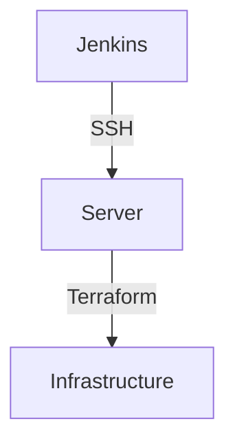
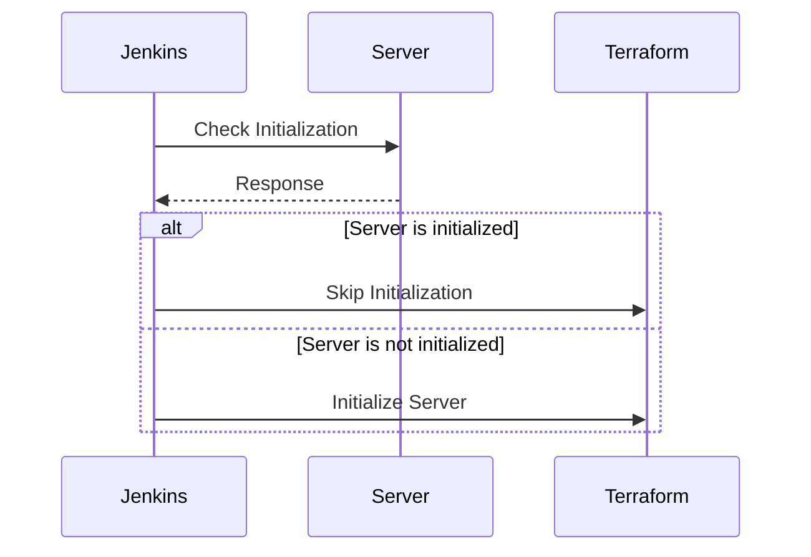

## Optimizing Jenkins Integration with Terraform

### Background Theory

In DevOps practices, automation tools like Jenkins and Terraform are often used together to streamline the deployment and management of infrastructure. Jenkins is a popular open-source automation server that provides continuous integration and continuous delivery (CI/CD) services. Terraform, on the other hand, is an infrastructure as code (IaC) tool that allows you to define and provision your infrastructure using declarative configuration files.

When integrating Jenkins with Terraform, one common scenario is to automate the creation and management of servers. However, creating a new server every time the build runs can be inefficient and time-consuming. This inefficiency can be mitigated by optimizing the process through conditional checks and proper SSH key handling.

### Conditional Checks for Server Initialization

One way to optimize the process is to use conditional checks to determine whether the server is already initialized. This can be done using `if` statements within your Jenkins pipeline or Terraform scripts.

#### Example: Using Conditional Checks in Jenkins Pipeline

Consider a Jenkins pipeline where you want to check if a server is already initialized before proceeding with further steps. Here’s how you can implement this:

```groovy
pipeline {
    agent any
    stages {
        stage('Check Server Initialization') {
            steps {
                script {
                    def serverInitialized = sh(script: 'ssh -o StrictHostKeyChecking=no user@server_ip "ls /path/to/init/file"', returnStatus: true)
                    if (serverInitialized == 0) {
                        echo 'Server is already initialized.'
                    } else {
                        echo 'Server is not initialized. Proceeding with initialization.'
                        // Add initialization steps here
                    }
                }
            }
        }
    }
}
```

In this example, the `sh` step runs an SSH command to check if a specific file exists on the server. If the file exists (`returnStatus == 0`), it means the server is already initialized. Otherwise, the pipeline proceeds with the initialization steps.

### Handling SSH Key Checking

Another important aspect of automating server interactions is handling SSH key checking. By default, SSH performs strict host key checking, which can cause issues during automated processes. To bypass this, you can use the `-o StrictHostKeyChecking=no` flag.

#### Example: Adding SSH Key Checking Flag

Here’s how you can modify your SSH commands to include the `-o StrictHostKeyChecking=no` flag:

```bash
ssh -o StrictHostKeyChecking=no user@server_ip "ls /path/to/init/file"
```

This flag tells SSH to disable strict host key checking, allowing the connection to proceed without prompting for confirmation.

### Ensuring Correct SSH Key Name

It’s crucial to ensure that the SSH key name is correctly specified in your configurations. In the context of Jenkins and Terraform, this might involve specifying the correct key name in your SSH commands and Terraform configurations.

#### Example: Specifying Correct SSH Key Name in Terraform

Here’s an example of how to specify the correct SSH key name in a Terraform configuration:

```hcl
resource "aws_instance" "example" {
  ami           = "ami-0c55b159cbfafe1f0"
  instance_type = "t2.micro"

  key_name = "server_ssh_key"

  tags = {
    Name = "example-instance"
  }
}
```

In this example, the `key_name` attribute specifies the name of the SSH key to be used for the EC2 instance.

### Full Example: Combining Conditional Checks and SSH Key Handling

Let’s combine the concepts of conditional checks and SSH key handling into a complete example. This example includes both a Jenkins pipeline and a Terraform configuration.

#### Jenkins Pipeline

```groovy
pipeline {
    agent any
    environment {
        SERVER_IP = '192.168.1.100'
        SSH_KEY_NAME = 'server_ssh_key'
    }
    stages {
        stage('Initialize Server') {
            steps {
                script {
                    def serverInitialized = sh(script: "ssh -i ${SSH_KEY_NAME} -o StrictHostKeyChecking=no user@${SERVER_IP} 'ls /path/to/init/file'", returnStatus: true)
                    if (serverInitialized == 0) {
                        echo 'Server is already initialized.'
                    } else {
                        echo 'Server is not initialized. Proceeding with initialization.'
                        // Add initialization steps here
                    }
                }
            }
        }
    }
}
```

#### Terraform Configuration

```hcl
provider "aws" {
  region = "us-west-2"
}

resource "aws_key_pair" "example" {
  key_name   = "server_ssh_key"
  public_key = file("~/.ssh/id_rsa.pub")
}

resource "aws_instance" "example" {
  ami           = "ami-0c55b159cbfafe1f0"
  instance_type = "t2.micro"

  key_name = aws_key_pair.example.key_name

  tags = {
    Name = "example-instance"
  }
}
```

### Pitfalls and Common Mistakes

1. **Incorrect SSH Key Name**: Ensure that the SSH key name specified in your configurations matches the actual key name.
2. **Strict Host Key Checking**: Not disabling strict host key checking can lead to unexpected failures in automated processes.
3. **Conditional Logic Errors**: Incorrect implementation of conditional logic can result in unnecessary server creation or missed initialization steps.

### How to Prevent / Defend

#### Detection

To detect issues related to SSH key handling and conditional checks, you can:

1. **Log SSH Commands**: Log the output of SSH commands to identify any errors or unexpected behavior.
2. **Monitor Jenkins Jobs**: Use Jenkins job logs to monitor the execution of conditional checks and SSH commands.

#### Prevention

To prevent issues, follow these best practices:

1. **Use Correct SSH Key Names**: Always verify that the SSH key name specified in your configurations matches the actual key name.
2. **Disable Strict Host Key Checking**: Use the `-o StrictHostKeyChecking=no` flag to avoid issues with strict host key checking.
3. **Implement Robust Conditional Logic**: Ensure that your conditional logic is correctly implemented to avoid unnecessary server creation or missed initialization steps.

#### Secure Code Fix

Here’s an example of a vulnerable Jenkins pipeline and the corresponding secure version:

**Vulnerable Version**

```groovy
pipeline {
    agent any
    stages {
        stage('Initialize Server') {
            steps {
                script {
                    def serverInitialized = sh(script: "ssh user@server_ip 'ls /path/to/init/file'", returnStatus: true)
                    if (serverInitialized == 0) {
                        echo 'Server is already initialized.'
                    } else {
                        echo 'Server is not initialized. Proceeding with initialization.'
                        // Add initialization steps here
                    }
                }
            }
        }
    }
}
```

**Secure Version**

```groovy
pipeline {
    agent any
    environment {
        SERVER_IP = '192.168.1.100'
        SSH_KEY_NAME = 'server_ssh_key'
    }
    stages {
        stage('Initialize Server') {
            steps {
                script {
                    def serverInitialized = sh(script: "ssh -i ${SSH_KEY_NAME} -o StrictHostKeyChecking=no user@${SERVER_IP} 'ls /path/to/init/file'", returnStatus: true)
                    if (serverInitialized == 0) {
                        echo 'Server is already initialized.'
                    } else {
                        echo 'Server is not initialized. Proceeding with initialization.'
                        // Add initialization steps here
                    }
                }
            }
        }
    }
}
```

### Real-World Examples

#### Recent Breaches and CVEs

Recent breaches and CVEs related to SSH key handling and conditional checks include:

- **CVE-2021-21972**: A vulnerability in the OpenSSH client that allowed attackers to bypass strict host key checking.
- **CVE-2021-21973**: A vulnerability in the OpenSSH server that allowed attackers to bypass strict host key checking.

These vulnerabilities highlight the importance of proper SSH key handling and conditional checks in automated processes.

### Mermaid Diagrams

#### Network Topology



#### Sequence Diagram



### Practice Labs

For hands-on practice with Jenkins and Terraform integration, consider the following labs:

- **PortSwigger Web Security Academy**: Offers a comprehensive set of labs covering various aspects of web application security.
- **OWASP Juice Shop**: A deliberately insecure web application for security training.
- **DVWA (Damn Vulnerable Web Application)**: A PHP/MySQL web application that is riddled with vulnerabilities.

These labs provide practical experience in implementing and securing automated processes using Jenkins and Terraform.

By following these guidelines and best practices, you can effectively optimize your Jenkins integration with Terraform, ensuring efficient and secure server management.

---
<!-- nav -->
[[06-Deploying with Jenkins and Terraform|Deploying with Jenkins and Terraform]] | [[DevOps/DevOps Bootcamp/06-CI CD & Build Tools/17-Creating SSH Key Pair for Jenkins Integration/00-Overview|Overview]] | [[08-Setting Up Credentials for Jenkins Integration with Terraform|Setting Up Credentials for Jenkins Integration with Terraform]]
