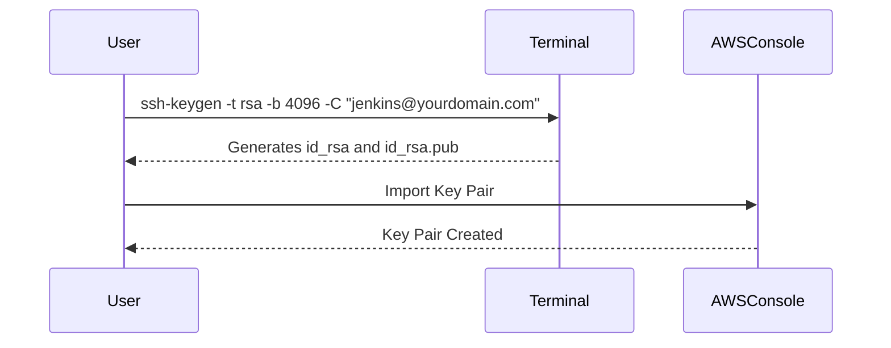
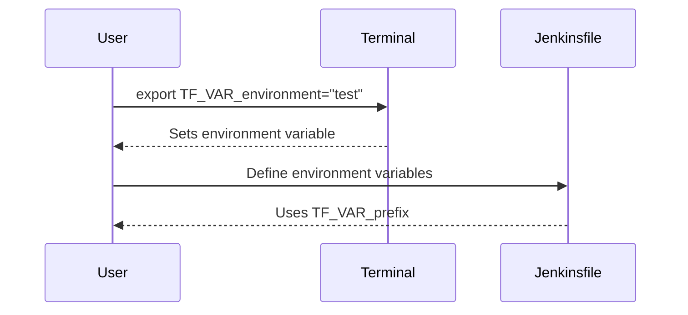

## Setting Up Credentials for Jenkins Integration with Terraform

In this section, we will delve into the process of setting up credentials for Jenkins integration with Terraform, specifically focusing on creating an SSH key pair and managing environment variables. This setup ensures that the Terraform provider can securely connect to an AWS account to create and manage resources.

### Background Theory

#### What is Jenkins?

Jenkins is an open-source automation server used for continuous integration and continuous delivery (CI/CD). It supports building, testing, and deploying software projects automatically. Jenkins integrates with various tools and technologies, including Terraform, to automate infrastructure provisioning.

#### What is Terraform?

Terraform is an infrastructure as code (IaC) tool developed by HashiCorp. It allows users to define and provision infrastructure resources using declarative configuration files written in the HashiCorp Configuration Language (HCL). Terraform supports multiple cloud providers, including AWS, Azure, and Google Cloud Platform.

#### What is AWS?

Amazon Web Services (AWS) is a comprehensive and broadly adopted cloud platform, offering over 200 fully featured services from data centers globally. AWS provides a wide range of services, including computing, storage, networking, database, analytics, application services, deployment, management, and machine learning.

### Setting Up Authentication

Before configuring the environment variables, we need to ensure that the Terraform provider can authenticate with the AWS account. This typically involves setting up AWS access keys or using IAM roles.

#### Creating an SSH Key Pair

To securely connect Jenkins to the AWS account, we need to create an SSH key pair. This key pair consists of a public key and a private key. The public key is uploaded to the AWS console, and the private key is stored securely on the Jenkins server.

```bash
# Generate an SSH key pair
ssh-keygen -t rsa -b 4096 -C "jenkins@yourdomain.com"
```

This command generates an RSA key pair with a bit length of 4096. The `-C` option specifies a comment, which can be your email address or any other identifier.

#### Uploading the Public Key to AWS

After generating the SSH key pair, upload the public key to the AWS console:

1. Log in to the AWS Management Console.
2. Navigate to the EC2 Dashboard.
3. In the left-hand menu, click on "Key Pairs."
4. Click on "Import Key Pair."
5. Enter a name for the key pair and paste the contents of the public key file (`id_rsa.pub`).

#### Storing the Private Key Securely

The private key should be stored securely on the Jenkins server. Ensure that the permissions are set correctly to prevent unauthorized access:

```bash
chmod 400 id_rsa
```

### Setting Environment Variables in Terraform

Once the authentication is set up, we need to configure the environment variables in Terraform. These variables allow us to specify the environment (e.g., `dev`, `test`, `prod`) and other parameters dynamically.

#### Default Environment Variable

By default, we might have defined the environment variable in Terraform as follows:

```hcl
variable "environment" {
  description = "The environment to deploy to (e.g., dev, test, prod)"
  default     = "dev"
}
```

However, we want to override this value from the Jenkins pipeline. One of the simplest ways to do this is by using Terraform environment variables with the `TF_VAR_` prefix.

#### Overriding Environment Variables

To override the `environment` variable from Jenkins, we can set the `TF_VAR_environment` environment variable:

```bash
export TF_VAR_environment="test"
```

This sets the `environment` variable to `test` for the current shell session. To make this change permanent, you can add the export command to your `.bashrc` or `.profile` file.

#### Using TF_VAR Prefix

The `TF_VAR_` prefix is a convention used by Terraform to set variable values via environment variables. Any variable defined in the Terraform configuration can be overridden using this prefix followed by the variable name.

For example, if we have additional variables like `region`, `availability_zone`, and `ip_address`, we can set them similarly:

```bash
export TF_VAR_region="us-west-2"
export TF_VAR_availability_zone="us-west-2a"
export TF_VAR_ip_address="10.0.0.1"
```

### Complete Example

Let's put everything together with a complete example. Assume we have the following Terraform configuration:

```hcl
variable "environment" {
  description = "The environment to deploy to (e.g., dev, test, prod)"
  default     = "dev"
}

variable "region" {
  description = "The AWS region to deploy to"
  default     = "us-east-1"
}

variable "availability_zone" {
  description = "The availability zone to deploy to"
  default     = "us-east-1a"
}

variable "ip_address" {
  description = "The IP address to assign to the instance"
  default     = "10.0.0.1"
}

provider "aws" {
  region = var.region
}

resource "aws_instance" "example" {
  ami           = "ami-0c55b159cbfafe1f0"
  instance_type = "t2.micro"

  tags = {
    Name = "example-instance-${var.environment}"
  }
}
```

In the Jenkinsfile, we can set the environment variables as follows:

```groovy
pipeline {
  agent any

  environment {
    TF_VAR_environment = 'test'
    TF_VAR_region = 'us-west-2'
    TF_VAR_availability_zone = 'us-west-2a'
    TF_VAR_ip_address = '1.2.3.4'
  }

  stages {
    stage('Initialize') {
      steps {
        sh 'terraform init'
      }
    }
    stage('Plan') {
      steps {
        sh 'terraform plan'
      }
    }
    stage('Apply') {
      steps {
        sh 'terraform apply -auto-approve'
      }
    }
  }
}
```

### Diagrams

#### SSH Key Pair Generation and Upload



#### Setting Environment Variables



### Pitfalls and How to Prevent / Defend

#### Pitfall: Exposing Private Keys

Exposing private keys can lead to unauthorized access to your AWS resources. Ensure that the private key is stored securely and has the correct permissions.

**How to Prevent / Defend:**

1. **Secure Storage:** Store the private key in a secure location, such as a password manager or a secure file system.
2. **Permissions:** Set the permissions of the private key file to `400` using `chmod 400 id_rsa`.
3. **Monitoring:** Monitor access logs to detect any unauthorized access attempts.

#### Pitfall: Hardcoding Secrets

Hardcoding secrets in the Jenkinsfile or Terraform configuration can expose sensitive information.

**How to Prevent / Defend:**

1. **Environment Variables:** Use environment variables to pass sensitive information securely.
2. **Secrets Management:** Use a secrets management tool like HashiCorp Vault or AWS Secrets Manager to store and retrieve secrets securely.
3. **Secure Coding Practices:** Follow secure coding practices to avoid hardcoding secrets in your codebase.

### Real-World Examples

#### Recent Breaches

One notable breach involving misconfigured Terraform and Jenkins was the Capital One breach in 2019. The attacker exploited a misconfigured web application firewall (WAF) to gain unauthorized access to sensitive data. While this breach did not directly involve Terraform or Jenkins, it highlights the importance of securing your infrastructure and pipelines.

#### CVEs

CVE-2021-20225 is a vulnerability in Jenkins that allows attackers to bypass authentication and gain unauthorized access to the Jenkins server. This vulnerability underscores the importance of keeping your Jenkins installation up to date and securing your SSH keys and environment variables.

### Practice Labs

For hands-on practice with Jenkins and Terraform integration, consider the following labs:

- **PortSwigger Web Security Academy:** Offers a series of labs focused on web application security, including CI/CD pipeline security.
- **OWASP Juice Shop:** A deliberately insecure web application for security training.
- **DVWA (Damn Vulnerable Web Application):** A PHP/MySQL web application that is riddled with vulnerabilities for educational purposes.
- **WebGoat:** An interactive, gamified web application security training tool.

These labs provide practical experience in setting up and securing Jenkins and Terraform pipelines.

### Conclusion

Setting up credentials for Jenkins integration with Terraform involves creating an SSH key pair, uploading the public key to AWS, and securely storing the private key. Additionally, managing environment variables using the `TF_VAR_` prefix allows dynamic configuration of Terraform resources from the Jenkins pipeline. By following best practices and using secure coding techniques, you can ensure that your infrastructure and pipelines remain secure.

---
<!-- nav -->
[[07-Optimizing Jenkins Integration with Terraform|Optimizing Jenkins Integration with Terraform]] | [[DevOps/DevOps Bootcamp/06-CI CD & Build Tools/17-Creating SSH Key Pair for Jenkins Integration/00-Overview|Overview]] | [[09-Setting Up Default Values in Terraform Variables for Jenkins Integration|Setting Up Default Values in Terraform Variables for Jenkins Integration]]
