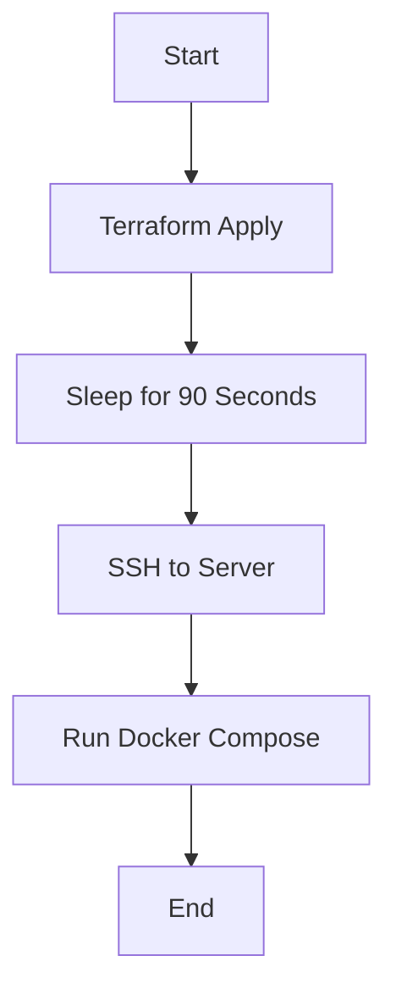

## Timing Issues in CI/CD Pipelines

### Introduction to Timing Issues

In Continuous Integration/Continuous Deployment (CI/CD) pipelines, timing issues often arise when the pipeline depends on resources that are not immediately available. One common scenario is when a new server is being provisioned as part of the pipeline execution. The server creation process may take several minutes, during which the pipeline might attempt to interact with the server before it is fully initialized. This can lead to errors and failed builds.

### Scenario: Server Creation and Initialization

Let's consider a scenario where a CI/CD pipeline uses Terraform to create an AWS EC2 instance. Once the instance is created, the pipeline needs to execute further commands, such as deploying applications using Docker Compose. However, if the pipeline attempts to execute these commands too quickly after the server creation, it may encounter issues because the server is not yet fully initialized.

#### Example Pipeline Steps

1. **Terraform Apply**: Create the EC2 instance.
2. **Wait for Initialization**: Ensure the server is fully initialized.
3. **Execute Commands**: Run Docker Compose to deploy applications.

### Handling Timing Issues

To handle timing issues effectively, the pipeline needs to include a delay mechanism to wait until the server is fully initialized. This can be achieved by introducing a sleep command in the pipeline.

#### Sleep Command in Jenkins

Jenkins provides a `sleep` step that allows the pipeline to pause for a specified duration. This can be used to wait for the server to initialize before proceeding with further steps.

```groovy
pipeline {
    agent any
    stages {
        stage('Create Server') {
            steps {
                sh 'terraform apply -auto-approve'
            }
        }
        stage('Wait for Initialization') {
            steps {
                sleep(time: 90, unit: 'SECONDS')
            }
        }
        stage('Deploy Application') {
            steps {
                sh 'ssh -i /path/to/key.pem ubuntu@${PUBLIC_IP} "docker-compose up -d"'
            }
        }
    }
}
```

### Explanation of the Pipeline

1. **Create Server**:
   - Uses `terraform apply` to create the EC2 instance.
   
2. **Wait for Initialization**:
   - Uses `sleep` to pause the pipeline for 90 seconds (1.5 minutes) to allow the server to initialize.
   
3. **Deploy Application**:
   - Uses `ssh` to connect to the server and run `docker-compose up -d`.

### Diagram of the Pipeline Flow



### Real-World Example: Timing Issue in CI/CD Pipeline

Consider a recent incident where a company's CI/CD pipeline failed due to a timing issue. The pipeline was attempting to deploy an application to a newly created EC2 instance, but the instance was not fully initialized at the time of deployment. This resulted in failed deployments and downtime for the company's services.

#### Vulnerability and Impact

The timing issue can lead to:
- Failed deployments.
- Inconsistent application behavior.
- Increased downtime.

### How to Prevent / Defend Against Timing Issues

#### Detection

- **Monitoring**: Use monitoring tools to track the status of the server during the pipeline execution.
- **Logging**: Log the timestamps of each step in the pipeline to identify delays and failures.

#### Prevention

- **Sleep Mechanism**: Introduce a sleep step in the pipeline to wait for the server to initialize.
- **Health Checks**: Implement health checks to ensure the server is fully initialized before proceeding with further steps.

#### Secure Coding Fixes

##### Vulnerable Code

```groovy
pipeline {
    agent any
    stages {
        stage('Create Server') {
            steps {
                sh 'terraform apply -auto-approve'
            }
        }
        stage('Deploy Application') {
            steps {
                sh 'ssh -i /path/to/key.pem ubuntu@${PUBLIC_IP} "docker-compose up -d"'
            }
        }
    }
}
```

##### Fixed Code

```groovy
pipeline {
    agent any
    stages {
        stage('Create Server') {
            steps {
                sh 'terraform apply -auto-approve'
            }
        }
        stage('Wait for Initialization') {
            steps {
                sleep(time: 90, unit: 'SECONDS')
            }
        }
        stage('Deploy Application') {
            steps {
                sh 'ssh -i /path/to/key.pem ubuntu@${PUBLIC_IP} "docker-compose up -d"'
            }
        }
    }
}
```

### Additional Considerations

#### Edge Cases

- **Server Already Exists**: If the server already exists, the sleep step may cause unnecessary delays. Consider conditional logic to skip the sleep step if the server is already initialized.
- **Variable Initialization Time**: The initialization time may vary depending on the server size and workload. Adjust the sleep duration accordingly.

#### Monitoring and Logging

- **Monitoring Tools**: Use tools like Prometheus and Grafana to monitor the server status.
- **Logging**: Use logging frameworks like ELK Stack to log pipeline execution details.

### Hands-On Labs

For hands-on practice, consider the following labs:

- **PortSwigger Web Security Academy**: Focuses on web application security but includes CI/CD pipeline scenarios.
- **OWASP Juice Shop**: A deliberately insecure web application for practicing security testing.
- **DVWA (Damn Vulnerable Web Application)**: Another web application for security testing.

These labs provide practical experience in handling CI/CD pipeline issues and can help reinforce the concepts learned.

### Conclusion

Handling timing issues in CI/CD pipelines is crucial for ensuring consistent and reliable deployments. By introducing sleep mechanisms and implementing health checks, you can mitigate the risks associated with server initialization delays. Always monitor and log pipeline execution to detect and resolve issues promptly.

---
<!-- nav -->
[[09-Setting Up Default Values in Terraform Variables for Jenkins Integration|Setting Up Default Values in Terraform Variables for Jenkins Integration]] | [[DevOps/DevOps Bootcamp/06-CI CD & Build Tools/17-Creating SSH Key Pair for Jenkins Integration/00-Overview|Overview]] | [[11-Understanding the Initialization Process in EC2 Instances|Understanding the Initialization Process in EC2 Instances]]
