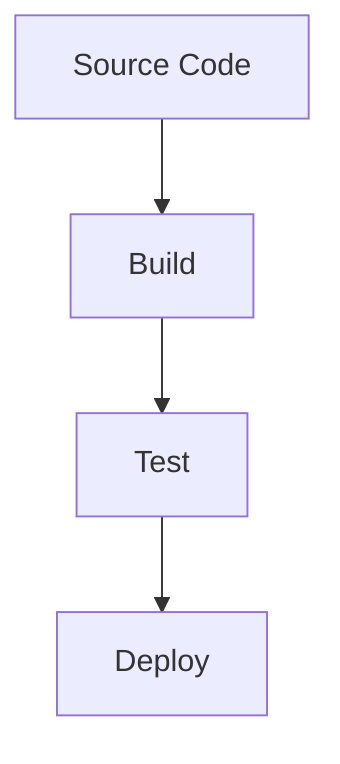

## Introduction to Build Automation and CI/CD Pipelines

As a DevOps engineer, one of your primary responsibilities is to configure and manage the Continuous Integration and Continuous Deployment (CI/CD) pipeline. This pipeline automates the process of building, testing, and deploying applications, ensuring that the software is reliable and ready for production use. In this section, we will delve into the specifics of configuring build automation tools, focusing on Jenkins as an example, and discuss the various steps involved in setting up a robust CI/CD pipeline.

### What is Build Automation?

Build automation refers to the process of automating the compilation, testing, and packaging of software. Traditionally, these tasks were performed manually by developers, but with the advent of build automation tools, these processes can be automated, reducing the likelihood of human error and increasing the efficiency of the development cycle.

#### Why Build Automation Matters

Build automation is crucial for several reasons:

1. **Consistency**: Automated builds ensure that the same steps are followed every time, leading to consistent results.
2. **Speed**: Automated builds can be executed quickly, allowing developers to receive feedback on their changes more rapidly.
3. **Reliability**: Automated builds reduce the risk of errors that might occur during manual builds.
4. **Scalability**: As the size and complexity of the project grow, manual builds become increasingly difficult to manage. Automated builds scale more easily.

### Key Components of a CI/CD Pipeline

A typical CI/CD pipeline consists of several stages:

1. **Source Code Management**: Version control systems like Git are used to manage the source code.
2. **Build**: The source code is compiled and packaged into executable formats.
3. **Test**: Automated tests are run to ensure the quality of the code.
4. **Deploy**: The built and tested code is deployed to a staging or production environment.

#### Example: Jenkins CI/CD Pipeline

Jenkins is a popular open-source automation server that supports a wide range of plugins and integrations. Here’s a high-level overview of how a Jenkins pipeline might be configured:



### Configuring Build Automation Tools

To set up a CI/CD pipeline, you need to configure the build automation tools appropriately. Let’s explore the specific steps and tools involved.

#### Installing Dependencies

Before building the application, dependencies need to be installed. This step ensures that all required libraries and frameworks are available.

For Node.js applications, you can use `npm` or `yarn` to install dependencies:

```bash
npm install
# or
yarn install
```

For Java applications, you can use `Gradle` or `Maven`:

```bash
gradle build
# or
mvn install
```

#### Running Tests

Testing is a critical part of the CI/CD pipeline. Automated tests help catch bugs early in the development cycle, improving the overall quality of the software.

For Node.js applications, you can run tests using `npm` or `yarn`:

```bash
npm test
# or
yarn test
```

For Java applications, you can run tests using `Gradle` or `Maven`:

```bash
gradle test
# or
mvn test
```

#### Building the Application

Once the tests pass, the application can be built. This step compiles the source code and packages it into a deployable format.

For Node.js applications, you can use `npm` or `yarn` to build the application:

```bash
npm run build
# or
yarn build
```

For Java applications, you can use `Gradle` or `Maven` to build the application:

```bash
gradle build
# or
mvn package
```

#### Packaging into Docker Images

Containerization is a common practice in modern DevOps environments. Docker images allow the application to be packaged along with its dependencies, ensuring consistency across different environments.

To package the application into a Docker image, you can use a `Dockerfile`. Here’s an example `Dockerfile` for a Node.js application:

```dockerfile
FROM node:14-alpine

WORKDIR /app

COPY package*.json ./
RUN npm install

COPY . .

CMD ["npm", "start"]
```

To build the Docker image, you can use the following command:

```bash
docker build -t my-node-app .
```

#### Bundling Frontend Code

For frontend applications, tools like Webpack can be used to bundle the code into a deployable format.

Here’s an example `webpack.config.js` file:

```javascript
const path = require('path');

module.exports = {
  entry: './src/index.js',
  output: {
    filename: 'bundle.js',
    path: path.resolve(__dirname, 'dist'),
  },
};
```

To bundle the frontend code, you can use the following command:

```bash
webpack
```

### Complete Example: Jenkins Pipeline

Let’s put all these pieces together in a Jenkins pipeline. Here’s an example `Jenkinsfile`:

```groovy
pipeline {
    agent any

    stages {
        stage('Checkout') {
            steps {
                git 'https://github.com/my-repo/my-app.git'
            }
        }

        stage('Install Dependencies') {
            steps {
                script {
                    if (env.BRANCH_NAME == 'master') {
                        sh 'npm install'
                    } else {
                        sh 'yarn install'
                    }
                }
            }
        }

        stage('Run Tests') {
            steps {
                script {
                    if (env.BRANCH_NAME == 'master') {
                        sh 'npm test'
                    } else {
                        sh 'yarn test'
                    }
                }
            }
        }

        stage('Build Application') {
            steps {
                script {
                    if (env.BRANCH_NAME == 'master') {
                        sh 'npm run build'
                    } else {
                        sh 'yarn build'
                    }
                }
            }
        }

        stage('Package into Docker Image') {
            steps {
                script {
                    sh 'docker build -t my-node-app .'
                }
            }
        }

        stage('Deploy') {
            steps {
                script {
                    sh 'docker push my-node-app'
                }
            }
        }
    }
}
```

### Common Pitfalls and How to Prevent Them

#### Dependency Management Issues

**Issue**: Outdated or incompatible dependencies can cause build failures.

**Prevention**:
- Regularly update dependencies.
- Use dependency management tools like `npm-check-updates` or `npm audit`.

#### Test Failures

**Issue**: Flaky tests can lead to false negatives.

**Prevention**:
- Write stable and reliable tests.
- Use test frameworks that support retries and timeouts.

#### Build Failures

**Issue**: Build scripts may fail due to missing steps or incorrect configurations.

**Prevention**:
- Thoroughly test build scripts locally before committing them.
- Use linting tools to catch common errors.

### Real-World Examples and Recent Breaches

#### Example: CVE-2021-21315

In 2021, a vulnerability was discovered in Jenkins that allowed attackers to execute arbitrary code on the Jenkins server. This vulnerability highlights the importance of keeping build automation tools up to date and securing them properly.

**Impact**: Attackers could gain unauthorized access to the Jenkins server and potentially compromise the entire CI/CD pipeline.

**Mitigation**:
- Keep Jenkins and all plugins up to date.
- Use Jenkins security features like role-based access control (RBAC).

### Hands-On Labs

To gain practical experience with CI/CD pipelines, consider the following labs:

- **PortSwigger Web Security Academy**: Offers a comprehensive course on web application security, including CI/CD pipeline security.
- **OWASP Juice Shop**: A deliberately insecure web application that can be used to practice CI/CD pipeline security.
- **DVWA (Damn Vulnerable Web Application)**: Another insecure web application that can be used to practice CI/CD pipeline security.

### Conclusion

Configuring build automation tools and setting up a CI/CD pipeline is a critical aspect of a DevOps engineer's role. By automating the build, test, and deployment processes, you can ensure that your software is reliable and ready for production use. Understanding the key components of a CI/CD pipeline and the tools involved will help you create a robust and efficient pipeline that meets the needs of your team and organization.

---
<!-- nav -->
[[DevOps/DevOps Bootcamp/06-CI CD & Build Tools/18-DevOps Engineer's Role in Build Tools/00-Overview|Overview]] | [[02-Introduction to Build Tools and Dependency Management|Introduction to Build Tools and Dependency Management]]
