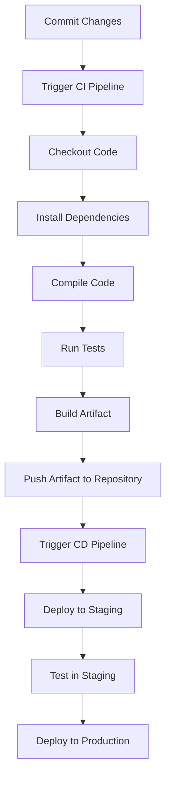

## Introduction to Build Tools and Dependency Management

### Overview of Build Tools and Dependency Management

Build tools and dependency management are fundamental components in modern software development and deployment processes. These tools automate the compilation, testing, packaging, and distribution of software applications. They also manage external libraries and frameworks that an application depends on, ensuring that all required dependencies are available and up-to-date.

For software developers, build tools like Maven, Gradle, and npm are used to compile code, run tests, and package applications. Dependency management tools such as Maven’s `pom.xml`, Gradle’s `build.gradle`, and npm’s `package.json` ensure that all necessary libraries and frameworks are included and managed correctly.

### Distinction Between Developer and DevOps Responsibilities

While developers focus on writing code and using build tools locally to run and test their applications, DevOps engineers take responsibility for the broader build and release cycle. This includes automating the build process, managing dependencies across different environments, and ensuring that the application can be deployed reliably and securely.

#### Local Development vs. Automated Build

Developers typically work in a local environment where they write code, run tests, and debug issues. They use build tools to compile their code and execute tests locally. However, the actual build and deployment process is handled by automated build systems managed by DevOps engineers.


### Importance of Build Tools and Dependency Management for DevOps Engineers

As a DevOps engineer, understanding build tools and dependency management is crucial because:

1. **Automation**: Automating the build process ensures consistency and reduces human error.
2. **Dependency Management**: Ensures that all required dependencies are correctly managed across different environments.
3. **Environment Awareness**: Understanding where and how the application will run helps in configuring the build process appropriately.

### Build Tools and Dependency Management in Practice

Let's explore some specific build tools and dependency management practices in detail.

#### Maven

Maven is a popular build tool for Java projects. It uses a `pom.xml` file to define project metadata, dependencies, and build instructions.

**Example pom.xml**

```xml
<project xmlns="http://maven.apache.org/POM/4.0.0"
         xmlns:xsi="http://www.w3.org/2001/XMLSchema-instance"
         xsi:schemaLocation="http://maven.apache.org/POM/4.0.0 http://maven.apache.org/xsd/maven-4.0.0.xsd">
    <modelVersion>4.0.0</modelVersion>
    <groupId>com.example</groupId>
    <artifactId>my-app</artifactId>
    <version>1.0-SNAPSHOT</version>
    <dependencies>
        <dependency>
            <groupId>junit</groupId>
            <artifactId>junit</artifactId>
            <version>4.12</version>
            <scope>test</scope>
        </dependency>
    </dependencies>
</project>
```

**Commands**

- `mvn clean`: Cleans the target directory.
- `mvn compile`: Compiles the source code.
- `mvn test`: Runs the unit tests.
- `mvn package`: Packages the compiled code into a JAR file.
- `mvn install`: Installs the package into the local Maven repository.

#### Gradle

Gradle is another powerful build tool that uses Groovy or Kotlin DSL for defining build scripts.

**Example build.gradle**

```groovy
apply plugin: 'java'
apply plugin: 'application'

repositories {
    mavenCentral()
}

dependencies {
    testImplementation 'junit:junit:4.12'
}

mainClassName = 'com.example.Main'
```

**Commands**

- `gradle clean`: Cleans the build directory.
- `gradle compileJava`: Compiles the Java source code.
- `gradle test`: Runs the unit tests.
- `gradle jar`: Creates a JAR file.
- `gradle installDist`: Creates a distribution package.

#### npm

npm is the package manager for JavaScript and Node.js projects. It uses a `package.json` file to define project metadata and dependencies.

**Example package.json**

```json
{
  "name": "my-app",
  "version": "1.0.0",
  "scripts": {
    "start": "node index.js",
    "test": "jest"
  },
  "dependencies": {
    "express": "^4.17.1"
  },
  "devDependencies": {
    "jest": "^26.6.3"
  }
}
```

**Commands**

- `npm install`: Installs dependencies listed in `package.json`.
- `npm start`: Starts the application.
- `npm test`: Runs the tests.

### Automating the Build Process

The build process is typically automated using Continuous Integration/Continuous Deployment (CI/CD) pipelines. These pipelines are configured to automatically build, test, and deploy the application whenever changes are committed.

#### Example CI/CD Pipeline



### Common Pitfalls and How to Prevent Them

#### Inconsistent Environments

One common issue is inconsistent environments where the application behaves differently in development, staging, and production. This can be caused by differences in dependencies, configurations, or runtime environments.

**How to Prevent**

- Use containerization technologies like Docker to ensure consistent environments.
- Use configuration management tools like Ansible or Terraform to manage infrastructure consistently.

**Example Dockerfile**

```Dockerfile
FROM node:14
WORKDIR /app
COPY package*.json ./
RUN npm install
COPY . .
CMD ["npm", "start"]
```

**Example Docker Compose File**

```yaml
version: '3'
services:
  app:
    build: .
    ports:
      - "3000:3000"
```

#### Dependency Vulnerabilities

Another issue is the presence of vulnerable dependencies in the application. This can lead to security vulnerabilities if not properly managed.

**How to Prevent**

- Regularly update dependencies to the latest versions.
- Use tools like Snyk or OWASP Dependency-Check to scan for vulnerabilities.
- Implement a dependency management policy that requires regular updates and security checks.

**Example Snyk Scan**

```bash
snyk test --file=package.json
```

### Real-World Examples and Case Studies

#### Recent CVEs and Breaches

One notable example is the Log4j vulnerability (CVE-2021-44228), which affected many Java applications due to a vulnerable dependency. This highlights the importance of regularly updating dependencies and using tools to scan for vulnerabilities.

**How to Prevent**

- Use tools like Snyk to monitor dependencies for vulnerabilities.
- Implement a dependency management policy that requires regular updates and security checks.

### Hands-On Labs

To gain practical experience with build tools and dependency management, consider the following hands-on labs:

- **PortSwigger Web Security Academy**: Offers labs on web application security, including dependency management.
- **OWASP Juice Shop**: A deliberately insecure web application for practicing web security skills.
- **DVWA (Damn Vulnerable Web Application)**: Another web application for learning web security.
- **WebGoat**: An interactive training application for learning about web application security.

These labs provide real-world scenarios where you can practice using build tools and managing dependencies in a secure manner.

### Conclusion

Understanding build tools and dependency management is essential for both developers and DevOps engineers. By automating the build process and managing dependencies effectively, you can ensure that your application is built and deployed consistently and securely. Regularly updating dependencies and using tools to scan for vulnerabilities can help prevent security issues. Hands-on labs provide practical experience in applying these concepts in real-world scenarios.

---
<!-- nav -->
[[01-Introduction to Build Automation and CICD Pipelines|Introduction to Build Automation and CICD Pipelines]] | [[DevOps/DevOps Bootcamp/06-CI CD & Build Tools/18-DevOps Engineer's Role in Build Tools/00-Overview|Overview]] | [[DevOps/DevOps Bootcamp/06-CI CD & Build Tools/18-DevOps Engineer's Role in Build Tools/03-Practice Questions & Answers|Practice Questions & Answers]]
