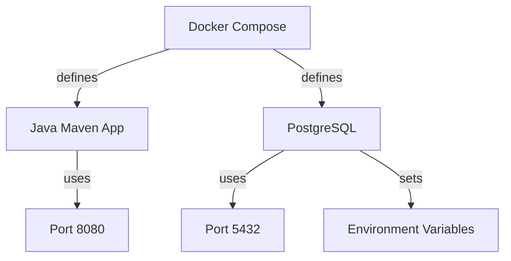
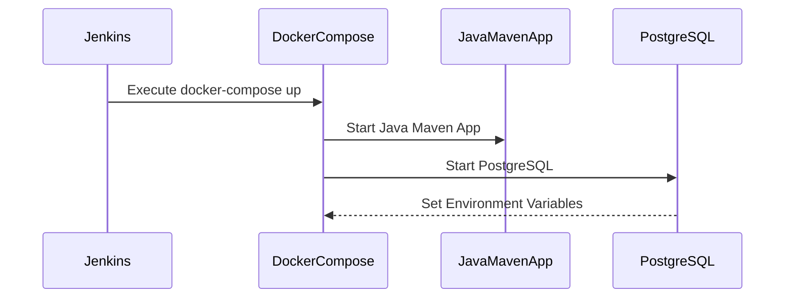

## Introduction to Docker Compose and Deployment on Remote Servers with Jenkins

Docker Compose is a tool for defining and running multi-container Docker applications. With Compose, you use a YAML file to configure your application’s services. Then, using a single command, you create and start all the services from your configuration. This makes it easier to manage complex applications with multiple dependencies.

In this chapter, we will delve into the details of using Docker Compose to deploy a Java Maven application and a PostgreSQL database on remote servers using Jenkins. We will cover the necessary steps, configurations, and best practices to ensure a secure and efficient deployment process.

### Background Theory

#### What is Docker Compose?

Docker Compose is a tool for managing multi-container Docker applications. It allows you to define the services that make up your application in a `docker-compose.yml` file. This file contains all the configuration needed to run your application, including the images, ports, environment variables, and volumes.

#### Why Use Docker Compose?

Using Docker Compose simplifies the management of multi-container applications. It provides a consistent way to define and run your application across different environments. This consistency helps in reducing errors and improving development efficiency.

#### How Does Docker Compose Work?

When you run `docker-compose up`, Docker Compose reads the `docker-compose.yml` file and starts the services defined in it. Each service is started as a separate container, and Docker handles the networking between these containers.

### Configuring Docker Compose for a Java Maven Application

Let's start by configuring Docker Compose for a Java Maven application. The first step is to define the service in the `docker-compose.yml` file.

```yaml
version: '3'
services:
  java-maven-app:
    image: your-java-maven-image:latest
    ports:
      - "8080:8080"
```

#### Explanation of the Configuration

- **version**: Specifies the version of the Docker Compose file format. Version 3 is widely used and supports most features.
- **services**: Defines the services that make up your application.
- **java-maven-app**: The name of the service. You can choose any name that makes sense for your application.
- **image**: Specifies the Docker image to use for the service. In this case, `your-java-maven-image:latest`.
- **ports**: Maps the container port to the host port. Here, port 8080 of the container is mapped to port 8080 of the host.

#### Why Define Ports?

Defining ports is crucial because it allows external systems to communicate with the container. In this case, the Java Maven application listens on port 8080, and we map this port to the host so that the application can be accessed from outside the container.

### Adding a PostgreSQL Service

Next, we will add a PostgreSQL service to our Docker Compose configuration.

```yaml
version: '3'
services:
  java-maven-app:
    image: your-java-maven-image:latest
    ports:
      - "8080:8080"
  postgres:
    image: postgres:13
    ports:
      - "5432:5432"
    environment:
      POSTGRES_PASSWORD: myPWD
```

#### Explanation of the PostgreSQL Configuration

- **postgres**: The name of the PostgreSQL service.
- **image**: Specifies the Docker image to use for PostgreSQL. Here, we use `postgres:13`.
- **ports**: Maps the container port 5432 to the host port 5432.
- **environment**: Sets the environment variables for the PostgreSQL container. Here, we set the `POSTGRES_PASSWORD` environment variable to `myPWD`.

#### Why Set Environment Variables?

Setting environment variables is essential for configuring the PostgreSQL container. The `POSTGRES_PASSWORD` environment variable is required to set the password for the PostgreSQL superuser. Without this, the container will fail to start.

### Full Docker Compose File

Here is the complete `docker-compose.yml` file:

```yaml
version: '3'
services:
  java-maven-app:
    image: your-java-maven-image:latest
    ports:
      - "8080:8080"
  postgres:
    image: postgres:13
    ports:
      - "5432:5432"
    environment:
      POSTGRES_PASSWORD: myPWD
```

### Deploying with Jenkins

Now that we have configured Docker Compose, we can use Jenkins to automate the deployment process. Jenkins is a popular open-source automation server that can be used to build, test, and deploy applications.

#### Setting Up Jenkins

To set up Jenkins for deploying Docker Compose, follow these steps:

1. **Install Jenkins**: Install Jenkins on your server. You can download it from the official Jenkins website.
2. **Install Docker Plugin**: Install the Docker plugin in Jenkins to enable Docker integration.
3. **Configure Jenkins Job**: Create a new Jenkins job and configure it to use Docker Compose.

#### Jenkins Job Configuration

Here is an example of a Jenkins job configuration:

1. **General Settings**:
   - Name: `Deploy-Docker-Compose`
   - Description: `Deploys Docker Compose application`

2. **Source Code Management**:
   - Repository URL: `https://github.com/your-repo/docker-compose.git`
   - Branches to build: `*/main`

3. **Build Triggers**:
   - Poll SCM: `H/10 * * * *`

4. **Build Steps**:
   - Execute shell:
     ```sh
     docker-compose -f docker-compose.yml up -d
     ```

#### Explanation of the Jenkins Job Configuration

- **General Settings**: Basic settings for the Jenkins job.
- **Source Code Management**: Specifies the repository containing the Docker Compose files.
- **Build Triggers**: Configures Jenkins to poll the repository every 10 minutes.
- **Build Steps**: Executes the `docker-compose up` command to start the services defined in the `docker-compose.yml` file.

### Real-World Examples and Security Considerations

#### Recent CVEs and Breaches

One recent example of a security breach involving Docker is the CVE-2021-29428, which affected Docker Desktop for Mac. This vulnerability allowed attackers to escalate privileges and gain root access to the host system. To mitigate such risks, it is important to keep Docker and related tools up to date and apply security patches promptly.

#### Secure Coding Practices

To ensure secure deployment, follow these best practices:

1. **Use Latest Tags**: Always use the latest tags for Docker images to ensure you have the latest security patches.
2. **Environment Variable Management**: Avoid hardcoding sensitive information like passwords in your Docker Compose files. Use environment variables or secrets management tools like Docker Secrets.
3. **Network Isolation**: Use Docker networks to isolate your services and reduce the attack surface.

### How to Prevent / Defend

#### Detection

To detect potential security issues, use tools like Docker Security Scanning. These tools can scan your Docker images for known vulnerabilities and provide recommendations for mitigation.

#### Prevention

1. **Regular Updates**: Keep your Docker images and related tools up to date.
2. **Security Policies**: Implement security policies for your Docker environment, such as limiting access to sensitive data and enforcing least privilege principles.
3. **Monitoring**: Monitor your Docker environment for unusual activity using tools like Docker Logging and Monitoring.

#### Secure-Coding Fixes

Here is an example of a vulnerable Docker Compose file and its secure version:

**Vulnerable Version**:
```yaml
version: '3'
services:
  java-maven-app:
    image: your-java-maven-image:latest
    ports:
      - "8080:8080"
  postgres:
    image: postgres:13
    ports:
      - "5432:5432"
    environment:
      POSTGRES_PASSWORD: myPWD
```

**Secure Version**:
```yaml
version: '3'
services:
  java-maven-app:
    image: your-java-maven-image:latest
    ports:
      - "8080:8080"
  postgres:
    image: postgres:13
    ports:
      - "5432:5432"
    environment:
      POSTGRES_PASSWORD: ${POSTGRES_PASSWORD}
```

In the secure version, the `POSTGRES_PASSWORD` is set using an environment variable, which can be managed securely using tools like Docker Secrets.

### Complete Example

Here is a complete example of a Docker Compose file and its corresponding Jenkins job configuration:

**Docker Compose File (`docker-compose.yml`)**:
```yaml
version: '3'
services:
  java-maven-app:
    image: your-java-maven-image:latest
    ports:
      - "8080:8080"
  postgres:
    image: postgres:13
    ports:
      - "5432:5432"
    environment:
      POSTGRES_PASSWORD: ${POSTGRES_PASSWORD}
```

**Jenkins Job Configuration**:
1. **General Settings**:
   - Name: `Deploy-Docker-Compose`
   - Description: `Deploys Docker Compose application`

2. **Source Code Management**:
   - Repository URL: `https://github.com/your-repo/docker-compose.git`
   - Branches to build: `*/main`

3. **Build Triggers**:
   - Poll SCM: `H/10 * * * *`

4. **Build Steps**:
   - Execute shell:
     ```sh
     export POSTGRES_PASSWORD=myPWD
     docker-compose -f docker-compose.yml up -d
     ```

### Mermaid Diagrams

#### Docker Compose Architecture



#### Jenkins Job Flow



### Conclusion

In this chapter, we have covered the detailed steps to configure Docker Compose for a Java Maven application and a PostgreSQL database. We have also explored how to use Jenkins to automate the deployment process. By following the best practices and secure coding guidelines, you can ensure a secure and efficient deployment of your Dockerized applications.

### Practice Labs

For hands-on practice, consider the following labs:

- **PortSwigger Web Security Academy**: Offers comprehensive labs on web application security.
- **OWASP Juice Shop**: A deliberately insecure web application for security training.
- **DVWA (Damn Vulnerable Web Application)**: Another popular web application for security testing.

These labs will help you gain practical experience in deploying and securing Dockerized applications.

---
<!-- nav -->
[[01-Introduction to Docker Compose Deployment on Remote Servers with Jenkins|Introduction to Docker Compose Deployment on Remote Servers with Jenkins]] | [[DevOps/DevOps Bootcamp/06-CI CD & Build Tools/19-Docker Compose Deployment On Remote Servers With Jenkins/00-Overview|Overview]] | [[03-Introduction to Docker Compose and Its Role in DevOps|Introduction to Docker Compose and Its Role in DevOps]]
