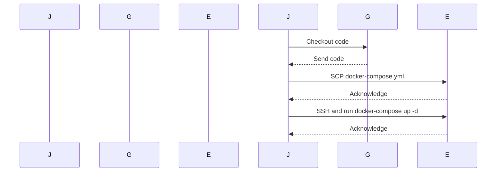

## Introduction to Docker Compose and Its Role in DevOps

Docker Compose is a tool for defining and running multi-container Docker applications. With Compose, you can create a `docker-compose.yml` file to configure your application’s services. Then, with a single command, you can create and start all the services from your configuration. This makes it easier to manage complex applications that consist of multiple interconnected services.

### What is Docker Compose?

Docker Compose is a tool that allows you to define and run multi-container Docker applications. It uses a YAML file (`docker-compose.yml`) to configure the services that make up an application. Each service is defined with its own configuration, including the Docker image to use, environment variables, ports, volumes, and more. Once the configuration is set, you can use commands like `docker-compose up` to start all the services defined in the file.

### Why Use Docker Compose?

Using Docker Compose simplifies the process of setting up and managing multi-container applications. Instead of manually starting each container and configuring them individually, you can define all the necessary configurations in a single YAML file. This makes it easier to replicate the same setup across different environments, such as development, testing, and production.

### How Does Docker Compose Work?

Docker Compose works by reading the `docker-compose.yml` file and creating the specified services. Here’s a high-level overview of the steps involved:

1. **Define Services**: In the `docker-compose.yml` file, you define the services that make up your application. Each service specifies the Docker image to use, environment variables, ports, volumes, and other configurations.
2. **Start Services**: When you run `docker-compose up`, Docker Compose starts all the services defined in the file. It creates the necessary containers and sets up the networking between them.
3. **Manage Services**: You can use various Docker Compose commands to manage the services, such as `docker-compose down` to stop and remove the containers, `docker-compose ps` to list the running services, and more.

### Example of a Basic Docker Compose File

Here’s an example of a basic `docker-compose.yml` file that defines two services: a web server and a database:

```yaml
version: '3'
services:
  web:
    image: nginx:latest
    ports:
      - "8080:80"
  db:
    image: postgres:latest
    environment:
      POSTGRES_PASSWORD: mysecretpassword
```

In this example:
- The `web` service uses the `nginx:latest` image and maps port 8080 on the host to port 80 in the container.
- The `db` service uses the `postgres:latest` image and sets the `POSTGRES_PASSWORD` environment variable.

### Running Docker Compose

To run the services defined in the `docker-compose.yml` file, you would use the following command:

```sh
docker-compose up
```

This command starts both the `web` and `db` services. You can also specify additional options, such as `-d` to run the services in detached mode.

### Using Docker Compose with Third-Party Applications

When using third-party applications like Postgres, MongoDB, Redis, etc., you can find the necessary configuration details in the image documentation or by searching online. These details help you set up the services correctly in your `docker-compose.yml` file.

### Example: Deploying Docker Compose on EC2 with Jenkins

Let’s walk through an example of deploying a Docker Compose application on an Amazon EC2 instance using Jenkins.

#### Prerequisites

Before proceeding, ensure you have the following:

1. **EC2 Instance**: An EC2 instance with Docker and Docker Compose installed.
2. **Jenkins**: A Jenkins server configured to interact with the EC2 instance.
3. **Repository**: A Git repository containing the `docker-compose.yml` file and other necessary files.

#### Step-by-Step Guide

1. **Install Docker and Docker Compose on EC2**:
   Ensure Docker and Docker Compose are installed on your EC2 instance. You can install them using the following commands:

   ```sh
   sudo apt-get update
   sudo apt-get install docker.io
   sudo curl -L "https://github.com/docker/compose/releases/download/1.29.2/docker-compose-$(uname -s)-$(uname -m)" -o /usr/local/bin/docker-compose
   sudo chmod +x /usr/local/bin/docker-compose
   ```

2. **Create the `docker-compose.yml` File**:
   Create a `docker-compose.yml` file in your Git repository. For example:

   ```yaml
   version: '3'
   services:
     web:
       image: nginx:latest
       ports:
         - "8080:80"
     db:
       image: postgres:latest
       environment:
         POSTGRES_PASSWORD: mysecretpassword
   ```

3. **Configure Jenkins Job**:
   Set up a Jenkins job to deploy the Docker Compose application on the EC2 instance. Here’s an example of a Jenkinsfile:

   ```groovy
   pipeline {
       agent any
       
       stages {
           stage('Checkout') {
               steps {
                   git 'https://github.com/your-repo.git'
               }
           }
           
           stage('Deploy') {
               steps {
                   script {
                       sh '''
                           # Copy the docker-compose.yml file to the EC2 instance
                           scp docker-compose.yml ec2-user@ec2-instance:/home/ec2-user/
                           
                           # SSH into the EC2 instance and run Docker Compose
                           ssh ec2-user@ec2-instance '
                               cd /home/ec2-user
                               docker-compose up -d
                           '
                       '''
                   }
               }
           }
       }
   }
   ```

   In this Jenkinsfile:
   - The `Checkout` stage checks out the code from the Git repository.
   - The `Deploy` stage copies the `docker-compose.yml` file to the EC2 instance and runs `docker-compose up -d` to start the services in detached mode.

4. **Run the Jenkins Job**:
   Trigger the Jenkins job to deploy the Docker Compose application on the EC2 instance. The job will copy the `docker-compose.yml` file to the EC2 instance and start the services.

### Diagram: Deployment Flow

Here’s a mermaid diagram illustrating the deployment flow:



### Common Pitfalls and How to Avoid Them

#### Pitfall 1: Missing Dependencies

Ensure that all necessary dependencies are installed on the EC2 instance. Missing dependencies can cause the Docker Compose command to fail.

**How to Prevent**:
- Install all required dependencies before running the Docker Compose command.
- Use a provisioning tool like Ansible or Terraform to ensure consistency across environments.

#### Pitfall 2: Incorrect Configuration

Incorrect configuration in the `docker-compose.yml` file can lead to issues when starting the services.

**How to Prevent**:
- Validate the `docker-compose.yml` file using `docker-compose config`.
- Test the configuration locally before deploying to the EC2 instance.

#### Pitfall 3: Network Issues

Network issues can prevent the services from communicating properly.

**How to Prevent**:
- Ensure that the necessary ports are open and accessible.
- Use a network scanner like `nmap` to verify network connectivity.

### Real-World Examples

#### Example 1: CVE-2021-21277

CVE-2021-21277 is a vulnerability in Docker that allows an attacker to escalate privileges and gain root access to the host system. This vulnerability can affect Docker Compose deployments if the Docker daemon is not properly secured.

**How to Prevent**:
- Keep Docker and Docker Compose up to date with the latest security patches.
- Use a firewall to restrict access to the Docker daemon.
- Limit the permissions of the user running Docker Compose.

#### Example 2: Data Leakage in Docker Volumes

Improperly configured Docker volumes can lead to data leakage if sensitive data is stored in the volumes.

**How to Prevent**:
- Use encrypted volumes to protect sensitive data.
- Regularly audit the contents of Docker volumes to ensure they do not contain sensitive information.

### Secure Coding Practices

#### Vulnerable Code Example

```yaml
version: '3'
services:
  web:
    image: nginx:latest
    ports:
      - "8080:80"
  db:
    image: postgres:latest
    environment:
      POSTGRES_PASSWORD: mysecretpassword
```

#### Secure Code Example

```yaml
version: '3'
services:
  web:
    image: nginx:latest
    ports:
      - "8080:80"
  db:
    image: postgres:latest
    environment:
      POSTGRES_PASSWORD: ${POSTGRES_PASSWORD}
```

In the secure example, the `POSTGRES_PASSWORD` is passed as an environment variable, which can be securely managed using Jenkins credentials.

### Conclusion

Deploying Docker Compose applications on remote servers using Jenkins is a powerful way to manage and automate the deployment of multi-container applications. By following best practices and securing your configurations, you can ensure that your deployments are reliable and secure.

### Practice Labs

For hands-on practice with Docker Compose and Jenkins, consider the following labs:

- **PortSwigger Web Security Academy**: Offers a variety of labs related to web application security, including Docker and CI/CD pipelines.
- **OWASP Juice Shop**: A deliberately insecure web application for security training purposes, which can be deployed using Docker Compose.
- **DVWA (Damn Vulnerable Web Application)**: Another popular web application for security training, which can be deployed using Docker Compose.

These labs provide practical experience in deploying and securing Docker Compose applications in a real-world context.

---
<!-- nav -->
[[02-Introduction to Docker Compose and Deployment on Remote Servers with Jenkins|Introduction to Docker Compose and Deployment on Remote Servers with Jenkins]] | [[DevOps/DevOps Bootcamp/06-CI CD & Build Tools/19-Docker Compose Deployment On Remote Servers With Jenkins/00-Overview|Overview]] | [[04-Introduction to Docker Compose|Introduction to Docker Compose]]
