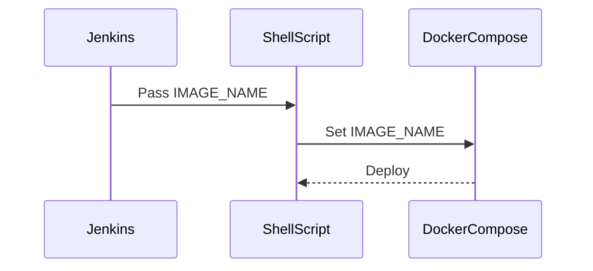

## Passing Parameters to Shell Scripts in Jenkins

In this section, we will delve into the process of passing parameters from a Jenkins pipeline to a shell script, and subsequently using these parameters within a Docker Compose deployment. This approach is essential for automating the deployment process and ensuring consistency across different environments.

### Background Theory

Jenkins is a widely used open-source automation server that provides continuous integration and continuous delivery (CI/CD) services. One of the key features of Jenkins is its ability to execute shell scripts and pass parameters to them. This capability is crucial for dynamic configurations, such as specifying different Docker images for development, testing, and production environments.

### Groovy Syntax in Jenkins Pipeline

Jenkins pipelines are typically written in Groovy, which is a powerful scripting language that integrates seamlessly with Jenkins. In the context of our discussion, we will use Groovy to pass parameters to a shell script.

#### Example: Passing Image Name as Parameter

Let's consider an example where we want to pass the `image name` as a parameter to a shell script. Here’s how you can achieve this:

```groovy
pipeline {
    agent any
    stages {
        stage('Deploy') {
            steps {
                script {
                    def imageName = 'myapp:latest'
                    sh """
                        ./deploy.sh ${imageName}
                    """
                }
            }
        }
    }
}
```

In this example, `imageName` is defined as a variable in the Groovy script and passed to the shell script `deploy.sh`.

### Reading Parameters in Shell Script

Once the parameters are passed to the shell script, they can be accessed using positional parameters. Positional parameters are denoted by `$1`, `$2`, etc., where `$1` represents the first argument, `$2` the second, and so on.

#### Example: Reading Parameters in Shell Script

Here’s how you can read the parameters in the shell script:

```bash
#!/bin/bash

# Accessing the first parameter
IMAGE_NAME=$1

echo "Image name: $IMAGE_NAME"
```

In this script, `$1` is used to access the first parameter passed to the script, which is the `image name`.

### Using Parameters in Docker Compose

Now that we have the `image name` available in the shell script, we can use it to configure the Docker Compose deployment. Docker Compose is a tool for defining and running multi-container Docker applications.

#### Example: Docker Compose Configuration

Assume we have a `docker-compose.yml` file that defines our application services. We can dynamically set the image name based on the parameter passed from Jenkins.

```yaml
version: '3'
services:
  app:
    image: ${IMAGE_NAME}
    ports:
      - "8080:8080"
```

In this configuration, `${IMAGE_NAME}` is a placeholder that will be replaced by the actual image name passed from the shell script.

### Complete Example

Let’s put everything together in a complete example:

#### Jenkinsfile

```groovy
pipeline {
    agent any
    environment {
        IMAGE_NAME = 'myapp:latest'
    }
    stages {
        stage('Deploy') {
            steps {
                script {
                    sh """
                        ./deploy.sh ${IMAGE_NAME}
                    """
                }
            }
        }
    }
}
```

#### deploy.sh

```bash
#!/bin/bash

# Accessing the first parameter
IMAGE_NAME=$1

echo "Image name: $IMAGE_NAME"

# Run Docker Compose
docker-compose -f docker-compose.yml up --build
```

#### docker-compose.yml

```yaml
version: '3'
services:
  app:
    image: ${IMAGE_NAME}
    ports:
      - "8080:8080"
```

### Mermaid Diagrams

To visualize the flow of parameters from Jenkins to the shell script and then to Docker Compose, we can use a sequence diagram:



### Pitfalls and Best Practices

#### Common Mistakes

1. **Incorrect Parameter Passing**: Ensure that the parameters are correctly passed from Jenkins to the shell script. Incorrect syntax or missing parameters can lead to errors.
2. **Environment Variable Overwriting**: Be cautious about environment variables being overwritten. Ensure that the environment variables are set correctly and consistently across different environments.
3. **Security Risks**: Passing sensitive information as parameters can expose your system to security risks. Always validate and sanitize input parameters.

#### How to Prevent / Defend

1. **Validation and Sanitization**: Validate and sanitize input parameters to ensure they meet the required format and do not contain malicious content.
2. **Environment Variable Management**: Use environment variable management tools like `envsubst` to safely substitute environment variables in configuration files.
3. **Secure Coding Practices**: Follow secure coding practices to prevent common vulnerabilities such as injection attacks.

### Real-World Examples

#### Recent CVEs and Breaches

One notable example is the `CVE-2021-25741`, which affected Jenkins and allowed attackers to execute arbitrary commands. This vulnerability highlights the importance of securing parameter passing and environment variable management.

### Detection and Prevention

#### Detection

- **Logging and Monitoring**: Implement logging and monitoring to detect unauthorized changes or suspicious activities.
- **Static Code Analysis**: Use static code analysis tools to identify potential security issues in your Jenkins pipelines and shell scripts.

#### Prevention

- **Input Validation**: Validate all input parameters to ensure they meet the expected format and do not contain malicious content.
- **Least Privilege Principle**: Apply the least privilege principle to limit the permissions of the Jenkins user and the shell script.

### Secure Code Fix

#### Vulnerable Code

```groovy
pipeline {
    agent any
    stages {
        stage('Deploy') {
            steps {
                script {
                    def imageName = params.IMAGE_NAME
                    sh """
                        ./deploy.sh ${imageName}
                    """
                }
            }
        }
    }
}
```

#### Fixed Code

```groovy
pipeline {
    agent any
    environment {
        IMAGE_NAME = params.IMAGE_NAME
    }
    stages {
        stage('Deploy') {
            steps {
                script {
                    sh """
                        ./deploy.sh ${IMAGE_NAME}
                    """
                }
            }
        }
    }
}
```

### Hands-On Labs

For practical experience, you can use the following labs:

- **PortSwigger Web Security Academy**: Offers comprehensive labs on web security, including Jenkins pipeline security.
- **OWASP Juice Shop**: Provides a vulnerable web application for practicing security testing and penetration testing.
- **DVWA (Damn Vulnerable Web Application)**: A PHP/MySQL web application that is deliberately vulnerable for security testing purposes.

By following these detailed explanations and examples, you should have a thorough understanding of how to pass parameters from Jenkins to shell scripts and use them in Docker Compose deployments.

---
<!-- nav -->
[[04-Introduction to Docker Compose|Introduction to Docker Compose]] | [[DevOps/DevOps Bootcamp/06-CI CD & Build Tools/19-Docker Compose Deployment On Remote Servers With Jenkins/00-Overview|Overview]] | [[DevOps/DevOps Bootcamp/06-CI CD & Build Tools/19-Docker Compose Deployment On Remote Servers With Jenkins/06-Practice Questions & Answers|Practice Questions & Answers]]
