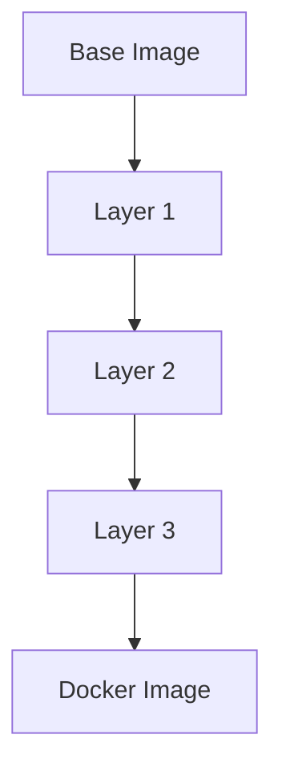

## Introduction to Docker and Artifact Management

Docker has revolutionized the way we manage and distribute software artifacts. Before Docker, developers had to deal with a variety of artifact formats depending on the programming language and framework used. For instance, Java applications often produced `.jar` and `.war` files, while other applications might use `.zip`, `.tar`, or even custom binary formats. This diversity created significant challenges in terms of consistency, reproducibility, and distribution. Docker simplifies this process by standardizing on a single artifact format: the Docker image.

### What is an Artifact?

An artifact is a file or set of files that are the result of a build process. These can include compiled binaries, libraries, configuration files, and scripts. In traditional software development, different languages and frameworks produce different types of artifacts. For example:

- **Java**: `.jar` (Java Archive) and `.war` (Web Application Archive)
- **Node.js**: `.js` files, `package.json`
- **Python**: `.py` files, `requirements.txt`

Each of these artifacts requires specific handling and management, leading to complexity in deployment and maintenance.

### Why Docker Simplifies Artifact Management

Docker simplifies artifact management by consolidating all these different types of artifacts into a single, standardized format: the Docker image. A Docker image is a lightweight, standalone, executable package that includes everything needed to run a piece of software, including the code, runtime, system tools, libraries, and settings.

#### Benefits of Using Docker Images

1. **Consistency**: Docker images ensure that the application runs the same way across different environments (development, testing, production).
2. **Reproducibility**: With Docker, you can easily reproduce the exact environment in which your application runs, reducing the "works on my machine" problem.
3. **Ease of Distribution**: Docker images can be easily distributed using Docker registries, making it simple to share and deploy applications.
4. **Unified Management**: Instead of managing multiple artifact types, you only need to manage Docker images, simplifying the overall process.

### How Docker Images Work

A Docker image is composed of layers. Each layer represents a specific instruction in the Dockerfile, such as copying a file, installing a package, or setting an environment variable. These layers are stacked on top of each other, forming a complete image.



When a Docker container is started from an image, it uses the layers to create a writable layer on top of the read-only layers. This allows the container to modify the filesystem without affecting the underlying image.

### Example: Building a Docker Image

Let's walk through an example of building a Docker image for a Node.js application.

#### Step 1: Create a `Dockerfile`

The `Dockerfile` is a text file that contains instructions for building a Docker image. Here’s a simple example:

```dockerfile
# Use the official Node.js runtime as a parent image
FROM node:14

# Set the working directory in the container
WORKDIR /app

# Copy the package.json and package-lock.json files
COPY package*.json ./

# Install the dependencies
RUN npm install

# Copy the rest of the application code
COPY . .

# Expose port 3000
EXPOSE 3000

# Command to run the application
CMD ["npm", "start"]
```

#### Step 2: Build the Docker Image

To build the Docker image, run the following command in the terminal:

```bash
docker build -t my-node-app .
```

This command tells Docker to build an image named `my-node-app` from the current directory (`.`).

#### Step 3: Run the Docker Container

Once the image is built, you can run it using:

```bash
docker run -p 3000:3000 my-node-app
```

This command maps port 3000 on the host to port 3000 in the container, allowing you to access the application.

### Full HTTP Request and Response Example

Here’s an example of a full HTTP request and response when accessing the Node.js application running in a Docker container:

**HTTP Request:**

```http
GET / HTTP/1.1
Host: localhost:3000
User-Agent: curl/7.64.1
Accept: */*
```

**HTTP Response:**

```http
HTTP/1.1 200 OK
Date: Mon, 01 Jan 2024 00:00:00 GMT
Content-Type: text/html; charset=utf-8
Content-Length: 12
Connection: keep-alive

Hello, World!
```

### Advantages of Using Docker Images

1. **No Need for Multiple Repositories**: With Docker, you only need a single repository that supports Docker images. This simplifies the management of artifacts.
2. **No Need to Move Multiple Files**: Instead of moving multiple files (like `.tar`, `package.json`, and configuration files), you can simply copy everything into the Docker image.
3. **No Need to Install Dependencies Directly on the Server**: Dependencies can be installed inside the Docker image, ensuring that the environment is consistent across different servers.

### Real-World Examples and Recent Breaches

Recent breaches have highlighted the importance of proper artifact management. For example, the Log4j vulnerability (CVE-2021-44228) affected many applications due to the use of outdated or insecure dependencies. By using Docker, you can ensure that all dependencies are managed within the image, reducing the risk of such vulnerabilities.

### Pitfalls and Common Mistakes

While Docker simplifies artifact management, there are still some pitfalls to be aware of:

1. **Insecure Base Images**: Always use trusted base images. Untrusted base images can introduce vulnerabilities.
2. **Large Images**: Avoid creating large images by removing unnecessary layers and using multi-stage builds.
3. **Unsecured Registries**: Ensure that Docker registries are properly secured to prevent unauthorized access.

### How to Prevent / Defend

#### Detection

- **Image Scanning**: Use tools like Trivy or Clair to scan Docker images for vulnerabilities.
- **Registry Security**: Implement role-based access control (RBAC) and encryption for Docker registries.

#### Prevention

- **Use Trusted Base Images**: Stick to official Docker images or those from trusted sources.
- **Multi-Stage Builds**: Use multi-stage builds to reduce the size of the final image and remove unnecessary layers.
- **Regular Updates**: Keep your Docker images up-to-date with the latest security patches.

#### Secure Coding Fixes

Here’s an example of a vulnerable Dockerfile and its secure version:

**Vulnerable Dockerfile:**

```dockerfile
FROM node:14

WORKDIR /app

COPY package*.json ./
RUN npm install

COPY . .

CMD ["npm", "start"]
```

**Secure Dockerfile:**

```dockerfile
# Use a minimal base image
FROM node:14-alpine

WORKDIR /app

# Use a multi-stage build
COPY package*.json ./
RUN npm ci --only=production

COPY . .

CMD ["npm", "start"]
```

### Conclusion

Docker simplifies artifact management by standardizing on a single artifact format: the Docker image. This reduces complexity, improves consistency, and makes it easier to distribute and manage applications. By understanding the benefits, pitfalls, and best practices of using Docker images, you can ensure that your applications are secure and reliable.

### Practice Labs

For hands-on practice with Docker and artifact management, consider the following labs:

- **PortSwigger Web Security Academy**: Offers practical exercises on securing web applications using Docker.
- **OWASP Juice Shop**: A deliberately insecure web application for practicing security skills, including Docker usage.
- **Docker Official Tutorials**: Provides comprehensive tutorials and examples for learning Docker.

By engaging with these resources, you can deepen your understanding and proficiency in using Docker for artifact management and distribution.

---
<!-- nav -->
[[DevOps/DevOps Bootcamp/06-CI CD & Build Tools/20-Docker Simplifies Artifact Management And Distribution/00-Overview|Overview]] | [[DevOps/DevOps Bootcamp/06-CI CD & Build Tools/20-Docker Simplifies Artifact Management And Distribution/02-Practice Questions & Answers|Practice Questions & Answers]]
