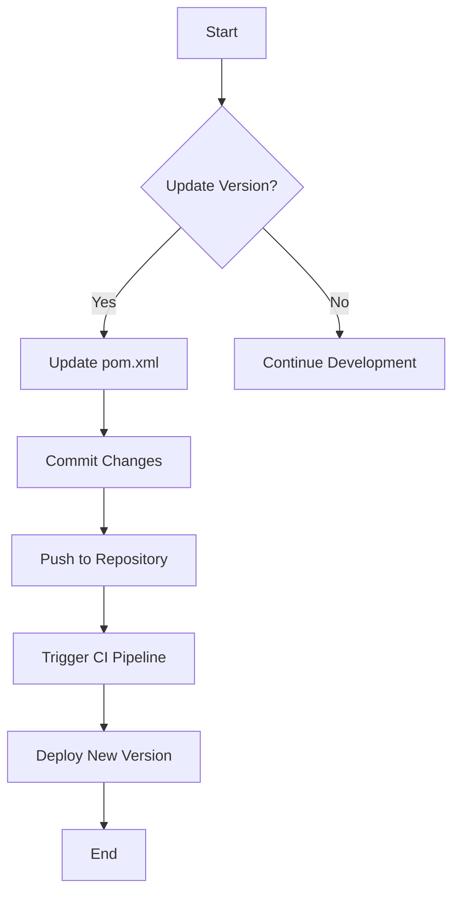

## General Concepts of Application Versioning in Build Tools

When developing and releasing software applications, one of the critical aspects is managing the versioning of the application. Versioning helps in tracking changes, maintaining consistency across environments, and ensuring that users can identify the latest updates. Different build tools and package managers handle versioning in their own unique ways, but the core principles remain consistent.

### What is Application Versioning?

Application versioning refers to the process of assigning a unique identifier to each release of an application. This identifier, typically a version number, helps in distinguishing between different releases and understanding the changes made in each release. Version numbers usually follow a specific format, such as `major.minor.patch`, which allows developers and users to quickly understand the significance of the changes.

#### Why is Versioning Important?

Versioning is crucial for several reasons:

1. **Tracking Changes**: Version numbers help in tracking the evolution of the application over time. Each version number represents a snapshot of the application at a particular point in time.
   
2. **Consistency Across Environments**: By using version numbers, developers can ensure that the same version of the application is deployed consistently across different environments (development, testing, production).

3. **User Awareness**: Users can easily identify the latest version of the application and understand the improvements or bug fixes included in each release.

4. **Dependency Management**: Version numbers are used to manage dependencies between different components of the application. This ensures that compatible versions of libraries and frameworks are used together.

### How Versioning Works in Different Build Tools

Different build tools and package managers maintain version information in their respective configuration files. Here’s a detailed look at how versioning is handled in popular build tools:

#### Maven

Maven is a widely-used build automation tool primarily for Java projects. Maven manages dependencies and builds the project using a `pom.xml` (Project Object Model) file.

**Configuration File: `pom.xml`**

```xml
<project xmlns="http://maven.apache.org/POM/4.0.0"
         xmlns:xsi="http://www.w3.org/2001/XMLSchema-instance"
         xsi:schemaLocation="http://maven.apache.org/POM/4.0.0 http://maven.apache.org/xsd/maven-4.0.0.xsd">
    <modelVersion>4.0.0</modelVersion>
    <groupId>com.example</groupId>
    <artifactId>my-app</artifactId>
    <version>1.0.0</version>
    <packaging>jar</packaging>
    <!-- Other configurations -->
</project>
```

In the above `pom.xml` file, the `<version>` tag specifies the current version of the application. To increase the version, you simply update this tag.

#### Gradle

Gradle is another popular build automation tool that supports both Java and non-Java projects. Gradle uses a `build.gradle` file to manage the build process.

**Configuration File: `build.gradle`**

```groovy
apply plugin: 'java'

group = 'com.example'
version = '1.0.0'

repositories {
    mavenCentral()
}

dependencies {
    // Dependencies go here
}
```

In the `build.gradle` file, the `version` variable holds the current version of the application. Updating this variable increases the version.

#### NPM/Yarn

NPM (Node Package Manager) and Yarn are package managers for JavaScript projects. They use a `package.json` file to manage dependencies and versioning.

**Configuration File: `package.json`**

```json
{
  "name": "my-app",
  "version": "1.0.0",
  "description": "A sample application",
  "main": "index.js",
  "scripts": {
    "start": "node index.js"
  },
  "dependencies": {
    "express": "^4.18.2"
  }
}
```

The `version` field in the `package.json` file specifies the current version of the application. To increase the version, you update this field.

### Best Practices for Versioning

While versioning is flexible, following best practices ensures consistency and clarity. Common versioning schemes include:

1. **Semantic Versioning (SemVer)**: A widely adopted scheme where the version number follows the format `MAJOR.MINOR.PATCH`. 
   - **MAJOR**: Incremented for incompatible API changes.
   - **MINOR**: Incremented for backward-compatible feature additions.
   - **PATCH**: Incremented for backward-compatible bug fixes.

2. **Calendar Versioning**: Uses dates in the version number, such as `YYYY.MM.DD`.

3. **Internal Versioning**: Uses a simple incrementing number, such as `1.0`, `1.1`, `1.2`, etc.

### Real-World Examples

#### Example 1: Semantic Versioning in a Java Project

Consider a Java project managed with Maven. Suppose the current version is `1.0.0`, and you want to release a minor update that adds new features but remains backward-compatible.

**Before Update:**

```xml
<project xmlns="http://maven.apache.org/POM/4.0.0"
         xmlns:xsi="http://www.w3.org/2001/XMLSchema-instance"
         xsi:schemaLocation="http://maven.apache.org/POM/4.0.0 http://maven.apache.org/xsd/maven-4.0.0.xsd">
    <modelVersion>4.0.0</modelVersion>
    <groupId>com.example</groupId>
    <artifactId>my-app</artifactId>
    <version>1.0.0</version>
    <packaging>jar</packaging>
    <!-- Other configurations -->
</project>
```

**After Update:**

```xml
<project xmlns="http://maven.apache.org/POM/4.0.0"
         xmlns:xsi="http://www.w3.org/2001/XMLSchema-instance"
         xsi:schemaLocation="http://maven.apache.org/PPOM/4.0.0 http://maven.apache.org/xsd/maven-4.0.0.xsd">
    <modelVersion>4.0.0</modelVersion>
    <groupId>com.example</groupId>
    <artifactId>my-app</artifactId>
    <version>1.1.0</version>
    <packaging>jar</packaging>
    <!-- Other configurations -->
</project>
```

#### Example 2: Calendar Versioning in a Node.js Project

Consider a Node.js project managed with NPM. Suppose the current version is `2023.01.01`, and you want to release a patch update on January 2nd.

**Before Update:**

```json
{
  "name": "my-app",
  "version": "2023.01.01",
  "description": "A sample application",
  "main": "index.js",
  "scripts": {
    "start": "node index.js"
  },
  "dependencies": {
    "express": "^4.18.2"
  }
}
```

**After Update:**

```json
{
  "name": "my-app",
  "version": "2023.01.02",
  "description": "A sample application",
  "main": "index.js",
  "scripts": {
    2023.01.02": "node index.js"
  },
  "dependencies": {
    "express": "^4.18.2"
  }
}
```

### Pitfalls and How to Avoid Them

#### Pitfall 1: Inconsistent Versioning

**Problem**: Using inconsistent versioning schemes across different parts of the project can lead to confusion and errors.

**Solution**: Adopt a consistent versioning scheme throughout the project. Document the chosen scheme and ensure all team members adhere to it.

#### Pitfall 2: Manual Version Updates

**Problem**: Manually updating version numbers in multiple places can introduce human error.

**Solution**: Automate version updates using scripts or tools like `npm version` for NPM projects or `mvn versions:set` for Maven projects.

### How to Prevent / Defend

#### Detection

To detect inconsistencies in versioning:

1. **Automated Checks**: Use continuous integration (CI) pipelines to run automated checks that verify the consistency of version numbers across different files.
   
2. **Manual Review**: Conduct regular manual reviews of version numbers to catch any discrepancies.

#### Prevention

To prevent versioning issues:

1. **Use Versioning Tools**: Leverage tools like `npm version` or `mvn versions:set` to automate version updates.
   
2. **Document Versioning Scheme**: Clearly document the versioning scheme and ensure all team members understand and follow it.

3. **Regular Audits**: Perform regular audits to ensure version numbers are consistent and up-to-date.

### Secure Coding Fixes

#### Vulnerable Code Example

Consider a scenario where a developer manually updates the version number in multiple places, leading to inconsistencies.

**Vulnerable Code:**

```xml
<!-- pom.xml -->
<version>1.0.0</version>

<!-- build.gradle -->
version = '1.0.0'
```

**Fixed Code:**

```xml
<!-- pom.xml -->
<version>1.1.0</version>

<!-- build.gradle -->
version = '1.1.0'
```

### Complete Example with Maven

#### Full HTTP Request and Response

**HTTP Request:**

```http
POST /api/deploy HTTP/1.1
Host: example.com
Content-Type: application/json

{
  "application": "my-app",
  "version": "1.1.0"
}
```

**HTTP Response:**

```http
HTTP/1.1 200 OK
Content-Type: application/json

{
  "status": "success",
  "message": "Deployment of my-app version 1.1.0 successful"
}
```

### Mermaid Diagrams

#### Versioning Workflow



### Hands-On Labs

For practical experience with versioning in build tools, consider the following labs:

- **PortSwigger Web Security Academy**: Focuses on web application security but includes sections on versioning and dependency management.
- **OWASP Juice Shop**: A deliberately insecure web application for security training. It includes exercises on versioning and dependency management.
- **DVWA (Damn Vulnerable Web Application)**: Another web application for security training that covers versioning and dependency management.

By following these guidelines and best practices, you can effectively manage and maintain the versioning of your applications, ensuring consistency and clarity across all environments.

---
<!-- nav -->
[[DevOps/DevOps Bootcamp/06-CI CD & Build Tools/22-Increasing Application Version in Build Tools/00-Overview|Overview]] | [[02-Introduction to Application Versioning in Build Tools|Introduction to Application Versioning in Build Tools]]
