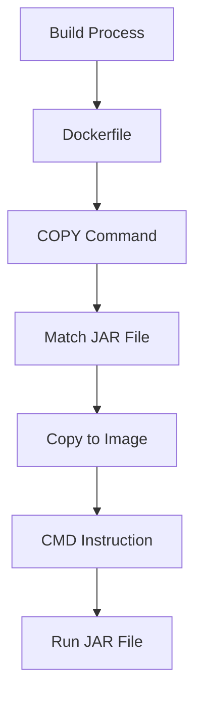

## Introduction to Dynamic Version Handling in Build Tools

In the context of DevOps and continuous integration/continuous deployment (CI/CD) pipelines, managing application versions dynamically is crucial. This ensures that your build process can adapt to new versions of your application without manual intervention. In this section, we will explore how to handle dynamic versioning in Dockerfiles and other build tools, focusing on practical examples and real-world scenarios.

### Background Theory

When building Docker images, it is common practice to include specific files such as JARs or WARs. These files often contain version information in their filenames. If the version changes, the build process must adapt accordingly. Hardcoding the filename can lead to issues when the version number changes, causing the build to fail.

#### Key Concepts

- **Dockerfile**: A script that contains a series of instructions to build a Docker image.
- **JAR File**: A Java Archive file that contains compiled Java classes and resources.
- **Regular Expressions (Regex)**: Patterns used to match character combinations in strings.

### Problem Statement

Consider a Dockerfile where the JAR file name is hardcoded:

```dockerfile
FROM openjdk:17-jdk-slim
COPY target/java-maven-app-1.1.0-SNAPSHOT.jar /app/
CMD ["java", "-jar", "/app/java-maven-app-1.1.0-SNAPSHOT.jar"]
```

If the version of the JAR file changes to `1.1.1`, the build will fail because the hardcoded filename does not exist.

### Solution: Dynamic Version Handling

To solve this problem, we need to make the Dockerfile more flexible by using regular expressions to match the JAR file dynamically.

#### Step-by-Step Mechanics

1. **Remove Hardcoded Filename**:
   Remove the hardcoded JAR filename from the Dockerfile.

2. **Use Regular Expression**:
   Use a regular expression to match the JAR file dynamically.

3. **Modify Entry Point**:
   Change the entry point to a command that can execute the JAR file dynamically.

### Example Dockerfile with Dynamic Version Handling

Here is an updated Dockerfile that uses a regular expression to match the JAR file dynamically:

```dockerfile
FROM openjdk:17-jdk-slim
COPY target/java-maven-app*.jar /app/app.jar
CMD ["java", "-jar", "/app/app.jar"]
```

In this example:
- `target/java-maven-app*.jar` matches any JAR file in the `target` directory that starts with `java-maven-app`.
- The matched JAR file is copied to `/app/app.jar`.
- The `CMD` instruction runs the JAR file located at `/app/app.jar`.

### Explanation of Each Component

1. **COPY Command**:
   - `COPY target/java-maven-app*.jar /app/app.jar`: This copies any JAR file in the `target` directory that starts with `java-maven-app` to `/app/app.jar`. The wildcard `*` allows for dynamic matching of the version number.

2. **CMD Instruction**:
   - `CMD ["java", "-jar", "/app/app.jar"]`: This runs the JAR file located at `/app/app.jar`. The `CMD` instruction is used instead of `ENTRYPOINT` because it allows for dynamic execution based on the copied JAR file.

### Real-World Examples

#### Recent CVEs and Breaches

Dynamic version handling is particularly important in environments where frequent updates are required. For instance, consider a scenario where a critical security patch is released for an application. Without dynamic version handling, the build process would need to be manually updated, which could delay the deployment of the patch.

#### Example Scenario

Suppose you are working on a web application that is frequently updated. The application is built using Maven, and the JAR files are generated with version numbers. Without dynamic version handling, each time the version number changes, the Dockerfile would need to be manually updated. This can lead to errors and delays in deployment.

### How to Prevent / Defend

#### Detection

To detect issues related to hardcoded filenames in Dockerfiles, you can use static analysis tools such as SonarQube or Checkmarx. These tools can identify hardcoded filenames and flag them for review.

#### Prevention

1. **Use Regular Expressions**: Always use regular expressions to match files dynamically.
2. **Automate Build Processes**: Use CI/CD pipelines to automate the build process and ensure that the Dockerfile is updated automatically.
3. **Code Reviews**: Implement code reviews to catch hardcoded filenames before they are merged into the codebase.

#### Secure Coding Fixes

Here is an example of a vulnerable Dockerfile and its secure counterpart:

**Vulnerable Dockerfile**:

```dockerfile
FROM openjdk:17-jdk-slim
COPY target/java-maven-app-1.1.0-SNAPSHOT.jar /app/
CMD ["java", "-jar", "/app/java-maven-app-1.1.0-SNAPSHOT.jar"]
```

**Secure Dockerfile**:

```dockerfile
FROM openjdk:17-jdk-slim
COPY target/java-maven-app*.jar /app/app.jar
CMD ["java", "-jar", "/app/app.jar"]
```

### Mermaid Diagrams

#### Dockerfile Flow



### Complete Example with Raw HTTP Messages

While this example does not involve HTTP messages directly, it is important to understand how the Dockerfile interacts with the build process. Here is a complete example of the Dockerfile and the resulting image:

**Dockerfile**:

```dockerfile
FROM openjdk:17-jdk-slim
COPY target/java-maven-app*.jar /app/app.jar
CMD ["java", "-jar", "/app/app.jar"]
```

**Resulting Image**:

The resulting image will contain the JAR file with the appropriate version number, and the `CMD` instruction will run the JAR file.

### Common Mistakes and Pitfalls

1. **Hardcoding Filenames**: One of the most common mistakes is hardcoding filenames in the Dockerfile. This can lead to build failures when the version number changes.
2. **Using Incorrect Regular Expressions**: Using incorrect regular expressions can result in the wrong files being matched, leading to unexpected behavior.
3. **Not Using CMD Instead of ENTRYPOINT**: Using `ENTRYPOINT` instead of `CMD` can cause issues when trying to run the JAR file dynamically.

### Hands-On Labs

For hands-on practice, you can use the following labs:

- **PortSwigger Web Security Academy**: This lab provides a comprehensive set of exercises to learn about web security.
- **OWASP Juice Shop**: This lab provides a vulnerable web application to practice security testing.
- **DVWA**: This lab provides a vulnerable web application to practice security testing.
- **WebGoat**: This lab provides a vulnerable web application to practice security testing.

These labs will help you understand how to handle dynamic versioning in Dockerfiles and other build tools.

### Conclusion

Handling dynamic versioning in Dockerfiles is crucial for maintaining a robust and efficient build process. By using regular expressions and modifying the entry point, you can ensure that your build process adapts to new versions of your application without manual intervention. This not only saves time but also reduces the risk of errors and delays in deployment.

---
<!-- nav -->
[[04-Introduction to Build Tools and Version Management|Introduction to Build Tools and Version Management]] | [[DevOps/DevOps Bootcamp/06-CI CD & Build Tools/22-Increasing Application Version in Build Tools/00-Overview|Overview]] | [[06-Introduction to Version Control in Build Tools|Introduction to Version Control in Build Tools]]
