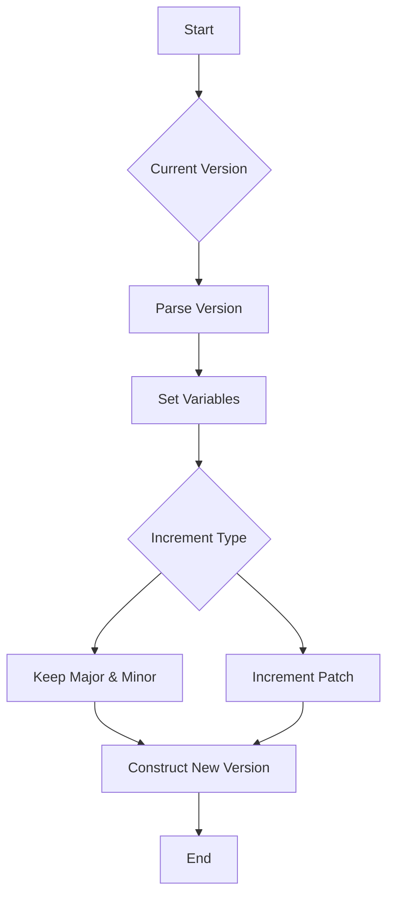

## Introduction to Version Control in Build Tools

Version control is a fundamental aspect of software development, especially in the context of continuous integration and continuous delivery (CI/CD). It ensures that changes to the software are tracked, documented, and can be rolled back if necessary. In the context of build tools, version control helps manage different versions of an application, allowing developers to incrementally update the software without causing disruptions.

### Semantic Versioning

Semantic versioning (SemVer) is a widely adopted versioning scheme that provides a simple and intuitive way to manage software versions. SemVer follows the format `MAJOR.MINOR.PATCH`, where:

- **MAJOR**: Represents incompatible API changes.
- **MINOR**: Represents backward-compatible feature additions.
- **PATCH**: Represents backward-compatible bug fixes.

This versioning scheme allows developers to quickly understand the nature of changes between different versions of a software package.

### Incrementing Versions in Build Tools

In build tools like Maven, Gradle, and npm, versioning plays a crucial role in automating the build process. These tools often provide plugins and commands to parse and manipulate version numbers. One such plugin is the `parse-version` plugin, which helps in setting and manipulating version numbers.

#### Parsing Version Numbers

The `parse-version` plugin parses the current version number and sets it into several variables, including:

- `major`: The current major version.
- `next_major`: The next major version.
- `minor`: The current minor version.
- `next_minor`: The next minor version.
- `patch`: The current patch version.
- `next_patch`: The next patch version.

These variables allow developers to easily manipulate the version numbers based on the type of change being made.

### Example: Incrementing Patch Version

Let's consider a scenario where you want to release a patch version of your application. This typically involves fixing a bug or introducing a small, non-breaking feature. To achieve this, you need to keep the current major and minor versions unchanged and increment the patch version.

#### Step-by-Step Process

1. **Access Current Major Version**:
    ```bash
    ${parsed_version.major}
    ```

2. **Access Current Minor Version**:
    ```bash
    ${parsed_version.minor}
    ```

3. **Increment Patch Version**:
    ```bash
    ${parsed_version.next_patch}
    ```

Here’s a complete example using a hypothetical build script:

```bash
# Assuming parsed_version is already set by the parse-version plugin
current_major=${parsed_version.major}
current_minor=${parsed_version.minor}
next_patch=${parsed_version.next_patch}

# Construct the new version string
new_version="${current_major}.${current_minor}.${next_patch}"

echo "New version: $new_version"
```

### Mermaid Diagram: Version Increment Flow

A visual representation of the version increment flow can help clarify the process:



### Real-World Examples

Consider a recent real-world example where a company released a patch version to fix a critical security vulnerability. This patch version incremented the patch number while keeping the major and minor versions unchanged. This approach ensured that users could quickly apply the fix without worrying about breaking changes.

### Common Pitfalls and How to Avoid Them

#### Incorrect Version Increment

One common pitfall is incorrectly incrementing the version number. For instance, incrementing the major version instead of the patch version can lead to unintended consequences, such as breaking compatibility with existing systems.

**Secure Coding Fix:**

To avoid this, ensure that the correct version number is incremented based on the type of change. Here’s an example of a secure coding practice:

```bash
# Vulnerable Code
incorrect_version="${parsed_version.major}.${parsed_version.minor}.${parsed_version.patch}"

# Secure Code
correct_version="${parsed_version.major}.${parsed_version.minor}.${parsed_version.next_patch}"
```

### Detection and Prevention

#### Detection

To detect incorrect version increments, you can implement automated checks in your CI/CD pipeline. For example, you can use a script to compare the current and new version numbers and ensure they follow the correct SemVer rules.

```bash
# Check if the version increment is correct
if [ "${parsed_version.patch}" -eq "${parsed_version.next_patch}" ]; then
    echo "Error: Incorrect version increment."
    exit 1
fi
```

#### Prevention

To prevent incorrect version increments, you can enforce strict versioning policies and use tools like semantic-release, which automates the version bumping process based on commit messages.

### Hands-On Lab Suggestions

For hands-on practice, consider the following labs:

- **PortSwigger Web Security Academy**: Focuses on web application security but also covers versioning in the context of software updates.
- **OWASP Juice Shop**: Provides a vulnerable web application for practicing security testing and version management.
- **DVWA (Damn Vulnerable Web Application)**: Another web application for practicing security testing and version management.

These labs will help you gain practical experience in managing and incrementing version numbers in real-world scenarios.

### Conclusion

Understanding and correctly implementing version control in build tools is crucial for maintaining the integrity and stability of software applications. By following best practices and using tools like the `parse-version` plugin, you can ensure that your software remains up-to-date and secure.

---
<!-- nav -->
[[05-Introduction to Dynamic Version Handling in Build Tools|Introduction to Dynamic Version Handling in Build Tools]] | [[DevOps/DevOps Bootcamp/06-CI CD & Build Tools/22-Increasing Application Version in Build Tools/00-Overview|Overview]] | [[07-Introduction to Version Management in Build Tools|Introduction to Version Management in Build Tools]]
