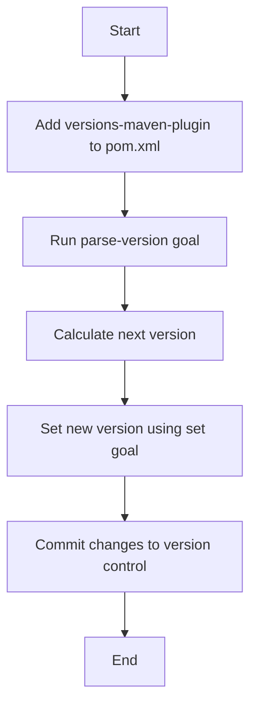

## Increasing Application Version in Build Tools

In the context of DevOps and continuous integration/continuous deployment (CI/CD) pipelines, managing application versions is a critical task. This ensures that each release is uniquely identifiable and traceable, which is essential for maintaining software quality and integrity. In this section, we will delve into how to dynamically manage and increment application versions using build tools such as Maven.

### Understanding Version Management

Version management is the process of systematically tracking and controlling changes to software versions. Each version of an application should reflect a specific state of the software at a particular point in time. This is crucial for several reasons:

1. **Traceability**: It allows developers and operations teams to track changes and understand the history of the software.
2. **Reproducibility**: It ensures that the same version of the software can be rebuilt exactly as it was originally released.
3. **Compatibility**: It helps in identifying dependencies and ensuring that different components of a system are compatible with each other.

### Semantic Versioning

Semantic Versioning (SemVer) is a widely adopted standard for versioning software. It follows the format `MAJOR.MINOR.PATCH`, where:

- **MAJOR**: Incremented for incompatible API changes.
- **MINOR**: Incremented for backward-compatible feature additions.
- **PATCH**: Incremented for backward-compatible bug fixes.

For example, if the current version is `1.2.3` and you release a new version with a significant API change, the new version would be `2.0.0`.

### Dynamic Version Incrementation

In a CI/CD pipeline, it is often necessary to automatically increment the version number based on the type of change being made. This ensures that the version number accurately reflects the nature of the changes.

#### Maven Version Management

Maven is a popular build automation tool used primarily for Java projects. It provides mechanisms to manage and increment version numbers dynamically.

##### Maven Plugin for Version Management

One of the most commonly used plugins for version management in Maven is the `versions-maven-plugin`. This plugin provides goals to manipulate the version numbers in the `pom.xml` file.

Let's walk through the steps to configure and use this plugin.

1. **Add the Plugin to `pom.xml`**:
   
   First, you need to add the `versions-maven-plugin` to your `pom.xml` file. Here is an example configuration:

   ```xml
   <project>
     ...
     <build>
       <plugins>
         <plugin>
           <groupId>org.codehaus.mojo</groupId>
           <artifactId>versions-maven-plugin</artifactId>
           <version>2.8.1</version>
           <configuration>
             <allowSnapshots>true</allowSnapshots>
           </configuration>
         </plugin>
       </plugins>
     </build>
     ...
   </project>
   ```

2. **Define Parameters for Version Set**:
   
   You can define parameters to specify the new version number. For example, you might want to set a new version number based on the old version number.

   ```xml
   <project>
     ...
     <properties>
       <new.version>1.2.4</new.version>
     </properties>
     ...
   </project>
   ```

3. **Use Goals to Increment Versions**:
   
   The `versions-maven-plugin` provides several goals to manipulate version numbers. For example, the `set` goal can be used to set the version number to a specified value.

   ```bash
   mvn versions:set -DnewVersion=1.2.4
   ```

   Alternatively, you can use the `next-version` goal to automatically calculate the next version number based on the current version.

   ```bash
   mvn versions:next-version
   ```

   This command will automatically increment the version number according to the SemVer rules.

### Parsing and Calculating Next Version

To dynamically calculate the next version number, you can use the `parse-version` goal provided by the `versions-maven-plugin`. This goal parses the current version and calculates the next version number.

```bash
mvn versions:parse-version
```

This command will output the parsed version information, including the next major, minor, and patch versions.

### Using Variables in New Version Definition

You can use variables to define the new version number based on the calculated values. For example, if you want to set the new version to the next minor version, you can use the following command:

```bash
mvn versions:set -DnewVersion=\${parsedVersion.nextMinor}
```

Here, `\${parsedVersion.nextMinor}` is a variable that contains the next minor version number.

### Example Workflow

Let's walk through a complete example workflow for dynamically incrementing the version number in a Maven project.

1. **Initial Setup**:
   
   Ensure that the `versions-maven-plugin` is added to your `pom.xml` file.

   ```xml
   <project>
     ...
     <build>
       <plugins>
         <plugin>
           <groupId>org.codehaus.mojo</groupId>
           <artifactId>versions-maven-plugin</artifactId>
           <version>2.8.1</version>
           <configuration>
             <allowSnapshots>true</allowSnapshots>
           </configuration>
         </plugin>
       </plugins>
     </build>
     ...
   </project>
   ```

2. **Parse Current Version**:
   
   Run the `parse-version` goal to parse the current version and calculate the next versions.

   ```bash
   mvn versions:parse-version
   ```

3. **Set New Version**:
   
   Use the `set` goal to set the new version number based on the calculated values.

   ```bash
   mvn versions:set -DnewVersion=\${parsedVersion.nextMinor}
   ```

4. **Commit Changes**:
   
   Commit the changes to your version control system.

   ```bash
   git commit -am "Bump version to \${parsedVersion.nextMinor}"
   ```

### Common Pitfalls and Best Practices

#### Common Pitfalls

1. **Hardcoding Version Numbers**:
   
   Avoid hardcoding version numbers in your build scripts. This can lead to inconsistencies and errors.

2. **Incorrect Version Calculation**:
   
   Ensure that the version calculation logic is correct and follows the SemVer rules. Incorrect version calculation can lead to compatibility issues.

3. **Manual Version Management**:
   
   Manual version management is error-prone and time-consuming. Use automated tools and scripts to manage version numbers.

#### Best Practices

1. **Automate Version Management**:
   
   Use build tools and plugins to automate version management. This ensures consistency and reduces the risk of errors.

2. **Follow SemVer Rules**:
   
   Follow the SemVer rules for versioning. This ensures that version numbers accurately reflect the nature of the changes.

3. **Document Versioning Strategy**:
   
   Document your versioning strategy and ensure that all team members understand it. This ensures consistency across the team.

### Real-World Examples

#### Recent CVEs and Breaches

While version management itself does not directly cause vulnerabilities, incorrect version management can lead to security issues. For example, if a version number is incorrectly incremented, it may lead to compatibility issues or the use of outdated libraries, which can introduce security vulnerabilities.

#### Example: CVE-2021-44228 (Log4j)

The Log4j vulnerability (CVE-2021-44228) is a prime example of why proper version management is crucial. Many applications were using outdated versions of Log4j, which led to widespread exploitation. Proper version management could have helped identify and mitigate this vulnerability earlier.

### How to Prevent / Defend

#### Detection

1. **Static Analysis Tools**:
   
   Use static analysis tools to detect outdated or vulnerable dependencies. Tools like SonarQube and OWASP Dependency-Check can help identify outdated dependencies.

2. **Dependency Check**:
   
   Regularly run dependency checks to ensure that all dependencies are up-to-date and free from known vulnerabilities.

#### Prevention

1. **Automated Version Management**:
   
   Use automated tools and scripts to manage version numbers. This ensures consistency and reduces the risk of errors.

2. **Continuous Integration/Continuous Deployment (CI/CD)**:
   
   Implement CI/CD pipelines to automate the build and deployment processes. This ensures that version numbers are correctly managed and updated.

3. **Secure Coding Practices**:
   
   Follow secure coding practices to ensure that version numbers are correctly managed and updated. This includes using automated tools and scripts to manage version numbers.

### Complete Example

Let's walk through a complete example of dynamically incrementing the version number in a Maven project.

#### Initial Setup

1. **Add the Plugin to `pom.xml`**:
   
   Ensure that the `versions-maven-plugin` is added to your `pom.xml` file.

   ```xml
   <project>
     ...
     <build>
       <plugins>
         <plugin>
           <groupId>org.codehaus.mojo</groupId>
           <artifactId>versions-maven-plugin</artifactId>
           <version>2.8.1</version>
           <configuration>
             <allowSnapshots>true</allowSnapshots>
           </configuration>
         </plugin>
       </plugins>
     </build>
     ...
   </project>
   ```

2. **Parse Current Version**:
   
   Run the `parse-version` goal to parse the current version and calculate the next versions.

   ```bash
   mvn versions:parse-version
   ```

3. **Set New Version**:
   
   Use the `set` goal to set the new version number based on the calculated values.

   ```bash
   mvn versions:set -DnewVersion=\${parsedVersion.nextMinor}
   ```

4. **Commit Changes**:
   
   Commit the changes to your version control system.

   ```bash

   git commit -am "Bump version to \${parsedVersion.nextMinor}"
   ```

### Conclusion

Proper version management is crucial for maintaining software quality and integrity. By using automated tools and scripts, you can ensure that version numbers are correctly managed and updated. This reduces the risk of errors and ensures consistency across the team.

### Practice Labs

For hands-on practice with version management in Maven, consider the following labs:

- **PortSwigger Web Security Academy**: Offers a variety of labs related to web application security, including version management.
- **OWASP Juice Shop**: A deliberately insecure web application for security training.
- **DVWA (Damn Vulnerable Web Application)**: A PHP/MySQL web application that is riddled with vulnerabilities for educational purposes.

These labs provide practical experience with version management and other DevOps practices.

### Summary Diagram



By following these steps and best practices, you can ensure that your application versions are managed effectively and securely.

---
<!-- nav -->
[[07-Introduction to Version Management in Build Tools|Introduction to Version Management in Build Tools]] | [[DevOps/DevOps Bootcamp/06-CI CD & Build Tools/22-Increasing Application Version in Build Tools/00-Overview|Overview]] | [[09-Maven Version Management|Maven Version Management]]
