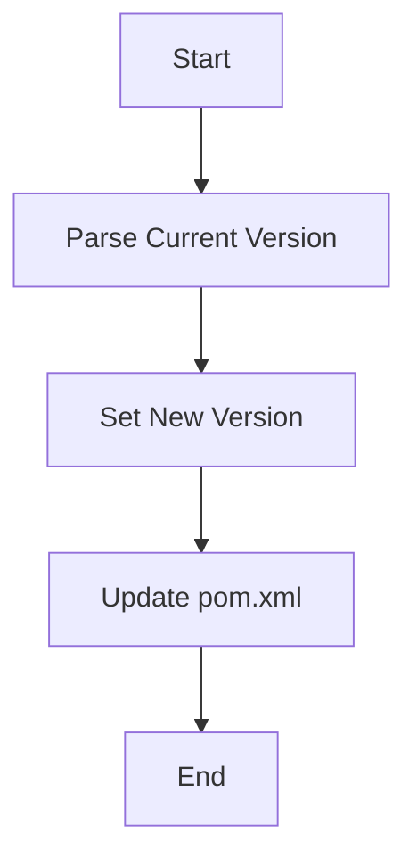

## Maven Version Management

Maven is a powerful build automation tool primarily used for Java projects. It provides a robust framework for managing project builds, dependencies, and versions. In this section, we'll explore how to increment the version of a Maven project.

### Maven Project Structure

A typical Maven project structure includes the following key files:

- **`pom.xml`**: The Project Object Model (POM) file, which contains metadata about the project and its dependencies.
- **`src/main/java`**: Directory containing the main source code.
- **`src/test/java`**: Directory containing test source code.

### Incrementing the Version Using Maven Plugins

To increment the version of a Maven project, we can use plugins such as the Maven Build Helper Plugin. This plugin provides various utilities for manipulating the project's version.

#### Step 1: Parse the Current Version

The first step is to parse the current version from the `pom.xml` file. This is done using the `parse-version` goal of the Maven Build Helper Plugin.

```xml
<project>
    <modelVersion>4.0.0</modelVersion>
    <groupId>com.example</groupId>
    <artifactId>my-app</artifactId>
    <version>1.1.0-SNAPSHOT</version>
    <!-- Other configurations -->
</project>
```

The `parse-version` goal breaks down the version into its constituent parts: major, minor, and patch.

```bash
mvn build-helper:parse-version
```

This command will output the parsed version details:

```plaintext
[INFO] Scanning for projects...
[INFO]
[INFO] ------------------< com.example:my-app >-------------------
[INFO] Building my-app 1.1.0-SNAPSHOT
[INFO] --------------------------------[ jar ]---------------------------------
[INFO]
[INFO] --- maven-build-helper-plugin:3.2.0:parse-version (default-cli) @ my-app ---
[INFO] Setting property 'parsedVersion.majorVersion' to '1'
[INFO] Setting property 'parsedVersion.minorVersion' to '1'
[INFO] Setting property 'parsedVersion.incrementalVersion' to '0'
[INFO] Setting property 'parsedVersion.qualifier' to 'SNAPSHOT'
[INFO] ------------------------------------------------------------------------
[INFO] BUILD SUCCESS
[INFO] ------------------------------------------------------------------------
[INFO] Total time:  0.818 s
[INFO] Finished at: 2023-10-05T14:45:30Z
[INFO] ------------------------------------------------------------------------
```

#### Step 2: Set the New Version

Once the current version is parsed, we can set a new version using the `versions:set` goal. This goal updates the version in the `pom.xml` file.

```bash
mvn versions:set -DnewVersion=1.2.0-SNAPSHOT
```

This command will update the `pom.xml` file to reflect the new version:

```xml
<project>
    <modelVersion>4.0.0</modelVersion>
    <groupId>com.example</groupId>
    <artifactId>my-app</artifactId>
    <version>1.2.0-SNAPSHOT</version>
    <!-- Other configurations -->
</project>
```

### Full Example: Incrementing the Version

Here is a complete example of incrementing the version of a Maven project:

1. **Initial `pom.xml`**:

    ```xml
    <project>
        <modelVersion>4.0.0</modelVersion>
        <groupId>com.example</groupId>
        <artifactId>my-app</artifactId>
        <version>1.1.0-SNAPSHOT</version>
        <!-- Other configurations -->
    </project>
    ```

2. **Parse the Current Version**:

    ```bash
    mvn build-helper:parse-version
    ```

3. **Set the New Version**:

    ```bash
    mvn versions:set -DnewVersion=1.2.0-SNAPSHOT
    ```

4. **Updated `pom.xml`**:

    ```xml
    <project>
        <modelVersion>4.0.0</modelVersion>
        <groupId>com.example</groupId>
        <artifactId>my-app</artifactId>
        <version>1.2.0-SNAPSHOT</version>
        <!-- Other configurations -->
    </project>
    ```

### Mermaid Diagram: Version Increment Process



### Pitfalls and Best Practices

#### Common Mistakes

- **Incorrect Version Syntax**: Ensure the version follows the correct format (e.g., `1.2.0-SNAPSHOT`).
- **Manual Version Updates**: Avoid manually updating the version in the `pom.xml` file; use build tools and plugins instead.
- **Ignoring Qualifiers**: Pay attention to qualifiers like `-SNAPSHOT`, which indicate development versions.

#### Best Practices

- **Automate Version Management**: Use build tools and plugins to automate version management.
- **Use Semantic Versioning**: Follow semantic versioning guidelines to ensure clarity and consistency.
- **Document Version Changes**: Maintain a changelog to document changes between versions.

### Real-World Examples

#### CVE-2021-44228 (Log4j Vulnerability)

The Log4j vulnerability (CVE-2021-44228) highlighted the importance of proper version management. Many organizations were affected because they were using outdated versions of Log4j. Proper version management could have helped identify and mitigate this vulnerability earlier.

#### Example Code: Secure Version Management

Here is an example of secure version management using Maven:

1. **Initial `pom.xml`**:

    ```xml
    <project>
        <modelVersion>4.0.0</modelVersion>
        <groupId>com.example</groupId>
        <artifactId>my-app</artifactId>
        <version>1.1.0-SNAPSHOT</version>
        <!-- Other configurations -->
    </project>
    ```

2. **Secure Version Management Script**:

    ```bash
    #!/bin/bash

    # Parse current version
    mvn build-helper:parse-version

    # Set new version
    mvn versions:set -DnewVersion=1.2.0-SNAPSHOT

    # Commit changes
    git commit -am "Bump version to 1.2.0-SNAPSHOT"
    ```

### How to Prevent / Defend

#### Detection

- **Static Analysis Tools**: Use static analysis tools like SonarQube to detect outdated dependencies.
- **Dependency Checkers**: Use tools like `mvn dependency:tree` to check for outdated dependencies.

#### Prevention

- **Automated Builds**: Use continuous integration (CI) systems to automatically build and test new versions.
- **Version Policies**: Implement strict version policies to ensure that only approved versions are used.

#### Secure Coding Fixes

- **Vulnerable Code**:

    ```xml
    <project>
        <modelVersion>4.0.0</modelVersion>
        <groupId>com.example</groupId>
        <artifactId>my-app</artifactId>
        <version>1.1.0-SNAPSHOT</version>
        <!-- Other configurations -->
    </project>
    ```

- **Fixed Code**:

    ```xml
    <project>
        <modelVersion>4.0.0</modelVersion>
        <groupId>com.example</groupId>
        <artifactId>my-app</artifactId>
        <version>1.2.0-SNAPSHOT</version>
        <!-- Other configurations -->
    </project>
    ```

### Conclusion

Proper version management is critical for maintaining the integrity and reliability of software builds. By using build tools like Maven and adhering to best practices, developers can ensure that their projects are up-to-date and secure. Regularly updating and validating versions helps prevent vulnerabilities and ensures smooth deployment processes.

### Practice Labs

For hands-on practice with Maven and version management, consider the following labs:

- **PortSwigger Web Security Academy**: Offers exercises on securing web applications.
- **OWASP Juice Shop**: Provides a vulnerable web application for practicing security.
- **DVWA (Damn Vulnerable Web Application)**: Another resource for practicing web application security.

By engaging with these labs, you can gain practical experience in managing application versions and ensuring the security of your builds.

---
<!-- nav -->
[[08-Increasing Application Version in Build Tools|Increasing Application Version in Build Tools]] | [[DevOps/DevOps Bootcamp/06-CI CD & Build Tools/22-Increasing Application Version in Build Tools/00-Overview|Overview]] | [[10-Semantic Versioning|Semantic Versioning]]
