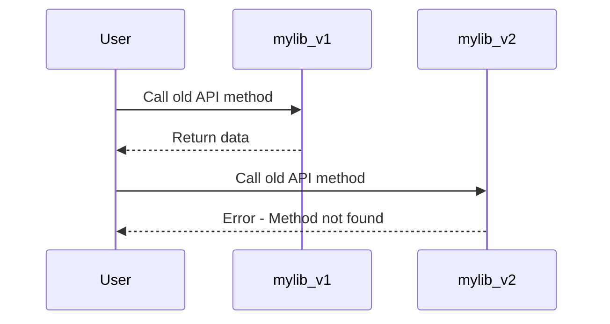
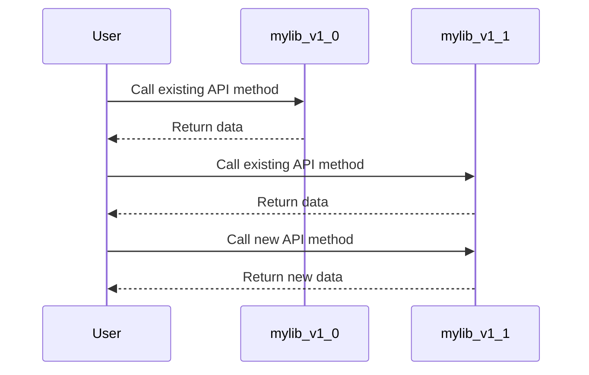
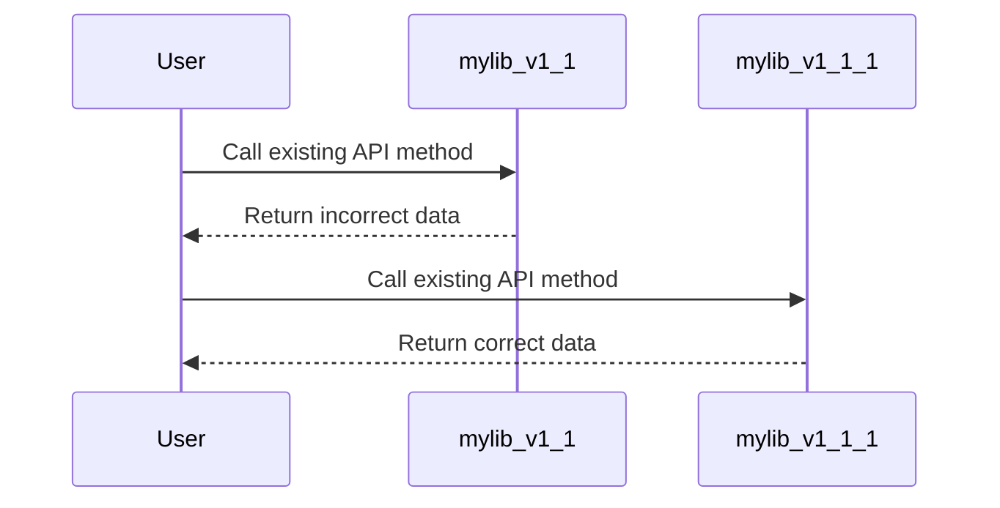
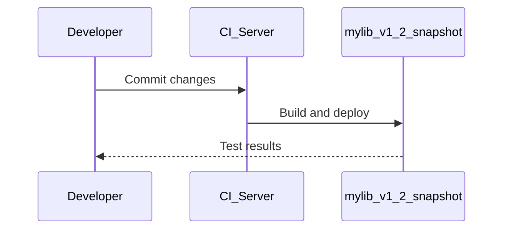
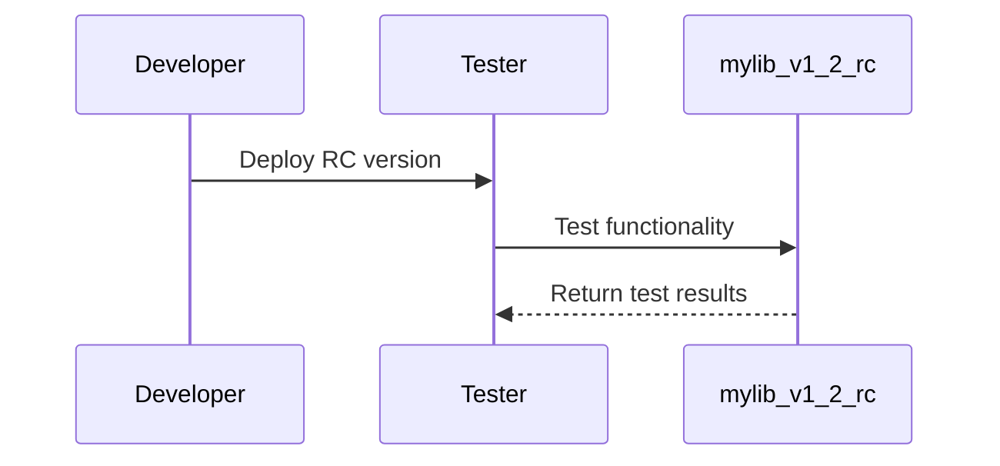
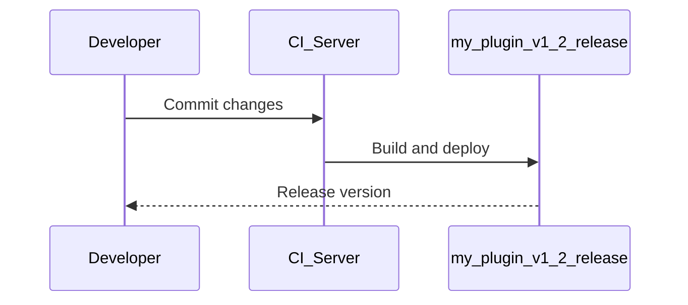
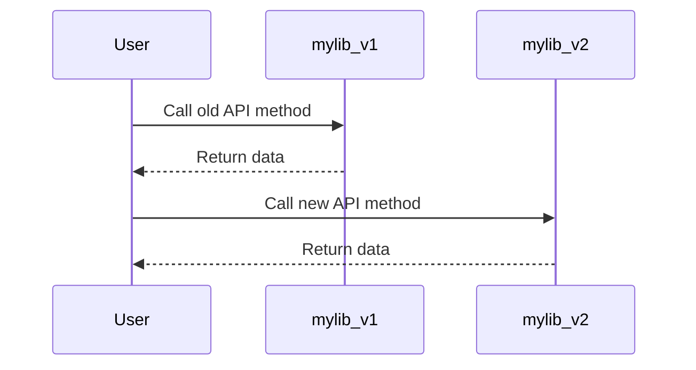
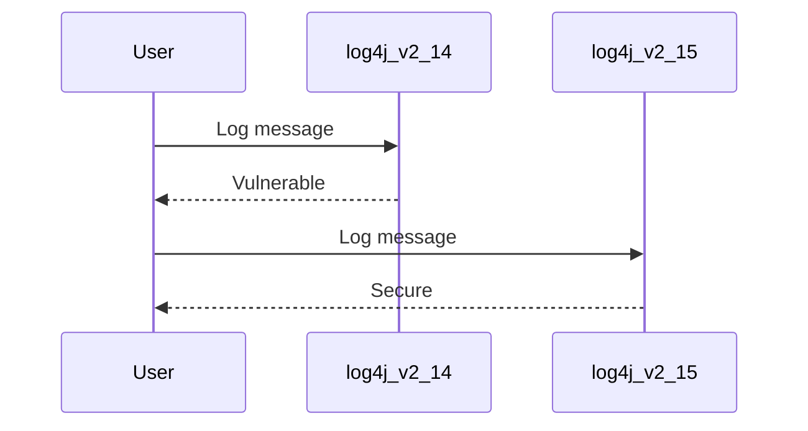
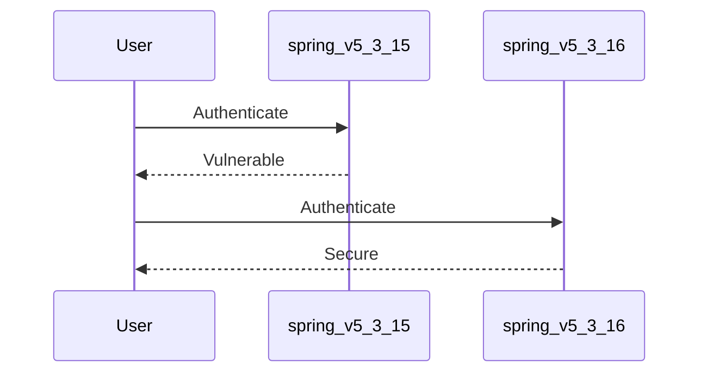

## Semantic Versioning

Semantic Versioning (SemVer) is a versioning system designed to provide a clear and consistent way to manage software versions. It is widely adopted in the software development community due to its simplicity and effectiveness in conveying the nature of changes between different versions of a software package. SemVer follows a specific format: `MAJOR.MINOR.PATCH`, where each component represents a different type of change:

### Major Version (`X.0.0`)

The major version number is incremented when incompatible API changes are made. This means that the software has undergone significant changes that may break backward compatibility. For example, if a library changes its public API in a way that existing code using the old version will no longer work, the major version should be incremented.

#### Example:
Consider a hypothetical library `mylib`. Suppose the current version is `1.0.0`. If a new version `2.0.0` is released with a completely revamped API that breaks existing integrations, this would be a major version update.

### Minor Version (`0.Y.0`)

The minor version number is incremented when new functionality is added in a backwards-compatible manner. This means that existing code using the old version will continue to work with the new version. Minor version updates typically include new features, enhancements, and bug fixes that do not break existing functionality.

#### Example:
Suppose `mylib` version `1.0.0` already exists. A new version `1.1.0` could introduce a new feature without breaking existing code.

### Patch Version (`0.0.Z`)

The patch version number is incremented when backwards-compatible bug fixes are made. This means that existing code using the old version will continue to work with the new version. Patch version updates typically address minor bugs and issues that do not affect the overall functionality.

#### Example:
Suppose `mylib` version `1.1.0` already exists. A new version `1.1.1` could fix a minor bug without affecting existing functionality.

### Snapshot Versions

Snapshot versions are used during the development phase to indicate that the version is not yet ready for production. They are often used in continuous integration (CI) environments to test changes before they are officially released. A snapshot version typically includes a suffix such as `-SNAPSHOT`.

#### Example:
Suppose `mylib` is being developed and a new version `1.2.0-SNAPSHOT` is created for testing purposes.

### Release Candidate Versions

Release candidate (RC) versions are used to indicate that the version is almost ready for release. They are often used to gather feedback from users before the final release. An RC version typically includes a suffix such as `-RC`.

#### Example:
Suppose `mylib` is nearing completion and a new version `1.2.0-RC` is created for final testing.

### Maven Plugin Example

Maven is a popular build automation tool used in Java projects. Maven plugins can be versioned using SemVer. For example, a Maven plugin might have a version `1.2.0-release`.

#### Example:
Suppose a Maven plugin `my-plugin` is being developed and a new version `1.2.0-release` is created for final release.

### How to Prevent / Defend

To ensure that versioning is done correctly and securely, follow these best practices:

1. **Use SemVer Consistently**: Ensure that all team members understand and adhere to the SemVer guidelines.
2. **Automate Versioning**: Use tools like Git hooks or CI/CD pipelines to automate versioning based on commit messages or tags.
3. **Document Changes**: Clearly document the changes made in each version, including bug fixes, new features, and API changes.
4. **Test Thoroughly**: Perform thorough testing for each version, especially for major and minor releases.
5. **Use Snapshots and RCs**: Utilize snapshot and RC versions to gather feedback and ensure stability before final release.

#### Vulnerable Code Example

Suppose a library `mylib` is being used in a project, and a new version `2.0.0` is released with a breaking change.

#### Secure Code Example

Ensure that the project is updated to use the new API methods in the new version.

### Real-World Examples

#### CVE-2021-44228 (Log4j)

In December 2021, a critical vulnerability (CVE-2021-44228) was discovered in Apache Log4j, a widely used logging framework. The vulnerability allowed attackers to execute arbitrary code on affected systems. This led to a major version update from `2.14.1` to `2.15.0`.

#### CVE-2022-22965 (Spring Framework)

In March 2022, a critical vulnerability (CVE-2022-22965) was discovered in the Spring Framework, which allowed attackers to bypass authentication mechanisms. This led to a minor version update from `5.3.15` to `5.3.16`.

### Practice Labs

For hands-on practice with versioning and build tools, consider the following labs:

- **PortSwigger Web Security Academy**: Offers a variety of labs related to web application security, including version management.
- **OWASP Juice Shop**: A deliberately insecure web application for security training.
- **DVWA (Damn Vulnerable Web Application)**: Another popular web application for security training.

These labs provide practical experience in managing software versions and ensuring security in real-world scenarios.

By following these guidelines and best practices, you can effectively manage software versions and ensure the security and stability of your applications.

---
<!-- nav -->
[[09-Maven Version Management|Maven Version Management]] | [[DevOps/DevOps Bootcamp/06-CI CD & Build Tools/22-Increasing Application Version in Build Tools/00-Overview|Overview]] | [[11-Understanding Versioning in Build Tools|Understanding Versioning in Build Tools]]
