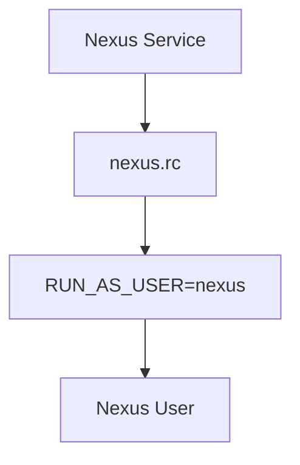

## Configuring Nexus to Run as the Nexus User

To ensure that Nexus runs with the least privileges necessary, it should be configured to run as the `nexus` user. This is typically done by modifying the `nexus.rc` configuration file.

### Modifying the `nexus.rc` File

1. **Locate the `nexus.rc` File**:
    ```sh
    sudo nano /etc/init.d/nexus.rc
    ```

2. **Modify the Configuration**:
    Uncomment the line that specifies the user:
    ```sh
    RUN_AS_USER=nexus
    ```

3. **Save and Exit**:
    Press `Ctrl+O` to save, then `Ctrl+X` to exit.

### Explanation of the `RUN_AS_USER` Directive

The `RUN_AS_USER` directive in the `nexus.rc` file specifies the user under which the Nexus service should run. By setting this to `nexus`, you ensure that the service runs with the permissions of the `nexus` user, enhancing security by limiting the scope of potential damage in case of a breach.

### Diagram: Nexus Service Configuration



---
<!-- nav -->
[[DevOps/DevOps Bootcamp/06-CI CD & Build Tools/24-Installing Nexus on Digital Ocean Droplet/01-Introduction to Nexus Repository Manager|Introduction to Nexus Repository Manager]] | [[DevOps/DevOps Bootcamp/06-CI CD & Build Tools/24-Installing Nexus on Digital Ocean Droplet/00-Overview|Overview]] | [[03-Creating a Dedicated User for Services|Creating a Dedicated User for Services]]
