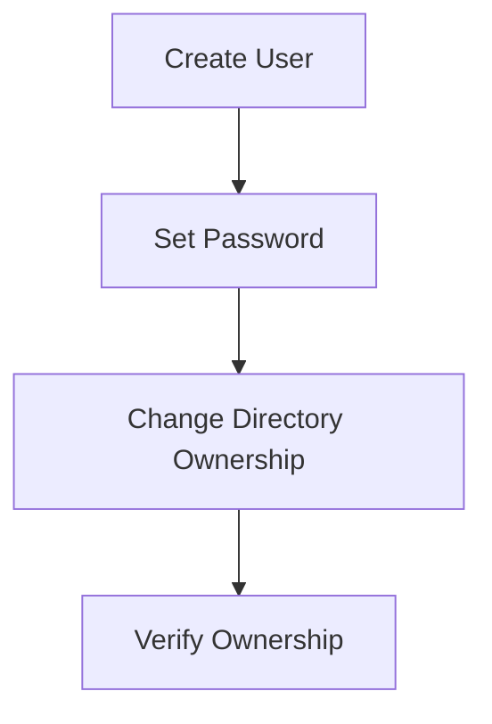

## Creating a Dedicated User for Services

When deploying applications like Nexus on a server, it is crucial to follow best practices for security and operational efficiency. One of the most important practices is to create a dedicated user for the service. This user should have only the necessary permissions required to run the application and interact with it, but not the elevated privileges of the `root` user. This approach helps mitigate the risk of privilege escalation attacks and ensures that the application runs securely.

### Why Create a Dedicated User?

Creating a dedicated user for a service like Nexus provides several benefits:

1. **Security**: By limiting the permissions of the user to only what is necessary, you reduce the potential damage that could be caused by a compromised application. If an attacker gains control of the application, they will not have elevated privileges to perform harmful actions on the system.

2. **Isolation**: Each service runs under its own user account, which helps isolate the application from other services running on the same server. This isolation can prevent issues where one service interferes with another.

3. **Auditability**: Using a dedicated user makes it easier to audit the actions performed by the application. Logs and activity can be traced back to the specific user, making it simpler to identify and investigate unauthorized activities.

### Steps to Create a Dedicated User

Let's walk through the steps to create a dedicated user for the Nexus service on a Linux system.

#### Step 1: Create the User

To create a new user named `nexus`, you can use the `adduser` or `useradd` command. Here, we'll use `useradd`:

```bash
sudo useradd nexus
```

This command creates a new user named `nexus`. Next, you need to set a password for this user:

```bash
sudo passwd nexus
```

You will be prompted to enter and confirm the password. For security reasons, it is recommended to use a strong, unique password.

#### Step 2: Verify User Creation

After creating the user, you can verify that the user has been added successfully by checking the `/etc/passwd` file:

```bash
grep nexus /etc/passwd
```

This command will display the entry for the `nexus` user in the `/etc/passwd` file, confirming that the user has been created.

### Changing Directory Ownership

Once the user is created, you need to ensure that the directories used by the Nexus service are owned by the `nexus` user. This includes changing the ownership of the directories where Nexus stores its data and configurations.

#### Step 1: Identify Directories

Identify the directories that Nexus uses. Typically, these might include directories like `/opt/nexus` or `/var/lib/nexus`.

#### Step 2: Change Ownership Recursively

Use the `chown` command to change the ownership of these directories recursively. For example, if the directories are `/opt/nexus` and `/var/lib/nexus`, you would run:

```bash
sudo chown -R nexus:nexus /opt/nexus
sudo chown -R nexus:nexus /var/lib/nexus
```

The `-R` flag specifies that the ownership should be changed recursively for all files and subdirectories within the specified directories.

### Example: Full Process

Here is a complete example of creating the `nexus` user and changing the ownership of the directories:

```bash
# Create the user
sudo useradd nexus

# Set the password
sudo passwd nexus

# Change ownership of directories
sudo chown -R nexus:nexus /opt/nexus
sudo chown -R nexus:nexus /var/lib/nexus
```

### Mermaid Diagram: User Creation and Directory Ownership

A visual representation of the process can help understand the flow:



### Common Pitfalls and How to Avoid Them

#### Pitfall 1: Not Setting a Strong Password

**Why It Matters**: Weak passwords can be easily guessed or cracked, leading to unauthorized access to the system.

**How to Avoid**: Always use strong, unique passwords. Consider using a password manager to generate and store complex passwords.

#### Pitfall 2: Incorrect Directory Ownership

**Why It Matters**: Incorrect ownership can cause the application to fail or behave unexpectedly. It can also lead to security vulnerabilities if the wrong user has access to sensitive data.

**How to Avoid**: Double-check the ownership of directories after changing them. Use commands like `ls -l` to verify the ownership.

### Real-World Examples

#### Example 1: CVE-2021-44228 (Log4Shell)

In the Log4Shell vulnerability (CVE-2021-44228), attackers exploited a flaw in the Apache Log4j library to execute arbitrary code on affected systems. If the application was running as a non-root user with limited permissions, the impact of the exploit would have been significantly reduced.

#### Example 2: SolarWinds Supply Chain Attack

In the SolarWinds supply chain attack, attackers compromised the build environment and inserted malicious code into the SolarWinds Orion software. If the build environment had been properly isolated and run with limited permissions, the scope of the attack could have been minimized.

### How to Prevent / Defend

#### Detection

Regularly monitor system logs and audit trails to detect any unauthorized access or suspicious activity. Tools like `auditd` can be configured to log detailed information about file accesses and modifications.

#### Prevention

1. **Use Strong Authentication**: Ensure that all users have strong, unique passwords. Consider implementing multi-factor authentication (MFA).

2. **Limit Permissions**: Always create dedicated users for services and limit their permissions to only what is necessary.

3. **Regular Audits**: Perform regular security audits to identify and address any potential vulnerabilities.

4. **Secure Configuration Management**: Use tools like Ansible, Puppet, or Chef to manage and enforce secure configurations across your infrastructure.

### Secure Code Fix

#### Vulnerable Code

```bash
# Vulnerable: Running as root
sudo -u root /opt/nexus/bin/nexus start
```

#### Fixed Code

```bash
# Secure: Running as nexus user
sudo -u nexus /opt/nexus/bin/nexus start
```

### Conclusion

Creating a dedicated user for services like Nexus is a fundamental best practice in DevOps and security. By following these steps and being aware of common pitfalls, you can ensure that your applications run securely and efficiently. Regular monitoring and auditing are essential to maintaining the security of your systems.

### Practice Labs

For hands-on experience with these concepts, consider the following labs:

- **PortSwigger Web Security Academy**: Offers practical exercises on securing web applications.
- **OWASP Juice Shop**: A deliberately insecure web application for practicing web security skills.
- **DigitalOcean Tutorials**: Provides step-by-step guides on setting up and securing various services on DigitalOcean droplets.

By combining theoretical knowledge with practical experience, you can master the art of secure DevOps practices.

---
<!-- nav -->
[[02-Configuring Nexus to Run as the Nexus User|Configuring Nexus to Run as the Nexus User]] | [[DevOps/DevOps Bootcamp/06-CI CD & Build Tools/24-Installing Nexus on Digital Ocean Droplet/00-Overview|Overview]] | [[04-Real-World Examples and Security Considerations|Real-World Examples and Security Considerations]]
