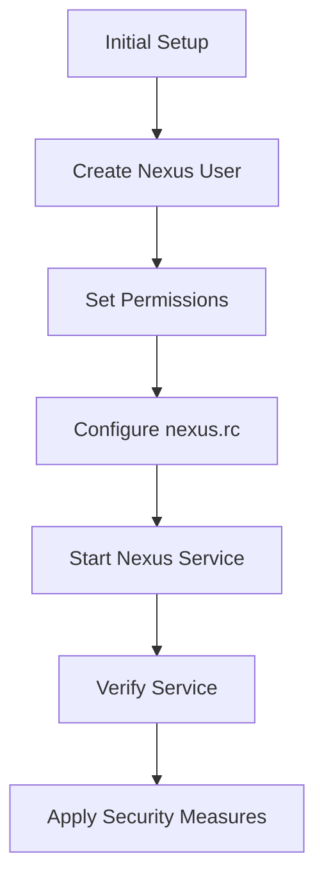

## Real-World Examples and Security Considerations

### Recent CVEs and Breaches

Several vulnerabilities have been identified in Nexus Repository Manager over the years. One notable example is CVE-2018-7488, which allowed unauthorized access to sensitive data due to improper authentication handling.

### How to Prevent / Defend

#### Secure Configuration

1. **Use Strong Passwords**: Ensure that the `nexus` user has a strong, unique password.
2. **Enable SSL/TLS**: Configure Nexus to use SSL/TLS for secure communication.
3. **Audit Logging**: Enable audit logging to track access and modifications to the repository.

#### Example: Secure Configuration

**Vulnerable Configuration**:
```sh
RUN_AS_USER=root
```

**Secure Configuration**:
```sh
RUN_AS_USER=nexus
```

#### Secure Coding Practices

1. **Least Privilege Principle**: Always run services with the minimum necessary privileges.
2. **Regular Updates**: Keep Nexus and its dependencies up to date to mitigate known vulnerabilities.

### Diagram: Secure Configuration Flow



---
<!-- nav -->
[[03-Creating a Dedicated User for Services|Creating a Dedicated User for Services]] | [[DevOps/DevOps Bootcamp/06-CI CD & Build Tools/24-Installing Nexus on Digital Ocean Droplet/00-Overview|Overview]] | [[05-Setting Up the Environment|Setting Up the Environment]]
