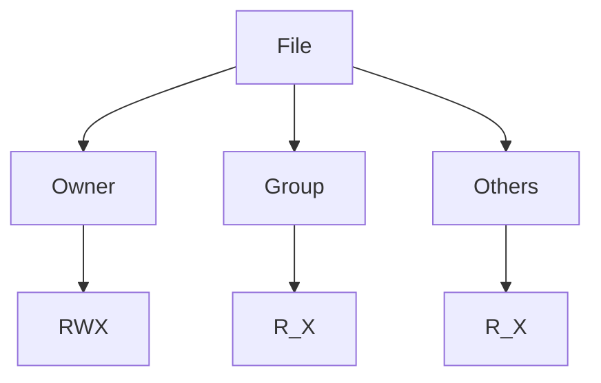

## Setting Up the Environment

### Creating the Nexus User

To ensure proper security and isolation, it is recommended to create a dedicated user for Nexus. This user will own the Nexus files and directories, ensuring that only authorized processes can modify them.

#### Steps to Create the Nexus User

1. **Log in to the Droplet**:
    ```sh
    ssh root@your_droplet_ip
    ```

2. **Create the Nexus User**:
    ```sh
    sudo useradd nexus
    sudo passwd nexus
    ```
    You will be prompted to set a password for the `nexus` user.

3. **Set Permissions**:
    Ensure that the directories used by Nexus have the correct ownership and permissions. For example, if Nexus is installed in `/opt/nexus`, you would run:
    ```sh
    sudo chown -R nexus:nexus /opt/nexus
    sudo chmod -R 755 /opt/nexus
    ```

### Explanation of File Permissions

File permissions in Unix-based systems are crucial for maintaining security and controlling access. Each file and directory has three sets of permissions: owner, group, and others.

- **Owner**: The user who owns the file.
- **Group**: Users belonging to the same group as the file.
- **Others**: All other users.

Permissions are represented using a combination of letters (`r` for read, `w` for write, `x` for execute) or numbers (4 for read, 2 for write, 1 for execute).

For example, `chmod 755 /opt/nexus` sets the permissions as follows:
- Owner: Read, Write, Execute (7)
- Group: Read, Execute (5)
- Others: Read, Execute (5)

### Diagram: File Permission Structure



---
<!-- nav -->
[[04-Real-World Examples and Security Considerations|Real-World Examples and Security Considerations]] | [[DevOps/DevOps Bootcamp/06-CI CD & Build Tools/24-Installing Nexus on Digital Ocean Droplet/00-Overview|Overview]] | [[06-Starting the Nexus Service|Starting the Nexus Service]]
