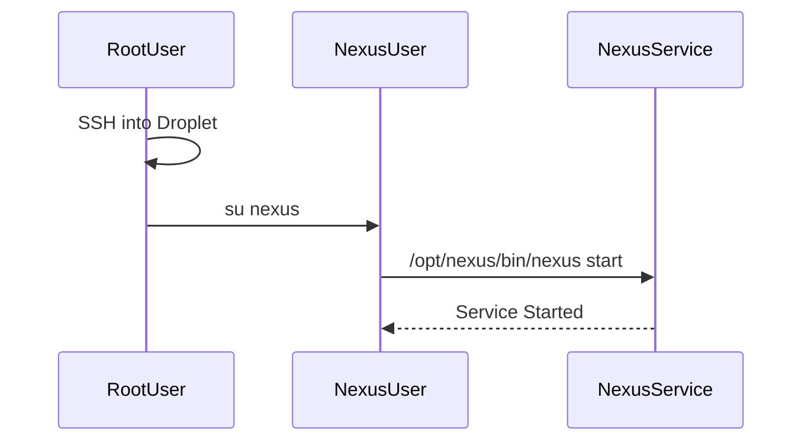

## Starting the Nexus Service

After configuring the environment and the `nexus.rc` file, you can start the Nexus service using the `nexus` user.

### Switching to the Nexus User

1. **Switch to the Nexus User**:
    ```sh
    su nexus
    ```

2. **Start the Nexus Service**:
    ```sh
    /opt/nexus/bin/nexus start
    ```

### Explanation of the Startup Command

The startup command `/opt/nexus/bin/nexus start` initiates the Nexus service. This command is typically located in the `bin` directory of the Nexus installation. The `start` parameter tells the script to start the service.

### Diagram: Nexus Service Startup Flow



---
<!-- nav -->
[[05-Setting Up the Environment|Setting Up the Environment]] | [[DevOps/DevOps Bootcamp/06-CI CD & Build Tools/24-Installing Nexus on Digital Ocean Droplet/00-Overview|Overview]] | [[07-Verifying the Nexus Service|Verifying the Nexus Service]]
