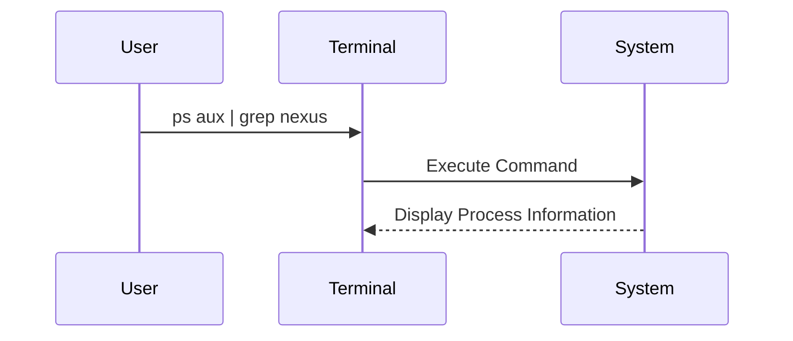

## Verifying the Nexus Service

Once the service is started, you can verify its status and ensure it is running correctly.

### Checking the Process ID

1. **Check the Process ID**:
    ```sh
    ps aux | grep nexus
    ```

2. **Identify the Process ID**:
    Look for the process ID (PID) associated with the Nexus service.

### Explanation of the `ps` Command

The `ps` command is used to display information about active processes. The `aux` options provide a detailed list of all processes running on the system. The `grep` command filters the output to show only lines containing the keyword `nexus`.

### Diagram: Process Verification Flow



---
<!-- nav -->
[[06-Starting the Nexus Service|Starting the Nexus Service]] | [[DevOps/DevOps Bootcamp/06-CI CD & Build Tools/24-Installing Nexus on Digital Ocean Droplet/00-Overview|Overview]] | [[DevOps/DevOps Bootcamp/06-CI CD & Build Tools/24-Installing Nexus on Digital Ocean Droplet/08-Conclusion|Conclusion]]
