## Introduction to Jenkins Administration and User Roles Configuration

Jenkins is a widely-used open-source automation server that provides continuous integration and continuous delivery (CI/CD) services. It allows teams to automate the building, testing, and deployment of their software. One of the key aspects of Jenkins is its role-based access control (RBAC) system, which enables administrators to manage user permissions and access levels effectively. This chapter will delve into the details of Jenkins administration and user roles configuration, providing a comprehensive understanding of the concepts, configurations, and security measures involved.

### Understanding Jenkins Roles

In Jenkins, roles are categorized into two primary types: **Administrators** and **Users**. These roles define the level of access and responsibilities assigned to different groups of individuals within an organization.

#### Administrators

Administrators are responsible for managing the Jenkins environment. They handle tasks such as:

- Setting up and configuring the Jenkins cluster.
- Managing multiple nodes within the Jenkins infrastructure.
- Installing and maintaining plugins.
- Backing up and restoring Jenkins data.
- Configuring global settings and security policies.

Typically, administrators are members of the operations or DevOps teams. They ensure that Jenkins is properly set up and maintained to support the development and deployment processes.

#### Users

Users are typically developers or DevOps engineers who create and manage jobs on Jenkins. Their responsibilities include:

- Creating and configuring jobs to run various workflows.
- Triggering builds and deployments.
- Monitoring job statuses and logs.

In larger organizations, these roles are often separated into distinct teams. However, in smaller organizations, the same team might handle both administrative and user roles.

### Jenkins Administration Interface

The Jenkins administration interface is where administrators perform most of their tasks. This section covers the key components and configurations available in the administration interface.

#### Accessing the Administration Interface

To access the administration interface, navigate to the Jenkins dashboard and click on the "Manage Jenkins" link. This will take you to the main administration page where you can configure various settings.

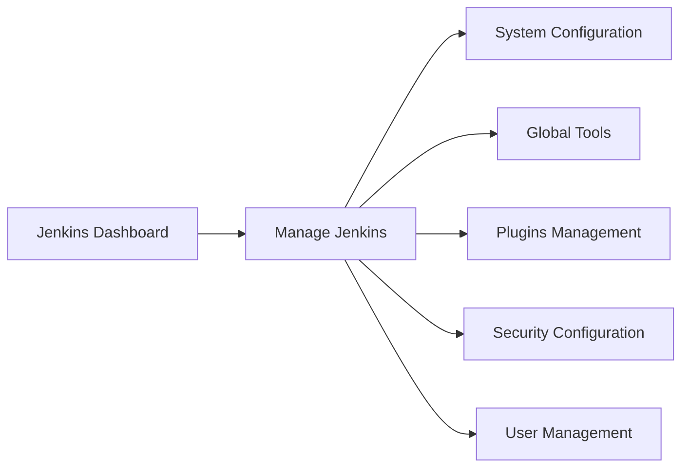

#### System Configuration

The "Configure System" option allows administrators to set up global configurations for Jenkins. This includes settings related to:

- Global properties.
- Build executors.
- Cloud providers.
- Tool installations.

For example, to configure a global property, you would navigate to `Manage Jenkins` > `Configure System` and add the necessary property.

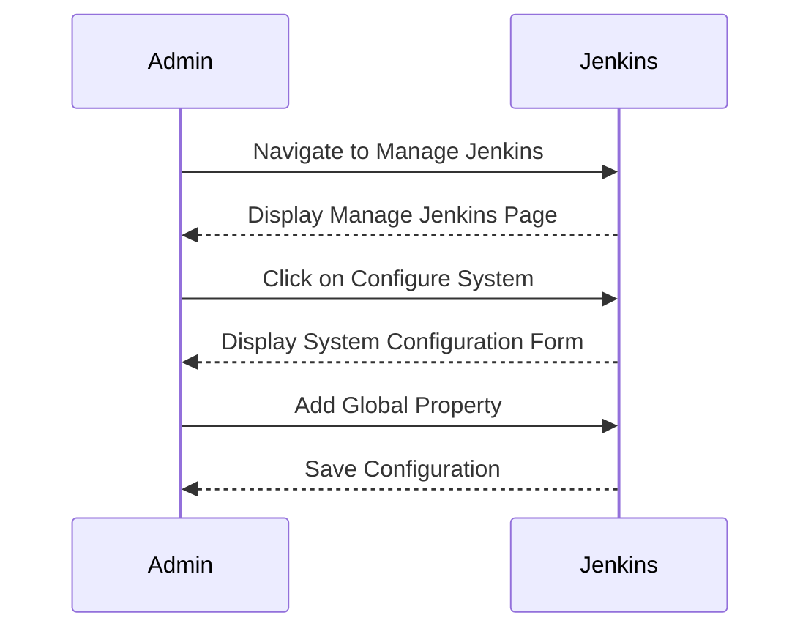

#### Global Tools

Global tools configuration allows administrators to define tools that are available across all Jenkins jobs. This includes tools like Maven, Node.js, Python, etc.

To configure global tools, navigate to `Manage Jenkins` > `Global Tool Configuration`.

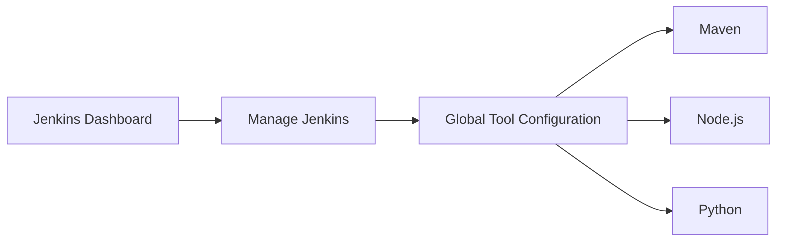

#### Plugins Management

Plugins are essential for extending Jenkins functionality. Administrators can install, update, and manage plugins through the `Manage Plugins` section.

To install a plugin, navigate to `Manage Jenkins` > `Manage Plugins` > `Available`. Select the desired plugin and click on `Install without restart`.

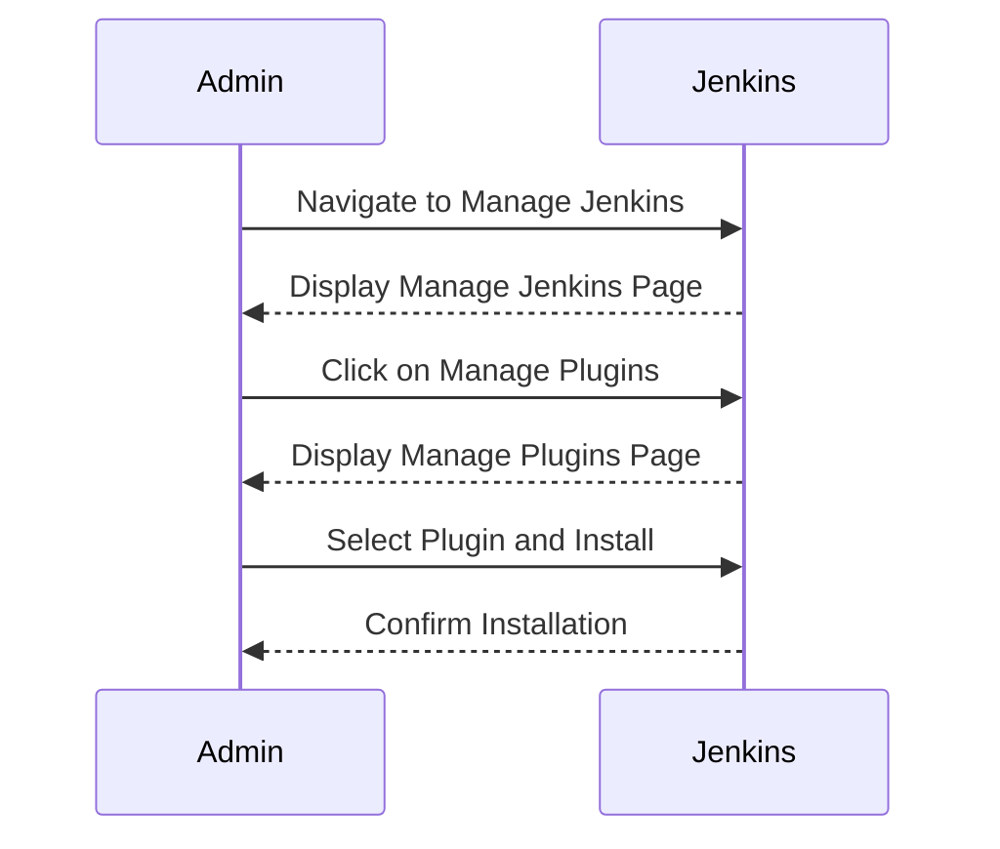

#### Security Configuration

Security is a critical aspect of Jenkins administration. The `Configure Global Security` option allows administrators to set up security policies, including:

- Authentication methods (LDAP, Active Directory, etc.).
- Authorization strategies (Matrix-based, Role-based).
- CSRF protection.
- Anonymous read access.

To configure security, navigate to `Manage Jenkins` > `Configure Global Security`.

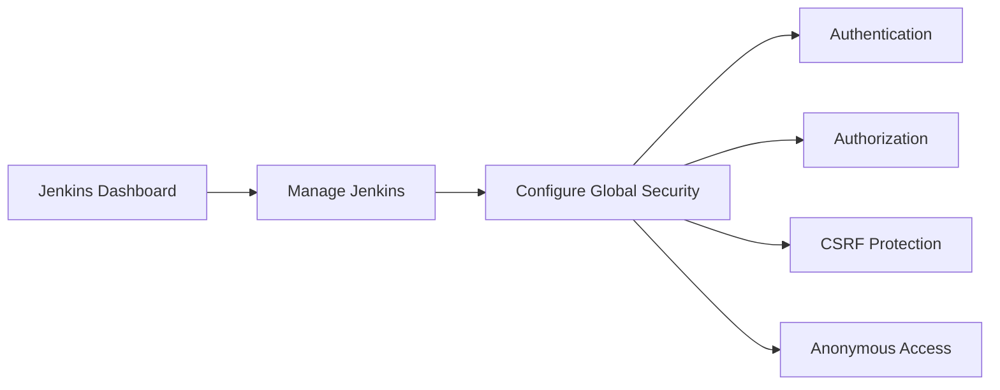

#### User Management

User management involves creating and managing user accounts within Jenkins. Administrators can create new users, assign roles, and manage user permissions.

To create a new user, navigate to `Manage Jenkins` > `Manage Users` > `Create User`.

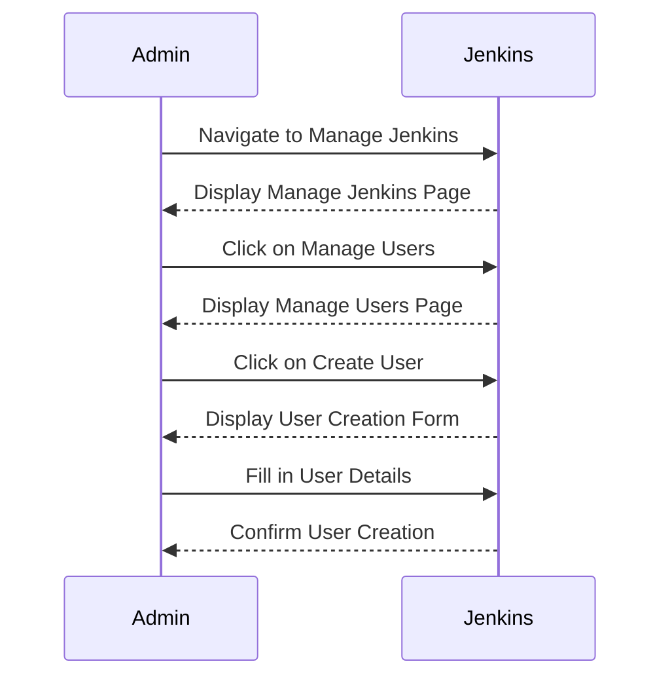

### Role-Based Access Control (RBAC)

Role-Based Access Control (RBAC) is a method of controlling access to resources based on the roles of individual users within an organization. In Jenkins, RBAC is implemented using the `Role Strategy Plugin`.

#### Installing the Role Strategy Plugin

To enable RBAC in Jenkins, you need to install the `Role Strategy Plugin`. Navigate to `Manage Jenkins` > `Manage Plugins` > `Available`, search for `Role Strategy Plugin`, and click on `Install without restart`.

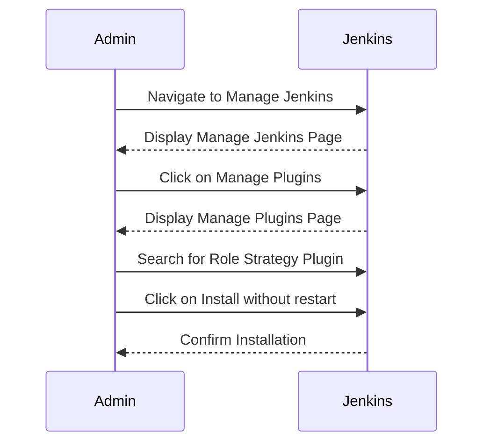

#### Configuring RBAC

Once the `Role Strategy Plugin` is installed, you can configure RBAC by navigating to `Manage Jenkins` > `Configure Global Security` and selecting `Role Strategy` as the authorization strategy.

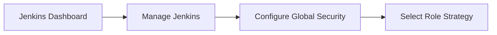

#### Defining Roles

Roles define the permissions and access levels for different groups of users. You can define roles by navigating to `Manage Jenkins` > `Manage and Assign Roles` > `Manage Roles`.

To create a new role, click on `Add Role`, provide a name, and select the appropriate permissions.

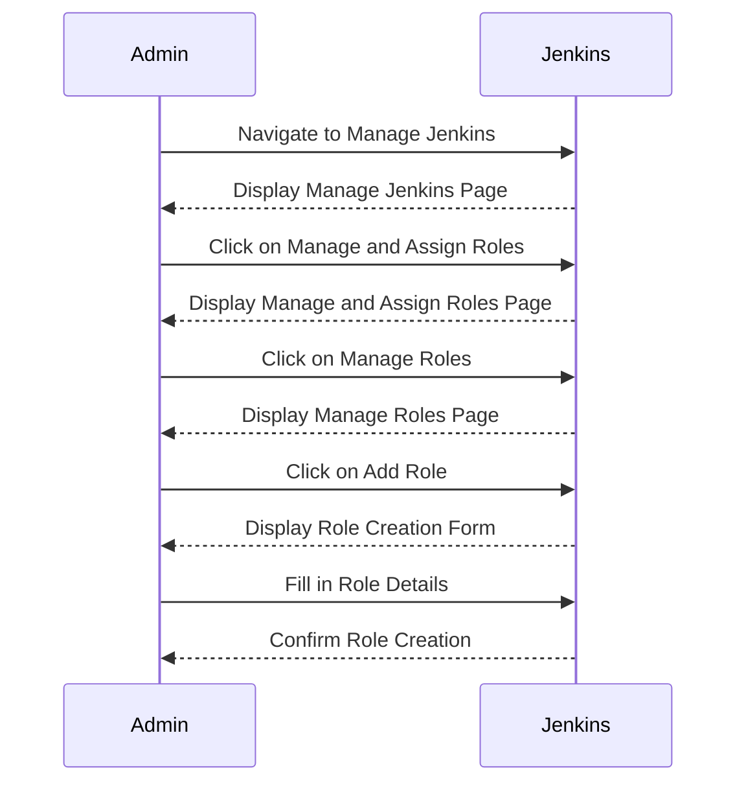

#### Assigning Roles

After defining roles, you can assign them to users or groups. Navigate to `Manage Jenkins` > `Manage and Assign Roles` > `Assign Roles`.

To assign a role, select the user or group, choose the role, and click on `Assign`.

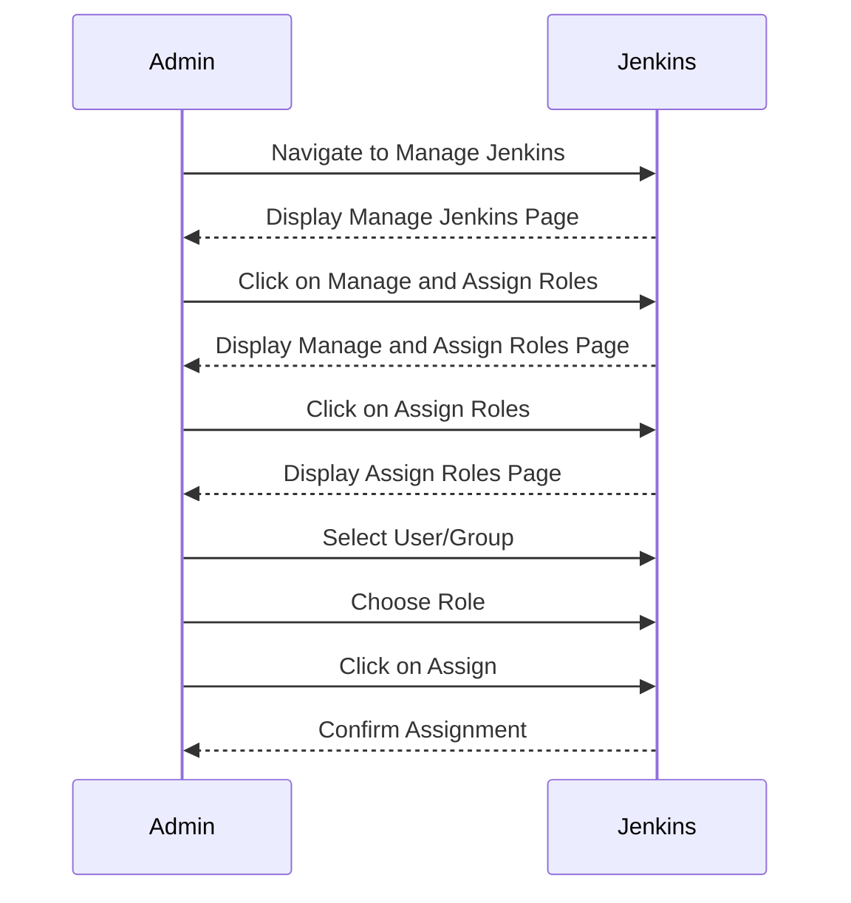

### Real-World Examples and Recent Breaches

Recent breaches involving Jenkins highlight the importance of proper configuration and security practices. One notable example is the breach of a Jenkins instance used by a major technology company, which led to unauthorized access to sensitive build artifacts and source code.

#### CVE-2018-1000807

CVE-2018-1000807 is a critical vulnerability in Jenkins that allowed attackers to execute arbitrary code on the Jenkins server. This vulnerability was due to improper validation of user input in the Jenkins CLI.

To mitigate this vulnerability, ensure that your Jenkins installation is up-to-date and apply the necessary security patches.

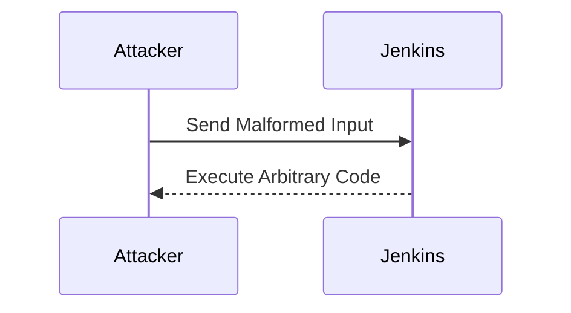

#### Secure Configuration Example

Here is an example of a secure Jenkins configuration:

```yaml
# Jenkins Configuration File
securityRealm:
  ldap:
    server: ldap.example.com
    rootDN: dc=example,dc=com
    userSearchBase: ou=users
    groupSearchBase: ou=groups
    managerDN: cn=admin,dc=example,dc=com
    managerPassword: secret
authorizationStrategy:
  roleBased:
    roles:
      - name: admin
        permissions:
          - hudson.model.Hudson.Administer
          - hudson.model.Item.Build
          - hudson.model.Item.Configure
          - hudson.model.Item.Delete
          - hudson.model.Item.Discover
          - hudson.model.Item.Read
          - hudson.model.Item.Workspace
      - name: developer
        permissions:
          - hudson.model.Item.Build
          - hudson.model.Item.Configure
          - hudson.model.Item.Discover
          - hudson.model.Item.Read
```

### How to Prevent / Defend

#### Detection

Regularly monitor Jenkins logs and audit trails to detect any unauthorized access attempts. Use tools like `Jenkins Audit Trail Plugin` to track user activities.

#### Prevention

- Keep Jenkins and all plugins up-to-date.
- Implement strong authentication mechanisms (LDAP, Active Directory).
- Use RBAC to limit user permissions.
- Regularly review and update security policies.

#### Secure Coding Fixes

Compare the vulnerable configuration with the secure configuration:

**Vulnerable Configuration:**

```yaml
securityRealm:
  ldap:
    server: ldap.example.com
    rootDN: dc=example,dc=com
    userSearchBase: ou=users
    groupSearchBase: ou=groups
    managerDN: cn=admin,dc=example,dc=com
    managerPassword: secret
authorizationStrategy:
  anyoneCanDoAnything:
```

**Secure Configuration:**

```yaml
securityRealm:
  ldap:
    server: ldap.example.com
    rootDN: dc=example,dc=com
    userSearchBase: ou=users
    groupSearchBase: ou=groups
    managerDN: cn=admin,dc=example,dc=com
    managerPassword: secret
authorizationStrategy:
  roleBased:
    roles:
      - name: admin
        permissions:
          - hudson.model.Hudson.Administer
          - hudson.model.Item.Build
          - hudson.model.Item.Configure
          - hudson.model.Item.Delete
          - hudson.model.Item.Discover
          - hudson.model.Item.Read
          - hudson.model.Item.Workspace
      - name: developer
        permissions:
          - hudson.model.Item.Build
          - hudson.model.Item.Configure
          - hudson.model.Item.Discover
          - hudson.model.Item.Read
```

### Conclusion

Proper configuration and management of Jenkins roles and permissions are crucial for ensuring the security and integrity of your CI/CD pipeline. By following the best practices outlined in this chapter, you can effectively manage Jenkins and protect against potential security threats.

### Practice Labs

To gain hands-on experience with Jenkins administration and user roles configuration, consider the following practice labs:

- **PortSwigger Web Security Academy**: Offers interactive labs on web application security, including Jenkins-related scenarios.
- **OWASP Juice Shop**: Provides a vulnerable web application for practicing security assessments, including Jenkins configurations.
- **DVWA (Damn Vulnerable Web Application)**: Another resource for practicing web application security, including Jenkins-related vulnerabilities.

By engaging in these labs, you can reinforce your understanding and practical skills in Jenkins administration and user roles configuration.

---
<!-- nav -->
[[DevOps/DevOps Bootcamp/06-CI CD & Build Tools/26-Jenkins Administration and User Roles Configuration/00-Overview|Overview]] | [[DevOps/DevOps Bootcamp/06-CI CD & Build Tools/26-Jenkins Administration and User Roles Configuration/02-Practice Questions & Answers|Practice Questions & Answers]]
