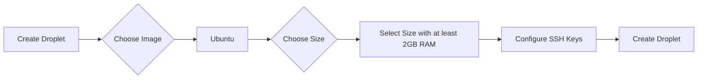

## Introduction to Jenkins Installation Using Docker on DigitalOcean

In this section, we will delve into the process of installing Jenkins on a DigitalOcean droplet using Docker. Jenkins is an open-source automation server that provides hundreds of plugins to support building, deploying, and automating any project. Installing Jenkins on a DigitalOcean droplet using Docker offers several advantages, including ease of setup, portability, and scalability.

### Why Use Jenkins?

Jenkins is widely used in continuous integration and continuous delivery (CI/CD) pipelines. It allows developers to automate the testing and deployment of their applications, ensuring that changes are integrated smoothly and frequently. Jenkins supports a wide range of build tools, source control management systems, and testing frameworks, making it a versatile choice for various development environments.

### Why Use Docker?

Docker simplifies the deployment and management of applications by packaging them into lightweight, portable containers. Containers encapsulate the application and its dependencies, ensuring consistency across different environments. Using Docker to deploy Jenkins offers several benefits:

1. **Ease of Setup**: Docker containers can be started with minimal configuration, reducing the time and effort required to set up Jenkins.
2. **Portability**: Docker containers are platform-independent, allowing Jenkins to run consistently across different environments.
3. **Scalability**: Docker makes it easy to scale Jenkins horizontally by running multiple instances of the container.
4. **Isolation**: Each Docker container runs in isolation, minimizing conflicts between different applications and services.

### Why Use DigitalOcean?

DigitalOcean is a cloud infrastructure provider that offers simple, intuitive, and affordable solutions for hosting applications. DigitalOcean droplets are virtual servers that provide a reliable and scalable environment for running Jenkins. DigitalOcean's user-friendly interface and robust API make it an excellent choice for deploying and managing Jenkins.

### Droplet Configuration

Before we proceed with the installation, let's discuss the configuration of the DigitalOcean droplet. The droplet will be running Ubuntu, a popular Linux distribution known for its stability and ease of use. Jenkins requires at least 1 GB of RAM, but for optimal performance, especially in a long-term CI/CD setup, it is recommended to allocate more resources.



### Step-by-Step Installation Process

#### 1. Create a DigitalOcean Droplet

1. **Log in to DigitalOcean**: Access your DigitalOcean account and navigate to the dashboard.
2. **Create a New Droplet**: Click on the "Create" button and select "Droplet".
3. **Choose an Image**: Select the Ubuntu image. Ensure you choose a version that is supported by Jenkins.
4. **Choose a Size**: Select a size that meets the minimum requirements for Jenkins. For a long-term CI/CD setup, it is recommended to choose a size with at least 2 GB of RAM.
5. **Configure SSH Keys**: Add your SSH keys to the droplet for secure access.
6. **Create the Droplet**: Review the settings and click on "Create".

#### 2. Install Docker on the Droplet

Once the droplet is created, SSH into the droplet and install Docker.

```bash
ssh root@your_droplet_ip
```

Install Docker using the following commands:

```bash
sudo apt-get update
sudo apt-get install -y docker.io
```

Verify that Docker is installed correctly:

```bash
docker --version
```

#### 3. Run Jenkins Docker Container

With Docker installed, you can now run the Jenkins Docker container. Use the following command to start the Jenkins container:

```bash
docker run -p 8080:8080 -p 50000:50000 -v jenkins_home:/var/jenkins_home -d --name jenkins jenkins/jenkins:lts
```

This command does the following:

- `-p 8080:8080`: Maps port 8080 on the host to port 8080 on the container, which is used for accessing the Jenkins web interface.
- `-p 50000:50000`: Maps port 50000 on the host to port 50000 on the container, which is used for Jenkins agent communication.
- `-v jenkins_home:/var/jenkins_home`: Mounts a volume named `jenkins_home` to `/var/jenkins_home` inside the container, which stores Jenkins data.
- `-d --name jenkins`: Runs the container in detached mode and assigns it the name `jenkins`.
- `jenkins/jenkins:lts`: Specifies the official Jenkins LTS (Long Term Support) image.

#### 4. Access Jenkins

After starting the Jenkins container, you can access Jenkins by navigating to `http://your_droplet_ip:8080` in your web browser. Follow the initial setup instructions to complete the installation.

### Common Pitfalls and How to Prevent Them

#### 1. Insufficient Resources

**Problem**: Allocating insufficient resources to the droplet can lead to performance issues and instability.

**Prevention**:
- Allocate at least 2 GB of RAM to the droplet.
- Monitor resource usage and adjust the droplet size as needed.

#### 2. Incorrect Docker Configuration

**Problem**: Incorrect Docker configuration can result in Jenkins not functioning properly.

**Prevention**:
- Verify that Docker is installed correctly by checking the version.
- Ensure that the correct ports are mapped and that the volume is mounted properly.

#### 3. Security Vulnerabilities

**Problem**: Jenkins is susceptible to various security vulnerabilities, such as CVE-2018-1000159, which affects Jenkins versions prior to 2.138.

**Prevention**:
- Regularly update Jenkins to the latest version.
- Enable security features such as the Jenkins Security Realms and Authorization Strategies.
- Use plugins like the Jenkins Security Scanner to identify and mitigate vulnerabilities.

### Secure Configuration Example

Here is an example of a secure Jenkins configuration using the `Jenkinsfile`:

```yaml
pipeline {
    agent any
    stages {
        stage('Build') {
            steps {
                sh 'echo Building...'
            }
        }
        stage('Test') {
            steps {
                sh 'echo Testing...'
            }
        }
        stage('Deploy') {
            steps {
                sh 'echo Deploying...'
            }
        }
    }
    post {
        always {
            cleanWs()
        }
        success {
            echo 'Pipeline successful!'
        }
        failure {
            echo 'Pipeline failed!'
        }
    }
}
```

### Detection and Prevention of Security Issues

#### Detection

- **Use Jenkins Security Scanner**: This plugin helps identify and mitigate security vulnerabilities in Jenkins.
- **Regular Audits**: Perform regular audits of Jenkins configurations and plugins to ensure compliance with security policies.

#### Prevention

- **Update Jenkins Regularly**: Keep Jenkins and its plugins up to date to protect against known vulnerabilities.
- **Enable Security Features**: Configure Jenkins to use secure authentication mechanisms and authorization strategies.
- **Limit Permissions**: Restrict permissions to only what is necessary for users and plugins.

### Conclusion

Installing Jenkins on a DigitalOcean droplet using Docker offers a streamlined and efficient approach to setting up a CI/CD pipeline. By following the steps outlined in this chapter, you can successfully deploy Jenkins and ensure its security and performance. Remember to regularly monitor and maintain your Jenkins instance to keep it secure and functional.

### Practice Labs

For hands-on practice, consider the following labs:

- **PortSwigger Web Security Academy**: Offers interactive labs for learning web security concepts.
- **OWASP Juice Shop**: A deliberately insecure web application for practicing web security skills.
- **DVWA (Damn Vulnerable Web Application)**: A PHP/MySQL web application that is riddled with vulnerabilities for educational purposes.
- **WebGoat**: An interactive, gamified training application for learning about web application security.

These labs provide practical experience in setting up and securing Jenkins in a real-world environment.

---
<!-- nav -->
[[DevOps/DevOps Bootcamp/06-CI CD & Build Tools/27-Jenkins Installation Using Docker On DigitalOcean/00-Overview|Overview]] | [[02-Introduction to Jenkins and Its Role in DevOps|Introduction to Jenkins and Its Role in DevOps]]
