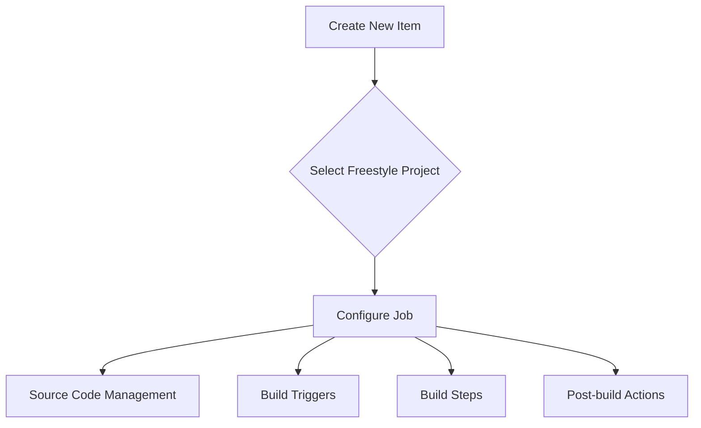

## Introduction to Jenkins Job Types for CI/CD Pipelines

In the realm of continuous integration and continuous delivery (CI/CD), Jenkins stands out as a powerful and flexible automation server. It allows developers to automate their software delivery processes, ensuring that code changes are tested and deployed efficiently. One of the key aspects of Jenkins is its ability to create different types of jobs, which serve various purposes within a CI/CD pipeline. In this chapter, we will delve deep into the different job types available in Jenkins, focusing primarily on the `Freestyle Project`, `Pipeline`, and `Multi-branch Pipeline`.

### Freestyle Project

The `Freestyle Project` is the simplest type of job in Jenkins. It is designed for straightforward workflows and is often the starting point for teams new to Jenkins. Let's explore what this means in detail.

#### What is a Freestyle Project?

A `Freestyle Project` is a basic job type that allows you to define a series of steps to execute during a build process. These steps can include:

- Source code checkout
- Compilation
- Testing
- Packaging
- Deployment

Each step is defined using a series of checkboxes and input fields in the Jenkins UI. This simplicity makes it easy to get started quickly, but it also limits the complexity of the workflow you can define.

#### Why Use a Freestyle Project?

The primary reason to use a `Freestyle Project` is its ease of setup and use. It is ideal for small projects or teams that are just beginning to implement CI/CD practices. Here are some scenarios where a `Freestyle Project` might be appropriate:

- **Simple Workflows**: If your build process is straightforward and doesn't require complex branching or conditional logic, a `Freestyle Project` can handle it effectively.
- **Quick Prototyping**: For rapid prototyping or proof-of-concept projects, a `Freestyle Project` allows you to quickly set up a basic CI/CD pipeline without much overhead.
- **Learning Tool**: For teams new to Jenkins, a `Freestyle Project` provides a gentle introduction to the concepts of CI/CD without overwhelming them with advanced features.

#### How Does a Freestyle Project Work?

To understand how a `Freestyle Project` works, let's walk through the process of creating one in Jenkins.

1. **Create a New Job**:
    - Navigate to the Jenkins dashboard.
    - Click on `New Item`.
    - Enter a name for your job (e.g., `my-job`).
    - Select `Freestyle project` and click `OK`.

2. **Configure the Job**:
    - In the configuration page, you can define various aspects of the job, such as source code management, build triggers, build steps, and post-build actions.
    - For example, you might configure it to check out code from a Git repository, run a shell script to compile the code, and then run tests.

Here is an example of configuring a `Freestyle Project`:



#### Example Configuration

Let's consider a simple example where we want to check out code from a Git repository, compile it using Maven, and run tests.

1. **Source Code Management**:
    - Choose `Git` as the SCM.
    - Enter the repository URL and credentials if needed.

2. **Build Triggers**:
    - Set up a trigger to build periodically or on code commit.

3. **Build Steps**:
    - Add a `Execute shell` step to run `mvn clean install`.

4. **Post-build Actions**:
    - Archive artifacts (e.g., JAR files).
    - Publish JUnit test results.

Here is the complete configuration in code form:

```yaml
# Jenkinsfile for Freestyle Project
pipeline {
    agent any
    stages {
        stage('Checkout') {
            steps {
                git url: 'https://github.com/my-repo/my-project.git'
            }
        }
        stage('Build') {
            steps {
                sh 'mvn clean install'
            }
        }
        stage('Test') {
            steps {
                junit 'target/surefire-reports/*.xml'
            }
        }
    }
    post {
        always {
            archiveArtifacts artifacts: '**/target/*.jar', allowEmptyArchive: true
        }
    }
}
```

#### Pitfalls and Best Practices

While `Freestyle Projects` are simple and easy to use, they come with some limitations:

- **Limited Flexibility**: They lack the advanced features and flexibility of pipeline jobs, such as conditional logic and parallel execution.
- **Manual Configuration**: All configurations must be done manually in the Jenkins UI, which can become cumbersome for large or complex projects.

To mitigate these issues, consider the following best practices:

- **Use Jenkinsfiles**: Even for `Freestyle Projects`, you can use Jenkinsfiles to define the build steps. This makes it easier to manage and version control your build definitions.
- **Keep It Simple**: Use `Freestyle Projects` for simple workflows and migrate to more advanced job types as your project grows.

### Pipeline Job Type

The `Pipeline` job type is a more advanced and flexible alternative to the `Freestyle Project`. It allows you to define complex workflows using a Jenkinsfile, which is a script written in Groovy. This job type is widely used in production environments due to its flexibility and power.

#### What is a Pipeline Job?

A `Pipeline` job is a type of job that uses a Jenkinsfile to define the entire build process. The Jenkinsfile is a script that describes the steps of the pipeline, including source code management, build steps, testing, and deployment. This approach provides several advantages:

- **Declarative Syntax**: The Jenkinsfile uses a declarative syntax that is easy to read and maintain.
- **Version Control**: Since the Jenkinsfile is stored in the source code repository, it can be version-controlled alongside the code.
- **Flexibility**: Pipelines can include complex logic, such as conditional steps, parallel execution, and parameterized builds.

#### Why Use a Pipeline Job?

The `Pipeline` job type is preferred in many production environments because of its flexibility and power. Here are some reasons to use it:

- **Complex Workflows**: Pipelines can handle complex workflows with multiple stages, branches, and conditional logic.
- **Reproducibility**: By storing the Jenkinsfile in version control, you ensure that the build process is reproducible across different environments.
- **Automation**: Pipelines can be triggered automatically based on events like code commits, pull requests, or external triggers.

#### How Does a Pipeline Job Work?

Creating a `Pipeline` job involves defining a Jenkinsfile and configuring Jenkins to use it. Here’s a step-by-step guide:

1. **Create a New Job**:
    - Navigate to the Jenkins dashboard.
    - Click on `New Item`.
    - Enter a name for your job (e.g., `my-pipeline`).
    - Select `Pipeline` and click `OK`.

2. **Define the Jenkinsfile**:
    - In the configuration page, you can define the Jenkinsfile either directly in the UI or by pointing to a file in your source code repository.

Here is an example of a Jenkinsfile for a `Pipeline` job:

```groovy
pipeline {
    agent any
    stages {
        stage('Checkout') {
            steps {
                git url: 'https://github.com/my-repo/my-project.git'
            }
        }
        stage('Build') {
            steps {
                sh 'mvn clean install'
            }
        }
        stage('Test') {
            steps {
                junit 'target/surefire-reports/*.xml'
            }
        }
        stage('Deploy') {
            steps {
                sh 'scp target/my-app.jar user@server:/path/to/deploy/'
            }
        }
    }
    post {
        always {
            archiveArtifacts artifacts: '**/target/*.jar', allowEmptyArchive: true
        }
    }
}
```

#### Example Configuration

Let's consider a more complex example where we want to check out code from a Git repository, compile it using Maven, run tests, and deploy the application to a remote server.

1. **Source Code Management**:
    - Use the `git` step to check out code from the repository.

2. **Build Steps**:
    - Use the `sh` step to run `mvn clean install`.

3. **Testing**:
    - Use the `junit` step to publish test results.

4. **Deployment**:
    - Use the `sh` step to copy the compiled JAR file to a remote server.

Here is the complete configuration in code form:

```yaml
# Jenkinsfile for Pipeline Job
pipeline {
    agent any
    stages {
        stage('Checkout') {
            steps {
                git url: 'https://github.com/my-repo/my-project.git'
            }
        }
        stage('Build') {
            steps {
                sh 'mvn clean install'
            }
        }
        stage('Test') {
            steps {
                junit 'target/surefire-reports/*.xml'
            }
        }
        stage('Deploy') {
            steps {
                sh 'scp target/my-app.jar user@server:/path/to/deploy/'
            }
        }
    }
    post {
        always {
            archiveArtifacts artifacts: '**/target/*.jar', allowEmptyArchive: true
        }
    }
}
```

#### Pitfalls and Best Practices

While `Pipeline` jobs offer significant flexibility, they also come with some challenges:

- **Complexity**: Writing and maintaining Jenkinsfiles can be complex, especially for large projects.
- **Debugging**: Debugging issues in a pipeline can be challenging due to the dynamic nature of the scripts.

To mitigate these issues, consider the following best practices:

- **Modularize Your Jenkinsfile**: Break down your Jenkinsfile into smaller, reusable modules to make it easier to manage.
- **Use Shared Libraries**: Jenkins shared libraries allow you to reuse common functions and steps across multiple pipelines.
- **Automate Testing**: Regularly test your Jenkinsfile to ensure it works as expected.

### Multi-branch Pipeline Job Type

The `Multi-branch Pipeline` job type is an extension of the `Pipeline` job type. It allows you to automatically discover and build multiple branches of a repository, making it ideal for managing multiple branches in a CI/CD pipeline.

#### What is a Multi-branch Pipeline Job?

A `Multi-branch Pipeline` job is a type of job that automatically discovers and builds multiple branches of a repository. It is particularly useful for managing multiple branches, such as feature branches, release branches, and hotfix branches. The main benefits of using a `Multi-branch Pipeline` include:

- **Automatic Discovery**: Jenkins automatically discovers and builds all branches in the repository.
- **Branch-Specific Configurations**: You can define branch-specific configurations using a Jenkinsfile in each branch.
- **Unified View**: Provides a unified view of all branches in the repository, making it easier to manage and monitor builds.

#### Why Use a Multi-branch Pipeline Job?

The `Multi-branch Pipeline` job type is ideal for managing multiple branches in a CI/CD pipeline. Here are some reasons to use it:

- **Branch Management**: Automatically manages builds for all branches in the repository.
- **Consistency**: Ensures that all branches follow the same build process, reducing the risk of inconsistencies.
- **Scalability**: Easily scales to handle multiple branches without manual intervention.

#### How Does a Multi-branch Pipeline Job Work?

Creating a `Multi-branch Pipeline` job involves defining a Jenkinsfile and configuring Jenkins to use it. Here’s a step-by-step guide:

1. **Create a New Job**:
    - Navigate to the Jenkins dashboard.
    - Click on `New Item`.
    - Enter a name for your job (e.g., `my-multi-branch-pipeline`).
    - Select `Multibranch Pipeline` and click `OK`.

2. **Define the Jenkinsfile**:
    - In the configuration page, you can define the Jenkinsfile either directly in the UI or by pointing to a file in your source code repository.

Here is an example of a Jenkinsfile for a `Multi-branch Pipeline` job:

```groovy
pipeline {
    agent any
    stages {
        stage('Checkout') {
            steps {
                git url: 'https://github.com/my-repo/my-project.git'
            }
        }
        stage('Build') {
            steps {
                sh 'mvn clean install'
            }
        }
        stage('Test') {
            steps {
                junit 'target/surefire-reports/*.xml'
            }
        }
        stage('Deploy') {
            steps {
                sh 'scp target/my-app.jar user@server:/path/to/deploy/'
            }
        }
    }
    post {
        always {
            archiveArtifacts artifacts: '**/target/*.jar', allowEmptyArchive: true
        }
    }
}
```

#### Example Configuration

Let's consider a scenario where we want to check out code from a Git repository, compile it using Maven, run tests, and deploy the application to a remote server for multiple branches.

1. **Source Code Management**:
    - Use the `git` step to check out code from the repository.

2. **Build Steps**:
    - Use the `sh` step to run `mvn clean install`.

3. **Testing**:
    - Use the `junit` step to publish test results.

4._ Deployment:
    - Use the `sh` step to copy the compiled JAR file to a remote server.

Here is the complete configuration in code form:

```yaml
# Jenkinsfile for Multi-branch Pipeline Job
pipeline {
    agent any
    stages {
        stage('Checkout') {
            steps {
                git url: 'https://github.com/my-repo/my-project.git'
            }
        }
        stage('Build') {
            steps {
                sh 'mvn clean install'
            }
        }
        stage('Test') {
            steps {
                junit 'target/surefire-reports/*.xml'
            }
        }
        stage('Deploy') {
            steps {
                sh 'scp target/my-app.jar user@server:/path/to/deploy/'
            }
        }
    }
    post {
        always {
            archiveArtifacts artifacts: '**/target/*.jar', allowEmptyArchive: true
        }
    }
}
```

#### Pitfalls and Best Practices

While `Multi-branch Pipeline` jobs offer significant flexibility, they also come with some challenges:

- **Complexity**: Managing multiple branches can be complex, especially for large repositories.
- **Resource Usage**: Building multiple branches simultaneously can consume significant resources.

To mitigate these issues, consider the following best practices:

- **Optimize Resource Usage**: Configure Jenkins to limit the number of concurrent builds to avoid resource exhaustion.
- **Use Branch Filters**: Define branch filters to exclude unnecessary branches from being built.
- **Monitor and Maintain**: Regularly monitor and maintain your `Multi-branch Pipeline` to ensure it works as expected.

### Real-World Examples and Case Studies

To illustrate the practical applications of Jenkins job types, let's look at some real-world examples and case studies.

#### Example 1: Netflix's CI/CD Pipeline

Netflix is a well-known company that heavily relies on CI/CD pipelines to deliver high-quality services. They use a combination of `Pipeline` and `Multi-branch Pipeline` jobs to manage their complex workflows.

- **Jenkinsfile**: Netflix defines their build process using Jenkinsfiles, which are stored in their source code repositories.
- **Branch Management**: They use `Multi-branch Pipeline` jobs to manage multiple branches, ensuring that all branches follow the same build process.
- **Parallel Execution**: Their pipelines include parallel execution of tests and deployments, significantly speeding up the build process.

#### Example 2: Airbnb's CI/CD Pipeline

Airbnb is another company that uses Jenkins extensively for their CI/CD pipelines. They use a mix of `Freestyle Project`, `Pipeline`, and `Multi-branch Pipeline` jobs to manage their workflows.

- **Freestyle Project**: For simple workflows, they use `Freestyle Project` jobs to quickly set up basic CI/CD pipelines.
- **Pipeline**: For more complex workflows, they use `Pipeline` jobs to define their build process using Jenkinsfiles.
- **Multi-branch Pipeline**: They use `Multi-branch Pipeline` jobs to manage multiple branches, ensuring consistency across all branches.

### Hands-On Labs

To gain practical experience with Jenkins job types, consider the following hands-on labs:

- **PortSwigger Web Security Academy**: Offers a variety of labs that cover CI/CD pipelines, including Jenkins.
- **OWASP Juice Shop**: A deliberately insecure web application that includes CI/CD pipelines for learning purposes.
- **DVWA (Damn Vulnerable Web Application)**: Another insecure web application that can be used to learn about CI/CD pipelines.

These labs provide real-world scenarios and challenges that help you apply the concepts learned in this chapter.

### Conclusion

In conclusion, Jenkins offers a variety of job types that cater to different needs in a CI/CD pipeline. The `Freestyle Project` is ideal for simple workflows, while the `Pipeline` and `Multi-branch Pipeline` jobs offer more flexibility and power for complex workflows. By understanding the strengths and weaknesses of each job type, you can choose the right one for your project and set up efficient and reliable CI/CD pipelines.

### Further Reading

For further reading and deeper understanding, consider the following resources:

- **Jenkins Documentation**: Official documentation provides comprehensive guides and tutorials.
- **Jenkins Plugins**: Explore the vast ecosystem of plugins available for Jenkins.
- **Community Forums**: Engage with the Jenkins community to get support and share knowledge.

By mastering Jenkins job types, you can significantly enhance your CI/CD capabilities and improve the quality and reliability of your software delivery processes.

---
<!-- nav -->
[[DevOps/DevOps Bootcamp/06-CI CD & Build Tools/28-Jenkins Job Types For CICD Pipelines/00-Overview|Overview]] | [[02-Jenkins Job Types for CICD Pipelines|Jenkins Job Types for CICD Pipelines]]
