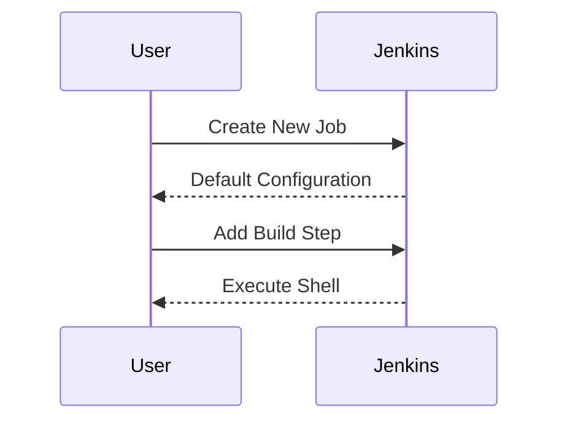
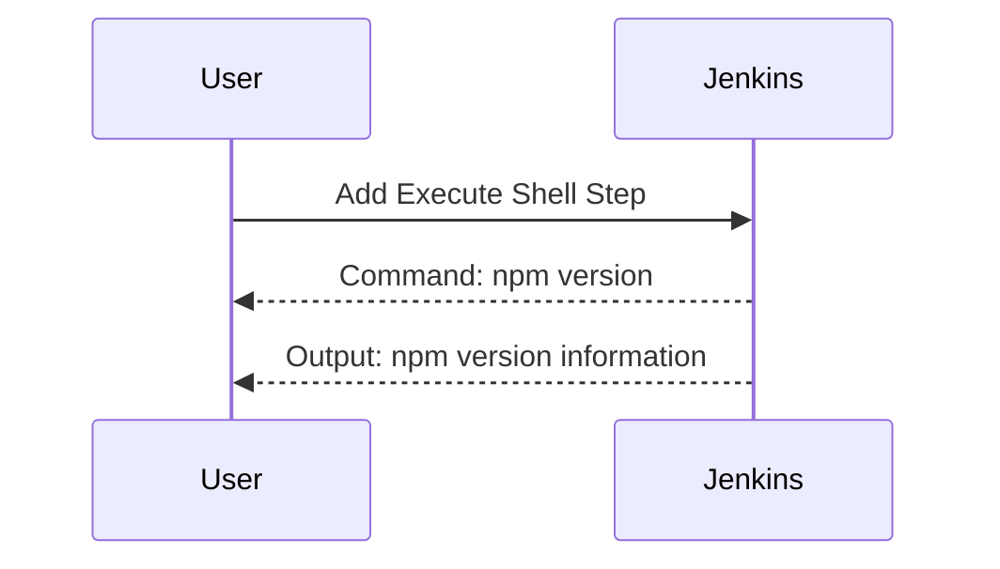
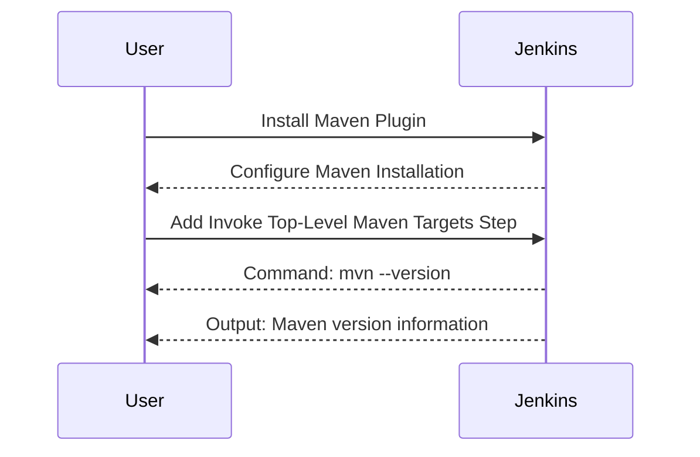
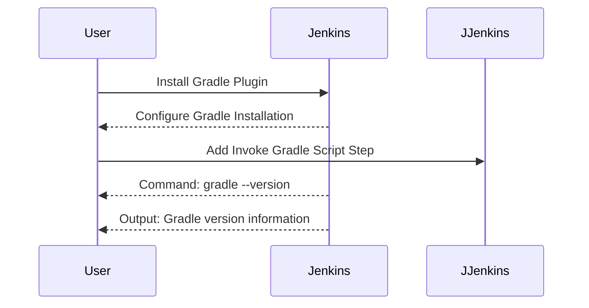

## Jenkins Job Types for CI/CD Pipelines

### Introduction to Jenkins Jobs

Jenkins is an open-source automation server widely used for continuous integration and continuous delivery (CI/CD) pipelines. A Jenkins job is a unit of work that can be executed to perform various tasks such as building, testing, and deploying applications. Understanding different types of Jenkins jobs and their configurations is crucial for setting up effective CI/CD pipelines.

### Default Configuration and Build Steps

When creating a new Jenkins job, it is often beneficial to start with the default settings and then customize as needed. In the provided transcript, the instructor suggests leaving everything on default and focusing on the build part. Let's explore this in more detail.

#### Adding a Build Step

To add a build step, navigate to the "Build" section of your Jenkins job configuration. Here, you can choose from several options, including:

- **Execute Shell**: This allows you to run shell commands within the Jenkins environment.
- **Invoke Top-Level Maven Targets**: This plugin allows you to execute Maven commands.
- **Gradle**: This plugin allows you to execute Gradle commands.
- **End**: This plugin allows you to execute End commands.

For the current scenario, let's focus on the "Execute Shell" option.



### Executing Shell Commands

The "Execute Shell" build step allows you to run shell commands within the Jenkins environment. This is particularly useful for executing commands that are available in the Jenkins container, such as `npm`.

#### Example: Executing npm Version

To execute `npm version`, you would add the following command in the "Execute Shell" build step:

```sh
npm version
```

This command will output the current version of npm installed in the Jenkins container.



### Limitations with Maven

While the "Execute Shell" build step is useful for executing commands like `npm`, it does not support executing Maven commands directly. This is because Maven is not installed directly in the Jenkins container by default.

#### Installing Maven as a Plugin

To execute Maven commands, you need to install Maven as a plugin. Jenkins provides a built-in plugin called "Maven Integration Plugin" which allows you to execute Maven commands.

To install Maven as a plugin:

1. Navigate to the Jenkins dashboard.
2. Click on "Manage Jenkins".
3. Click on "Global Tool Configuration".
4. Scroll down to the "Maven" section.
5. Click on "Add Maven".
6. Provide a name for the Maven installation (e.g., "Maven 3.8").
7. Specify the path to the Maven installation directory.

Once Maven is installed as a plugin, you can use the "Invoke Top-Level Maven Targets" build step to execute Maven commands.

#### Example: Executing Maven Version

To execute `mvn --version`, you would add the following command in the "Invoke Top-Level Maven Targets" build step:

```sh
mvn --version
```

This command will output the version of Maven installed in the Jenkins environment.



### Other Available Tools

In addition to Maven, Jenkins supports other build tools such as Gradle and End. These tools can be installed and configured similarly to Maven.

#### Example: Configuring Gradle

To configure Gradle, follow these steps:

1. Navigate to the Jenkins dashboard.
2. Click on "Manage Jenkins".
3. Click on "Global Tool Configuration".
4. Scroll down to the "Gradle" section.
5. Click on "Add Gradle".
6. Provide a name for the Gradle installation (e.g., "Gradle 7.4").
7. Specify the path to the Gradle installation directory.

Once Gradle is installed, you can use the "Invoke Gradle Script" build step to execute Gradle commands.

#### Example: Executing Gradle Version

To execute `gradle --version`, you would add the following command in the "Invoke Gradle Script" build step:

```sh
gradle --version
```

This command will output the version of Gradle installed in the Jenkins environment.



### How to Prevent / Defend

#### Detection

To ensure that your Jenkins environment is properly configured and secure, you should regularly check the following:

- **Plugin Updates**: Ensure that all plugins are up-to-date to avoid vulnerabilities.
- **Tool Configurations**: Verify that all build tools are correctly installed and configured.
- **Build Logs**: Review build logs to identify any errors or issues during the build process.

#### Prevention

To prevent common issues and ensure a secure Jenkins environment, follow these best practices:

- **Use Secure Credentials**: Store sensitive information such as API keys and passwords securely using Jenkins credentials management.
- **Limit Access**: Restrict access to Jenkins to only authorized users and groups.
- **Regular Audits**: Perform regular audits of Jenkins configurations and plugins to identify and mitigate potential security risks.

#### Secure Code Fix

Here is an example of how to securely configure a Jenkins job to execute Maven commands:

**Vulnerable Configuration:**

```yaml
pipeline {
    agent any
    stages {
        stage('Build') {
            steps {
                sh 'mvn --version'
            }
        }
    }
}
```

**Secure Configuration:**

```yaml
pipeline {
    agent any
    environment {
        MAVEN_HOME = '/path/to/maven'
    }
    stages {
        stage('Build') {
            steps {
                withMaven(maven: 'Maven 3.8') {
                    sh 'mvn --version'
                }
            }
        }
    }
}
```

In the secure configuration, the `withMaven` step ensures that the correct Maven installation is used, and the `MAVEN_HOME` environment variable is set to the correct path.

### Conclusion

Understanding and configuring Jenkins jobs effectively is crucial for setting up robust CI/CD pipelines. By leveraging the built-in plugins and tools, you can execute various commands and build scripts seamlessly. Regularly auditing and securing your Jenkins environment will help prevent common issues and ensure a secure development process.

### Practice Labs

For hands-on practice with Jenkins and CI/CD pipelines, consider the following labs:

- **PortSwigger Web Security Academy**: Offers a comprehensive set of labs covering various aspects of web application security, including CI/CD pipelines.
- **OWASP Juice Shop**: A deliberately insecure web application for practicing web security skills, including CI/CD pipeline setup.
- **DVWA (Damn Vulnerable Web Application)**: Another popular web application for learning web security, including CI/CD pipeline configurations.

These labs provide practical experience in setting up and securing CI/CD pipelines using Jenkins and other tools.

---
<!-- nav -->
[[01-Introduction to Jenkins Job Types for CICD Pipelines|Introduction to Jenkins Job Types for CICD Pipelines]] | [[DevOps/DevOps Bootcamp/06-CI CD & Build Tools/28-Jenkins Job Types For CICD Pipelines/00-Overview|Overview]] | [[DevOps/DevOps Bootcamp/06-CI CD & Build Tools/28-Jenkins Job Types For CICD Pipelines/03-Practice Questions & Answers|Practice Questions & Answers]]
